参考： **深入理解Java虚拟机：JVM高级特性与最佳实践（第2版）**

**Java的优势**：摆脱了硬件平台的约束。提供了一个相对安全的内存管理和访问机制，避免了绝大部分的内存泄漏和指针越界问题。它实现了热点代码检测和运行时编译及优化，这使得Java应用能随着运行时间的增加而获得更高的性能。它有一套完善的应用程序接口。

**HotSpot VM 的热点代码探测技术**：它可以通过执行计数器找出最具有编译价值的代码，然后通知JIT编译器以方法为单位进行编译，如果一个方法被频繁调用，或者方法种有效循环次数很多，将会分别触发标准编译和（栈上替换）编译动作，通过编译器与解释器恰当的协同工作，可以在最优化程序响应时间和最佳执行性能种取得平衡。


**JDK，JRE， JVM三者间的关系**

JDK(Java Development Kit)是针对Java开发员的产品，是整个Java的核心，包括了Java运行环境JRE， JAVA工具和Java基础类库。JRE(Java Runtime Enviroment) 是运行Java程序所必须的环境的集合，包含JVM标准实现及Java核心类库。JVM是Java虚拟机，实现Java跨平台的关键，能够运行以Java语言写作的软件程序。


## 1 自动内存管理机制


### 1 Java 内存区域与内存溢出异常

Java运行时数据区：

- **程序计数器（program Counter Register）**
- **堆（Heap）**
- **方法区（Method Area)**
- **虚拟机栈（VM Stack）**
- **本地方法栈（Native Method Stack)**


**程序计数器**： 

是一块较小的内存空间，他可以看作是当前线程所执行的字节码的行号指示器。在虚拟机的概念模型中，字节码解释器工作时就是要通过改变这个计数器的值来选取下一条需要执行的字节码 指令， 分支，循环，跳转，异常处理，线程恢复等等基础功能都需要依赖这个计数器。

**由于Java虚拟机的多线程是通过线程轮流切换并分配处理器执行时间的方式来实现的，任何一个时刻都只会处理一条线程中的指令。因此为了线程切换后能够恢复到正确的执行位置，每条线程都需要有一个独立的程序计数器，各条线程之间的计数器互不影响，独立存储，这类区域被称为“线程私有的”的内存；**

**Java虚拟机栈**：

他也是**线程私有**的，生命周期与线程相同，每个方法在执行的同时都会创建一个栈帧（Stack Frame） 用于存储：**局部变量表，操作数栈，动态链接 ， 方法出口等信息。每一个方法从到那个用到执行完成的过程，就对应着一个栈帧在虚拟机中入栈到出栈的过程。**

局部变量表存放了编译器可知的各种基本数据类型( boolean, byte, char, short, int, float, long, double )， 对象引用(refrence类型)和 returnAddress类型（指向了一条字节码指令的地址）。

在Java虚拟机规范中，对这个区域规定了两种异常状况：如果线程请求的栈深度大于虚拟机所允许的深度，将抛出StackOverflowError异常； 如果虚拟机栈可以动态扩展，但扩展时无法申请到足够的内存，就会抛出OutOfMemoryError异常。


**以上两个区域都是线程私有的，线程之间不共享。**


**Java堆**

1. **此内存区域的唯一目的就是存放对像实例，所有的对象实例都在这里分配。**
2. **是被所有线程共享的一块内存区域。**
3. **Java堆是垃圾收集管理器的主要区域。**
4. **堆可以处于物理上不连续的内存空间中。只要逻辑上连续即可。**
5. **可扩展。通过 -Xmx控制。**


**方法区（Method Area）**

1. 是各线程共享的内存区域。
2. **存储已被虚拟机加载的类信息，常量，静态变量，即时编译器编译后的代码。**
3. 可以选择不实现垃圾收集。这区域的内存回收目标主要是针对常量池的回收和对类型的卸载。
4. **运行时常量池**： 是方法区的一部分，**class 文件除了有类的版本，字段，方法，接口等描述信息外，还有一项信息是存放编译器各种中字面量和符号引用。**


**对象的创建：**

虚拟机遇到一条new 指令，首先将检查这个指令的参数是否能够在常量池中定位到一个类的符号引用，并且检查这个符号引用代表的类是否已经被**加载，解析和初始化**过，如果没有则先执行对应的类加载过程。

通过类加载检查后，接下来迅即为新生对象分配内存，对象所需内存的大小在类加载完成后就可完全确定。为对象分配内存等同于把一块儿确定大小的内存从Java堆中划分出来，假设Java堆中的内存是绝对规整的，所有用过的内存都放在一边，未用过的在另一边，中间仅用一个指针作为分界点，那只需将指针向空闲空间那边挪动与对象大小相等的距离即可。这种分配方式称为**指针碰撞**（Bump the Pointer）。如果Java堆中内存并不规整，虚拟机就必须维护一个列表,记录哪些块儿是可用的，在分配时从列表中找到一块儿足够大的空间划分给对象实例，并更新列表上的记录，这种分配方式称为**空闲列表**（free list）。**而Java堆是否规整又由所采用的垃圾收集器是否带有压缩整理功能决定。**

内存分配完成后，虚拟机需要将分配到的内存空间都初始化为零值（不包括对象头），接下来要对对象进行必要的设置，例如这个对象是哪个类的实例、如何才能找到类的元数据信息、对象的哈希码、对象的GC分代年龄，线程持有的锁等信息。这些信息存放在对象的对象头（Object Header）之中。根据虚拟机当前的运行状态的不同，如是否启用偏向锁等，对象头会有不同的设置方式。


对象的内存布局：在HotSpot虚拟机中，对象在内存中的布局可以分为三个部分：

- 对象头（Header），包含两部分信息，第一部分用**于存储对象自身的运行时数据**，如hashCode，锁状态标志等。另一部分是类型指针，即对象指向它的类元数据的指针，**虚拟机通过这个指针来确定这个对象是哪个类的实例。**并不是所有的虚拟机实现都必须在对象数据上保留类型指针，换句话说，查找对象的元数据并不一定要经过对象本身，另外，如果对象是一个Java数组，那在对象头中还必须有一块用于记录数组长度的数据，因为虚拟机可以通过普通的Java对象的元数据信息确定Java对象的大小，但是从数组的元数据中却无法确定数组的大小。
- 实例数据（Instance Data)。对象真正存储的有效信息，程序代码中所定义的各种类型的字段内容。无论是从父类继承下来的，还是在子类中定义的，都需要记录下来，这部分的存储顺序会受到虚拟机分配策略参数的和字段在Java源码中定义顺序的影响。HotSpot的默认分配策略是，相同宽度的字段总是被分配到一起，在满足这个前提的情况下，在父类中定义的变量会出现在子类之前。
- 对齐填充（padding)，起到占位符作用。


**对象的访问定位**：

Java程序需要通过栈上的reference 数据来操作堆上的具体对象。主要有使用句柄和直接指针两种。

如果使用句柄访问的话，那么Java堆中将会划分处一块内存来作为句柄池，reference中存储的就是句柄地址。而句柄中包含了对象实例数据与类型数据各自的具体地址信息。如图：


如果使用直接指针访问，那么Java堆对象的布局中就必须考虑如何放置访问类型数据的相关信息，而reference中存储的就直接是对象地址，如图：


这两种对象访问方式各有优势，使用句柄来访问最大的好处就是reference中存储的是稳定的句柄地址，在对象被移动时只会改变句柄中的实例数据指针，而reference本身不需要修改。

使用直接指针的最大好处时速度更快，它节省了一次指针定位的时间开销，由于对象的访问十分频繁，这类开销积累起来之后也很大。


操作系统分配给每个进程的内存是有限制的，32位系统位2GB，虚拟机提供了参数来控制Java堆和方法区的这两部分内存的最大值，剩余内存位2GB 减去 Xmx(最大堆容量)， 再减去MaxPermSize(最大方法区容量)，程序计数器消耗可以忽略，如果虚拟机本身耗费的内存不计算在内，剩下的内存就由薰妮基栈和本地栈瓜分了。每个线程分配的站容量越大，可以建立的线程数量就越小。


### 2 垃圾收集器与内存分配策略

参考： https://www.jianshu.com/p/5261a62e4d29

了解gc和内存分配的原因：需要排查各种内存溢出，内存泄漏问题时，当垃圾回收成为系统达到更高并发量的瓶颈时，我们就需要堆这些自动化技术实施必要的监控和调节。

程序计数器，虚拟机栈，本地方法栈 的内存分配和回收都具有确定性，因为方法结束或者线程结束时内存就自然的随着回收了。而Java堆和方法区不一样，一个接口的多个实现类需要的内存可能不一样，一个方法的的多个分支需要的内存也不一样，我们只有处在程序运行期才能知道会创建了哪些对象，这部分内存的分配和回收都是动态的，也是垃圾收集器的主要关注目标。

常用的判断对象是否死亡的方法：

1. **引用计数法。** 实现简单，效率搞。但无法解决对象之间相互循环引用的问题。

2. **可达性分析算法。**主流商用语言（Java，C#等）的实现。基本思路是通过一系列的称为 “GC Roots”的对象作为起始点，从这些节点开始向下搜索，搜索所走过的路径称为**引用链**（reference chain），当一个对象到GC Root这个对象不可达时，则证明此对象时不可用的。

   在Java语言中，可作为GC Roots 的对象包括以下几种：

   - **虚拟机栈（栈帧中的本地变量表）中引用的对象。**
   - **方法区中类静态属性引用的对象。**
   - **方法区中常量引用的对象。**
   - **本地方法栈中JNI（即一般说的Native方法）引用的对象。**

   


在JDK1.2后，Java对引用概念进行了扩充将引用分为以下几个部分(强度逐次减弱)。

- 强引用（Strong reference)。在程序代码中普遍存在的，类似“ Object obj = new Object()" 这类的引用，只要强引用还在，垃圾回收器就永远不会回收掉被引用的对象。
- 软引用（soft reference), 用来描述一些有用但并非必须的对象，对于软引用关联着的对象，在系统将要发生内存溢出异常之前，将会把这些对象列进回收范围之中进行第二次回收，如果这回回收还没有足够的内存，才会抛出异常。
- 弱引用（weak reference)。强度比软引用更弱，被弱引用关联的对象只能生存到下一次垃圾回收发生之前，当垃圾收集器工作时，无论当前内存是否足够，都会回收掉制备弱引用关联的对象。
- 虚引用（phantom reference），一个对象是否有虚引用的存在，不会对其生存时间构成影响，也无法通过虚引用来获取一个实例对象，为一个对象设立虚引用关联的唯一目的就是能在这个对象被收集器回收时收到一个系统通知。

**关于 finalize() 方法**： 建议大家尽量避免使用它，因为它不是C/C++中的析构函数，而是Java刚诞生时为了使 C/C++程序员更容易接受它所做的一个妥协。它的运行代价高昂，不确定性大， 无法保证各个对象的调用顺序，finalize()能做的， 使用try-finaaly 或者其他方式都可以做的更好，可以完全忘记Java语言中这个方法的存在。


**回收方法区：** 方法区的垃圾回收主要有两部分内容，废弃常量和无用的类。回收废弃常量与回收Java堆中的对象非常类似，在当前系统中没有找到常量池中的常量的引用的话，就在在必要时将其回收。常量池中的其他类（接口），方法，字段的符号引用也与此类似。**判定一个类是否是无用的类需要同时满足下面三个条件**：

- **该类的所有实例都已经被回收，也就是Java堆中不存在该类的任何实例。**
- **加载该类的ClassLoader已经被回收。**
- **该类对应的java.lang.Class对象没有在任何地方被引用，无法在任何地方通过反射访问该类的方法。**

虚拟机可以对满足上述三个条件的无用类进行回收，但也不必然回收，仅仅是可以回收。是否对类进行回收，HotSpot虚拟机提供了-Xnoclassgc参数进行控制。


### 3垃圾收集算法


#### 1.标记-清除算法

最基础的收集算法（Mark-Sweep）。算法分为标记和清除两个阶段：首先标记出所有需要回收的对象，在标记后统一回收所有被标记的对象。或许算法都是针对此算法的不足而改进的。此算法的主要不足体现在两方面： 

- 效率问题，标记和清除两个过程的效率都不高。
- 空间问题, 标记清楚之后会产生大量的不连续的内存碎片。空间碎片太多可能会导致以后再程序运行过程中需要分配大对象时，无法找到足够的连续内存而不得不提前触发另一次垃圾收集动作。


#### 2.复制算法

复制算法是为了解决效率问题。它将可用内存按容量划分成大小相等的两块儿，每次只是用其中的一块儿，当这一块儿内存用完了，就将还存活着的对象复制到另外一块儿上去，然后后再把已经使用过的内存空间一次清理掉。这样使得**每次都是对整个半区进行内存回收**，内存分配时也就不用考虑内存碎片等复杂情况，只要移动堆顶指针，按顺序分配既可，实现简单，运行高效，只是这种算法代价是将内存缩小为原来的一半。

现在的商业虚拟机都是用的这种收集算法来回收新生代，由于新生代中的对象98%是朝生夕死，所以并不需要按照1：1的比例来划分内存空间，而是将内存分为一块儿较大的Eden空间和两块儿较小的Survivor空间，每次使用Eden 和 其中一块Survivor。当回收时，将Eden和Survivor中还存活着的对象一次性地复制到另外一块Survivor空间上，最后清理掉Eden和刚才用过的Survivor空间。HotSpot虚拟机默认**Eden和Survivor的大小比例是8:1，也就是每次新生代中可用内存空间为整个新生代容量的90%（80%+10%），只有10%的内存会被“浪费”。**


#### 3.标记-整理算法

复制收集算法再对象存活率较高的时就要进行较多的复制操作，效率将会变低，更关键的是，如果不想浪费50%的空间，就需要有额外的空间进行分配担保，以应对被使用的内存中所有对象都100%存活的极端情况。

标记-整理法，标记过程仍与之前一样，但后续步骤不是直接对可回收对象进行清理，而是让所有存活的对象都向一端移动，然后直接清理掉端边界以外的内存。


#### 4.分代收集算法

当前商业虚拟机的垃圾收集都采用”分代收集“算法。只是根据对象存活周期的不同将内存划为几块。一般是把Java堆分为新生代和老年代。在新生代中，每次垃圾收集时都发现有大批对象死去，只有少量存活，那就选用复制算法，只需要付出少量存活对象的对象的复制成本就可以完成收集。而老年代中因为对象存活率高，没有额外空间对它进行分配担保，就必须使用标记-整理法。


### 4.HotSpot收集器实现

安全区域是指在一段代码片段中，引用关系不会发生变化。在这个区域中的任意地方开始GC都是安全的。我们也可以把Safe Region看作是被扩展的SafePoint。在线程执行到Safe Region中的代码时，首先标识自己已经进入了safe region，那样，当着这段时间内JVM要发起GC时，就不用管标识自己为safe Region状态线程了。在线程要离开Safe Region时，它要检查系统是否已经完成了根节点枚举，如果完成了，那线程就继续执行，否则它就必须等待直到受到可以安全离开Safe Region的信号为止。

**Parallel Scavenge收集器：**

Parallel Scavenge收集器是一个新生代收集器，它也是使用复制算法的收集器，又是并行的多线程收集器。他的特点是它的关注点与其他收集器不同，CMS等收集器的关注点是尽可能缩短垃圾收集时用户线程的停顿时间。而Parallel Scavenge收集器目标则是达到一个可控制的吞吐量，即**吞吐量 = 运行用户代码时间/ (运行用户代码时间 + 垃圾收集时间)**。停顿时间越短就越适合需要与用户交互的程序，良好的响应速度能提升用户体验，而高吞吐量则可以高效率的利用CPU时间，尽快完成程序的运算任务，**主要适合在后台运算而不需要太多交互的任务**。Parallel Scavenge收集器，分别是控制最大垃圾手机时间的 -XX:MaxGCPauseMillis参数以及直接设置吞吐量大小的 -XX：GCTimeRatio 参数。


**CMS (Concurrent Mark Sweep)收集器**

它是以一个获得最短回收停顿时间为目标的收集器。这类应用尤其重视服务的响应速度。基于“标记-清除”算法实现的，整个过程包括：

1. 初始标记。
2. 并发标记。
3. 重新标记。
4. 并发清除。

其中初始标记，重新标记这两个步骤仍然需要“stop the world”, 初始标记仅仅只是标记一下GC Roots能直接关联到的对象，速度很快，并发标记阶段就是进行GC RootsTracing 的过程，而重新标记阶段则是为了修正并发标记期间因为用户程序继续运行而导致标记产生变动的那一部分对象的标记记录，这个阶段的停顿世纪那一般回避初始标记产生变动的那一部分对象的标记记录。这个阶段的停顿时间一般回避初始标记阶段稍长些，但远比并发标记的时间短。

由于整个过程中耗时最长的并发标记和并发清除过程收集器线程都可以与用户线程一起工作，所以从总体上来说，CMS收集器的内存回收过程是与用户线程一起并发执行的。

CMS的优点是并发收集，低停顿。但是有３个明显的缺点：

- CMS收集器对CPU资源非常敏感。这是面向并发设计的程序的通用毛病。CMS默认启动回收线程数量是（CPU数量 + 3）/4，也即当并发回收时，并发回收时垃圾收集线程占用不少于25%的CPU资源，占用资源比例随着CPU数量的增加而下降。当CPU不足4个（譬如2个）时，CMS对用户程序的影响就可能变得很大。
- CMS收集器无法处理浮动垃圾（Floating Garbage）。由于CMS并发清理阶段用户线程还在运行着，伴随着运行产生的这部分垃圾无法在当次收集中处理掉，这一部分就被称为“浮动垃圾”。在JDK1.6中，CMS 收集器的启动域值已经提升至92%。要是CMS云从期间预留的内存无法满足程序需要，
- CMS是一款基于“标记=清除”算法实现的收集器。会产生大量的空间碎片，给大对象的分配带来麻烦，导致提前触发Full GC。


**G1 收集器**

G1是一款面向服务端应用的垃圾收集器。与CMS相比，具有如下特点。

- **并行与并发**：G1 能充分利用多CPU。多核环境下的硬件又是，使用多个CPU来缩短stop-the-world停顿的时间，部分其他的收集器原本需要停顿的Java线程执行的GC动作，G1收集器仍然可以通过并发的方式让Java程序继续。

- **分代收集**：与其他收集器一样，分代概念在G1中依然得以保留，虽然G1可以不需要其他收集器配和就能独立管理整个GC堆，但他能够采用不同的方式去处理新创建的对象和已经存活了一段时间，熬过了多次GC的就对象以获得更好的收集效果。

- **空间整合**：与CMS的“标记-清理算法”不同，G1从整体上来看是基于“标记-整理”算法实现的收集器，从局部（两个Region之间）上来看是基于“复制”算法实现的，但无论如何，这两种算法都意味着G1运作期间不会长生内存空间碎片，这种特性有利于程序长时间运行。

- **可预测的停顿**：G1除了追求停顿外，还能建立可预测的停顿时间模型，能让使用者明确指定在一个长度为M毫秒的时间片段内，小号在垃圾收集时间上的时间不得超过N毫秒。

  在G1之前的其他收集器进行收集的范围都是整个新生代或者老年代，而G1不再是这样，使用G1收集器时，Java堆的内存布局就与其他收集器有很大差别，**它将整个Java堆划分层多个大小相同的独立区域（Region), 虽然话保留新生代和老年代的概念，但新生代和老年代不再是物理隔离的了，他们都是一部分Region(不需要连续)的集合。**

  G1之所以能建立可预测的停顿时间模型，是因为它可以有计划的避免在整个Java堆中进行整个全区域的垃圾收集。**G1跟踪各个Region里面垃圾堆积的价值大小（回收所获得的空间大小以及回收所需要时间的经验值），在后台维护一个优先列表，每次根据允许的收集时间，优先回收价值最大的Region(即Garbage-First的由来)。**这种使用Region划分内存空间以及由优先级的区域回收方式，保证了G1收集器在有限的时间内可以获得尽可能高的收集效率。

  在G1中，Region之间的对象引用以及其他收集器中的新生代与老年代之间的对象引用，虚拟机都是使用Remembered Set来避免全堆扫描的。G1中每个堆都有一个与之对应的Remember Set，虚拟机发现程序在对Reference类型的数据进行写操作时，会产生一个Write Barrier暂时中断写操作，检查reference引用对象是否处于不同的region之中，在分代的例子中就是检查是否老年代的对象是否引用了新生代的对象，如果是，变通过CardTable把相关引用信息记录到被引用对象所属的Region 的 Remember Set 之中，当金星内存回收时，在GC根节点的枚举范围内加入Remenber set 即可保证不对全堆扫描也不会有遗漏。

  **如果不计算维护Remembered Set的操作，G1收集器的运作和CMS的阶段划分是一样的，**


### 5 GC日志


"3324K-＞152K（3712K）"含义是 **“GC前该区域内存区域已使用容量 -> GC 后该内存区域已使用容量（该内存区域总容量）**” 而在方括号之外的 “3324K -> 152k (11904K )” 表示的是 “**GC前Java堆已使用容量 -> GC 后Java堆已使用容量（Java堆总容量）**”


相关参数说明：


### 6. 内存分配与回收策略


**堆内存**

在Java中，堆被划分成两个不同的区域： **新生代（Young），老年代（Old)** 。新生代（Young）又被划分为三个区域： **Eden, From Survivor,  To Survivor**。


jdk1.6中，新老默认比例为1：2（该值可以通过参数 -XX: NewRatio来指定）。默认的 Edem: from: to = 8:1:1(可以通过参数 -XX: SurvivorRatio来设定)。Jvm每次只会使用Edem和其中一块儿 Survivor区域来为对象服务，无论何时，总有一块儿survivor空着，实际空间利用率是90%。

**GC堆**

GC分为两种： Minor GC， full GC(或者称为 Major GC)。

**Minor GC是发生在新生代中的垃圾收集动作，所采用的是复制算法。**当一个对象被判定死亡的时候，GC就有责任来回收掉这部分对象的内存空间，新生代是GC收集垃圾的频繁区域，当对象在Eden 和survivor（假设为from）出生后，在经过一次Minor GC 后，如果对象还在，并且能够被另外一块儿Survivor 区域所容纳（to）,则使用复制算法将这些复制算法将这些仍然还活着的对象复制到to 中去，然后清理Eden 和 from区域。并且将这些对象的年龄设置为1，以后对象在Survivor区每熬过一次 Minor GC ，就将对象的年龄 + 1， 当对象的年龄达到某个值时（默认是15岁，可以通过参数 -XX：MaxTenuringThreshold来设定），这些对象就会称为老年代。**Minor GC非常频繁，一般回收速度也比较快。**

**Full GC 是发生在老年代的垃圾收集动作，所采用的是标记-清除算法。**发生次数更少，而且会产生很多内存碎片，此后如果找不到足够空间为较大对象分配内存空间就会出发一次GC。


常见的内存分配策略：

1. **对象优先在Eden分配**。当Eden区没有足够空间进行分配时，虚拟机将发起一次Minor GC。
2. **大对象直接进入old区**。最典型的大对象就是那种很长的字符串以及数组，经常出现大对象容易导致内存还有不少空间时就提前出发垃圾回收。
3. **长期存活的对象进入old区。**
4. 动态对象年龄判定。，如果在Survivor空间中相同年龄所有对象大小的总和大于Survivor空间的一半，年龄大于或等于该年龄的对象就可以直接进入老年代，无须等到MaxTenuringThreshold中要求的年龄。
5. **空间分配担保。**在发生MInor GC之前，虚拟机会先检查老年代最大可用的连续空间是否大于新生代所有对象总空间。如果条件成立，那么Minor GC可以确保是安全的。如果不成立，那么会继续检查老年代最大可用的连续空间是否大于历次晋升到老年代对象的平均大小，如果大于，将尝试着进行一次Minor GC，尽管是有风险的，如果小于，或者HandlePromotionFailure设置不允许冒险，那这时也要改为进行一次Full GC。


### 7. 虚拟机性能监控工具

常见的JVM监控工具有：

1. jps 。虚拟机进程状况信息。

2. jstat。虚拟机统计信息监视工具。是用于见是虚拟机各种状态信息的命令行工具。它可以现实本地或者远程虚拟机进程中类装载，内存，垃圾收集，JIT编译等运行数据。

   

3. jinfo: Java配置信息工具（Configuration Info for Java）。作用是实时的查看和调整虚拟机各项参数，使用jps命令的 -v参数可以查看虚拟机启动是现实指定的参数列表。

4. jmap: Java内存映像工具。用于生成堆转储快照。

5. jhat: 与jmap搭配使用，来分析jmap生成的堆转储快照。

6. jstack:  Java的堆栈跟踪工具，用于生成虚拟机当前时刻的线程快照。线程快照就是当前虚拟机每一条线程正在执行的方法对战

7. JConsole 和 VisualJVM  ，可视化工具。


## 2. 虚拟机执行子系统

**各种不同平台的虚拟机与所有的平台都使用统一程序存储格式 -–字节码（ByteCode）是构成平台无关性的基石。 同时，虚拟机还有另外一个中立特性 --— 语言无关性。JVM的设计者从设计之初就考虑到JVM的规范问题。Jvm并不必然只能运行Java语言。时至今日，商业机构和开源机构已经在Java之外开发出一大批在JVM上运行的语言，如：Clojure,  Groovy,  JRuby, Jython, Scala, Kotlin等。**

**Java虚拟机不和包括Java在内的任何语言绑定， 它只与“ Class文件”这种特定的二进制文件格式所关联。 Class文件中包含Java虚拟机指令集和符号表以及其他若干辅助信息。基于安全考虑，Java虚拟机规范在Class文件中使用很多强制性的语法和结构化约束，任何一个功能性语言都可以表示为一个能被Java虚拟机所接受的有效Class文件。虚拟机并不关心Class的来源是何种语言。**如图：


Java语言中的各种变量，关键字和运算符号的语义最终都是由多条字节码命令组合而成，因此字节码命令所能提供的语义描述能力肯定会比Java语言本身更加强大。


### 1.Class类文件结构

**任何一个Class文件都对应着唯一一个类或者接口的定义信息，但反过来说，类或者接口并不一定都得定义在文件里面（比如类或接口也可以通过类加载器直接生成）。Class 文件是一组以8位字节为基础单位的二进制流，各个数据的项目严格按照顺序紧凑的排在Class文件中，中间没有添加任何分隔符，这使得整个Class文件存储的都是程序运行的必要数据。当需要占用8位字节以上空间的数据项时，则会按照高位在前的方式分割成若干个8位字节进行存储。**

Class文件采用一种类似C语言结构体的伪结构来存储数据，这种伪结构只有两种数据类型： **无符号数 和 表。**

- **无符号数**： 属于基本的数据类型。以u1, u2, u4, u8来分别代替一个字节，2个字节，4个字节和8个字节的无符号数，无符号数可以用来描述数组，索引引用，数值量或者按照utf-8编码构成的字符串值。

- **表**：是由多个无符号数后者其他表作为数据项构成的符和数据类型，所有表都习惯性的以“_info” 结尾。表用于描述有层次关系的复合结构的数据，整个Class文件本质上就是一张表。

  

无论是无符号还是表，当需要描述同一类型但是数量不定的多个数据时，经常会使用一个前置的容量计数器加上若干个连续的数据项的形式，这时，称这一系列连续的某一类型的数据位某一类型的集合。

class的文件结构依次包含：

- **魔数**
- **版本号**
- **常量池**
- **访问符**
- **类，超类，接口**
- **字段**
- **方法**
- **属性**


**常量池**

常量池中主要存放两大类常量：　字面量（Literal) 和符号引用 （Symbolic References）,字面量比较接近于Java语言层面的常量概念，如文本字符串，声明为final的常量值等，而符号引用属于编译原理方面的概念，包括了下面三类常量：

- 类和接口的全限定名（Full Qualified Name)
- 字段的名称和描述符（Descriptor)
- 方法的名称和描述符。

在Class文件中不会保存各个方法，字段的最终内存布局信息，因此这些字段，方法的符号引用不经过运行期转换的话无法的大哦真正的内存入口地址，也就无法直接被虚拟机使用，当虚拟机运行时，需要从常量池获得对应的符号引用，在在类创建时或者运行时解析，翻译到具体的内存地址中。

常量池中每一项常量都是一个表，在jdk1.7之前共有11种不同的数据结构。有一个constant_pool_count 的量，2个字节用来标记常量池中常量的个数。

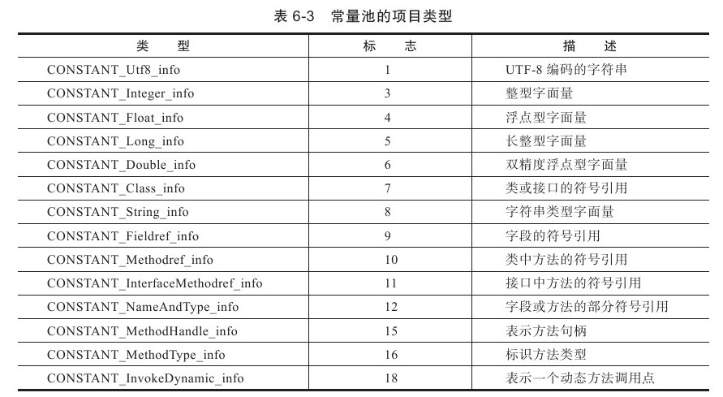


**常量池内14中常量项的结构总表结构：**

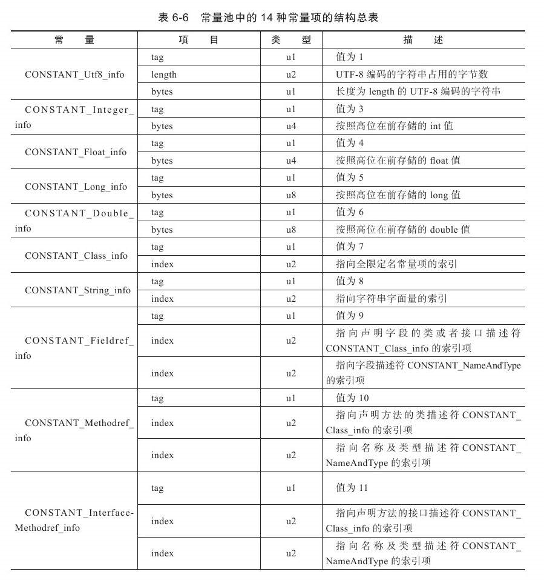

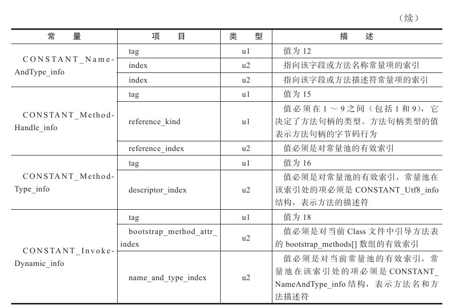


**访问标志**

在常量池结束之后，紧接着的两个字节代表着访问标志（access_flags), 这个标志用于识别一些类或者接口层次的访问信息，包括：这个Class是类还是接口，是否定义为public类型，是否定义为abstract类型，如果是类的话，是否是被声明为final等。标志位以及标记含义如下表：

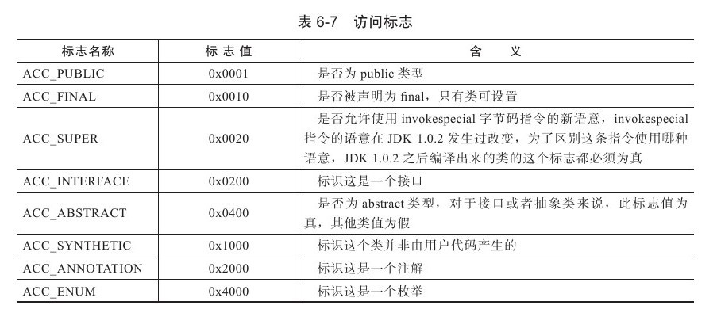


**类索引，父类索引与接口索引集合**

类索引和父类索引都是一个u2类型的数据，而接口索引集合一组u2类型的数据，Class文件中由这三项数据来确定这个类的继承关系。类索引用于确定这个类的全限定名，父类索引用于确定这类的父类的全限定名。父类索引只有一个。除了java.lang.Object之外，所有的Java类都有父类，接口索引集合就用来描述这个类实现了哪些接口，这些被实现的接口将按照implements语句，（如果这个类本身是一个接口，则应该是extends语句）后的接口顺序从左到右排列在接口索引集合中。

类索引，父类索引和接口索引集合都按照顺序排列在访问标之后，类索引和父类索引用两个u2类型的索引量表示，他们各自指向同一个类型为CONSTANT_Class_info的类描述符常量。通过CONSTANT_Class_info类型的常量中的索引值可以找到定义在CONSTANT_Utf8_info类型的常量中的全限定名字符串。


**字段表集合**

字段表结合（field_info)用于描述接口或者类中声明的变量。字段（field）包括类级变量以及实例级变量，但不包括在方法内部声明的局部变量。


**方法表**

Class文件存储格式中对方法的描述与对字段的描述几乎采用了完全一致的方式，方法表的结构如同字段表一样，依次包括了访问标志（access_flags）、名称索引（name_index）、描述符索引（descriptor_index）、属性表集合（attributes）几项，这些数据项目的含义也非常类似，仅在访问标志和属性表集合的可选项中有所区别。

​    在Java语言中，要重载一个方法，除了要与原方法具有相同的简单名称之外，还要求必须拥有一个与原方法不同的特征签名，特征签名就是一个方法中各个参数在常量池中的字段符号引用的集合，也就是因为返回值不会包含在特征签名中，因此Java语言里面无法仅仅依靠返回值的不同来对一个已有方法进行重载的。但是在Class文件格式中，特征签名的范围更大一些，只要描述符不是完全一致的两个方法也可以共存。也就是说，如果两个方法由相同的名称和特征签名，但返回值不同，那么也是可以合法共存于同一个Class文件中的。


### 2. 字节码指令 

**Java虚拟机的指令由一个字节长度的，代表着某种特定餐桌含义的数字（称为操作码， Opcode)以及跟随其后的零至多个代表此操作所需参数（称为操作数， Operands)而构成。**由于Java虚拟机采用面向操作数栈而不是寄存器的架构。所以大多数的指令都不包含操作数，只有一个操作码。

字节码指令集是一种具有鲜明特点，优劣势都很明显的指令集架构。由于限制了Java虚拟机操作码的长度为一个字节（0-255），这意味着指令集的操作码总数不能超过256条，又由于Class文件格式放弃编译后代码的操作数长度对齐，这就意味着虚拟机处理哪些超过一个字节数据的时候，不得不在运行时从字节中重建出具体数据的结构，如果要将一个16位长度的无符号整数使用两个无符号字节存储起来（将他们命名为byte1和byte2)，那他们的值应该是这样的：(byte1 << 8) |byte2 。  这种操作在某种程度上会导致解释执行字节码时损失一些性能。但这样做的优势也非常明显，放弃了操作数长度对齐，就意味着九二一省略很多填充和间隔符，用一个字节来代表操作码，也就是为了获得短小精悍的编译代码。这种追求小数据量，高传输效率的设计是Java的原始设计准则。

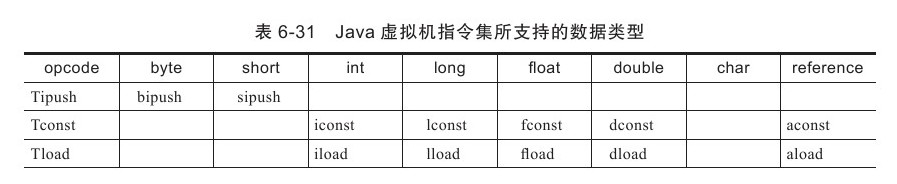

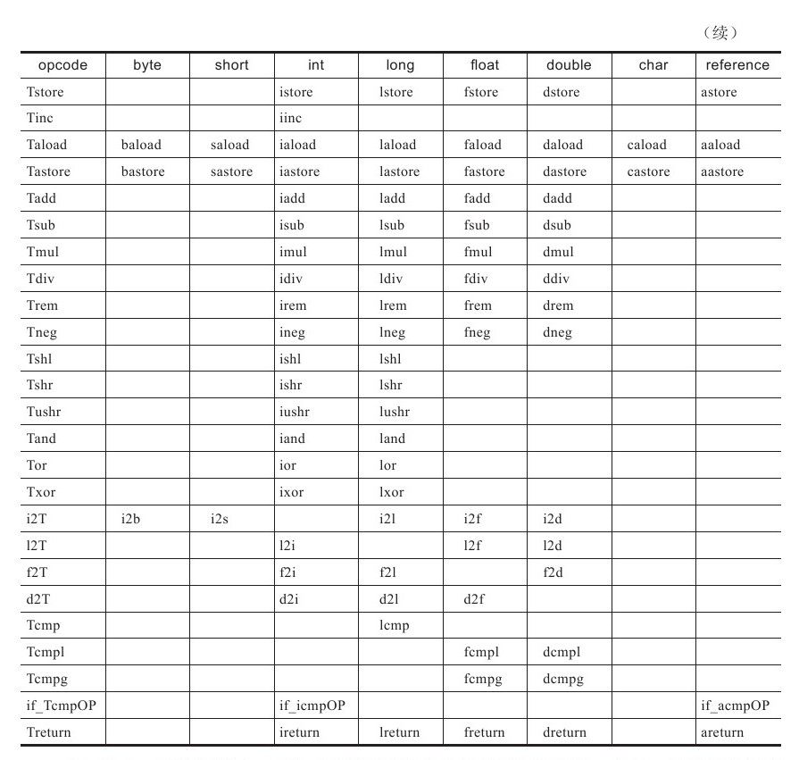

从表中可以看出，大部分的指令都没有支持整数类型byte, char和 short,  甚至没有任何指令支持boolean类。编译器会在编译器或运行期将byte 和 short 类型的数据带符号扩展，为相应的int类型数据，将 boolean 和 char 类型数据零位扩展（Zero-Extend）为相应的int类型数据，与之类似，在处理boolean, byte, short 和 char 类型的数组时，也会转换为使用对应的int类型的字节码来处理。因此，大多数对于boolean、byte、short和char类型数据的操作，实际上都是使用相应的int类型作为运算类型（Computational Type）。


**加载和存储指令**

**加载和存储指令用于将数据在栈帧中的局部变量表和操作数栈之间来回传输**，这类指令包括以下内容：

- **将一个局部变量加载到操作栈**：iload、iload_＜n＞、lload、lload_＜n＞、fload、fload_＜n＞、dload、dload_＜n＞、aload、aload_＜n＞。

- **将一个数值从操作数栈存储到局部变量表**：istore、istore_＜n＞、lstore、lstore_＜n＞、fstore、fstore_＜n＞、dstore、dstore_＜n＞、astore、astore_＜n＞。   _
- _将一个常量加载到操作数栈：bipush、sipush、ldc、ldc_w、ldc2_w、aconst_null、iconst_m1、iconst_＜i＞、lconst_＜l＞、fconst_＜f＞、dconst_＜d＞。
- 扩充局部变量表的访问索引的指令：wide。

存储数据的操作数栈和局部变量表主要就是又加载和存储指令进行操作，除此之外，还有少量指令，如访问对象的字段或者数组元素的指令也会想操作数栈传输数据。


**运算指令**

运算或者算数指令用于堆两个操作数栈上的值进行某种特定运算，并把结果重新存入到操作栈顶。大体上算数指令可以分为两种类型：对整型数据进行运算的指令和对浮点型数据进行运算的指令，无论那种算数运算，都使用Java虚拟机的数据类型，由于没有字节支持byte, short, char 和 boolean 类型的算数指令，对于这类数据的运算，应该使用操作int类型的指令代替。所有的算数指令如下：

- 加法指令： iadd,  ladd, fadd, dadd
- 减法指令：isub,  lsub, fsub, dsub
- 乘法指令： imul, lmul, fmul, dmul
- 除法指令： idiv, ldiv, fdiv, ddiv
- 求余指令：irem、lrem、frem、drem。
-   取反指令：ineg、lneg、fneg、dneg。
- 位移指令：ishl、ishr、iushr、lshl、lshr、lushr。
- 按位或指令：ior、lor。
- 按位与指令：iand、land。
- 按位异或指令：ixor、lxor。
- 局部变量自增指令：iinc。
- 比较指令：dcmpg、dcmpl、fcmpg、fcmpl、lcmp。

在把浮点数转换为整数时，Java虚拟机使用IEEE 754 标准中的向零舍入模式，这种模式的摄入结果会导致数字被截断，所有小数部分的有效直接都会被丢弃掉，向零摄入模式将在目标数字类型中选择一个最接近但是不大于原值的数字来作为最精确的舍入结果。另外，Java虚拟机在处理浮点数运算时，不会抛出任何运行时异常（这里所讲的是Java语言中的异常，请读者勿与IEEE 754规范中的浮点异常互相混淆，IEEE 754的浮点异常是一种运算信号），当一个操作产生溢出时，将会使用有符号的无穷大来表示，如果某个操作结果没有明确的数学定义的话，将会使用NaN值来表示。所有使用NaN值作为操作数的算术操作，结果都会返回NaN。

**对象创建于与访问指令**

虽然类实例和数组都是对象，但是Java虚拟机对类实例和数组的创建与操作使用了不同了字节码指令。对象创建后，就可以通过对象访问指令获取对象实例或者数组实例中的字段或者数组元素，这些指令如下：

- 创建类的指令： new
- 创建数组的指令： newarray,  anewarray, multianewarray
- 访问类字段（static字段，或者称为类变量）和实例字段的指令： getfield, putfield, getstatic, putstatic.
- 将数组元素加载到操作数栈的指令： baload, caload, saload, iaload, laload、faload、daload、aaload
- 取数组长度的指令：arraylength。
- 将一个操作数栈的值存储到数组元素中的指令：bastore、castore、sastore、iastore、fastore、dastore、aastore。
- 检查类实例类型的指令： instanceof,  checkcast.


**控制转移指令**

控制转移指令可以让Java虚拟机有条件或者无条件的从指定位置指令而不是控制指令的下一条指令执行程序，从概念模型上理解，可以认为控制转移指令就是在有条件或者无条件的修改PC寄存器的值。控制转移指令如下：

- 条件分支：ifeq, iflt, i、ifle、ifne、ifgt、ifge、ifnull、ifnonnull、if_icmpeq
- 复合条件分支：tableswitch,  lookupswitch
- 无条件分支： goto, goto_w, jsr, ret


### 3.虚拟机类加载机制


与那些在编译时需要进行链接工作的语言不同，在Java语言里面，类型的加载，连接和初始化的过程多是在程序运行期间完成的，这种策略虽然会令类加载时稍微增加一些性能开销，但是回味Java引用程序提供高度的灵活性。Java里天生可以动态扩展的语言特性就是依赖运行期的动态加载和动态连接这个特点实现的。例如，如果编写一个面向接口的应用程序，可以等到运行时再指定其实际的实现类，用户可以通过Kava预定义和自定义的类加载器，让一个本地的应用程序可以再运行时从网络或其他地方加载一个二进制流作为程序代码的一部分。


**类的生命周期**

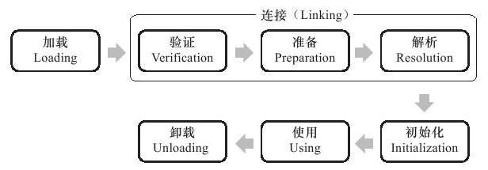

加载，验证，准备，初始化和卸载这5个阶段的顺序是确定的，类的加载过程必须按照这个顺序按部就班的开始，而解析阶段不一定：它在某些情况下可以在初始化阶段后再开始，这是为了支持Java语言的运行时绑定（也称为动态绑定）。

对于初始化阶段，虚拟机规范则是严格规定了有且只有5种情况必须立即对类进行初始化（**称为对一个类的主动引用**）：

- **使用new 关键字实例化对象时，读取或者设置一个类的静态字段（被final 修饰， 已在编译期结果放入常量池的静态字段除外）的时候，以及调用一个类的静态方法的时候。**
- **使用java.lang.reflect包的方法对类进行反射调用的时候，如果类没有进行过初始化，这需要先触发其初始化。**
- **当初始化一个类的时候，如果发现其父类还未进行初始化，则需要先触发其父类的初始化。**
- **当虚拟机启动时，用户需要执行一个要执行的主类（包含main方法的那个类），虚拟机会先初始化这个类。**

除此之外，所用引用类的方式都不会触发初始化，称为被动引用。比如 "通过数组定义来引用类，不会触发此类的初始化"  "通过子类引用父类的的静态字段，不会导致子类初始化。"

接口的加载过程和类加载过程有些不同，针对接口需要做一些特殊的说明：接口也有初始化过程，这点与类是一致的，接口不能使用 static{} 语句块儿，但编译器仍然会为接口生成 “<client> ()” 类构造器，用于初始化接口中所定义的成员变量。另外，一个接口在初始化时，并不要求其父类都已经初始化过，只有在真正使用到父类接口的时候才会初始化。


**类加载的过程**

在加载阶段，虚拟机需要完成以下3件事情：

1. 通过一个类的全限定名来获取定义此类的二进制字节流。
2. 将这个字节流所代表的静态存储结构转化为方法区的运行时的数据结构。
3. 在内存中生成一个代表这个类的java.lang.class对象，作为方法区这个类的各种数据的访问接口。

对于数组类而言，情况就有所不同，数组类本身不通过类加载器创建，它是由Java虚拟机直接创建的。但是数组类于类加载器仍然有很密切的关系，因为数组类的元素类型（指的是数组去掉所有维度的类型），最终是要靠类加载器去创建，一个数组类（简称为C）创建过程遵循以下规则：

如果数组的组件类型是引用类型，那就递归采用本节中定义的加载过程去加载这个组件类型，数组C将在加载组件类型的类加载器的类名称空间上被标识，**一个类必须与类加载器一起确定唯一性。**

如果数组的组件类型不是引用类型（如Int[]数组），Java虚拟机将会吧数组C标记为与引导类加载器相关。

数组类的可见性与它的组件类型的可见性一致，如果组件类型不是引用类型，那数组类的可见性将默认为public。


**验证**

验证是来连接阶段的有第一步，这一阶段的目的是为了确保Class字节流中包含的信息符和当前虚拟机的要求。

Class文件并不一定要求用Java源码编译而来，可以使用任何途径产生，甚至包括用十六进制编辑器直接编写来产生Class文件。在字节码语言层面上，上述Java代码无法做到的事情都是可以实现的，至少语义上是可以表达出来的。虚拟机如果不检查输入的字节流，对其完全信任的话，很可能会因为载入了有害的字节流而导致系统崩溃，所以验证是虚拟机对自身保护的一项重要工作。主要完成过以下4个阶段的检验动作：

- 文件格式验证
- 元素据验证（对字节码描述的信息进行语义分析，以确保其描述的信息符和Java语言规范。
- 字节码验证（通过数据流和控制流分析，确定程序语义是合法的，符合逻辑的。保证被校验类的方法在运行时不会做出危害虚拟机安全的事件。）
- 符号引用验证。发生在虚拟机将符号引用转化为直接引用的时候，可以看作是对类自身以外（常量池重得各种符号引用）信息进行匹配性校验，确保解析动作能够正常执行。
- 


**准备阶段**

准备阶段是正式为类变量分配内存并设置类变量初始值的阶段，这些变量所使用的内存都将在方法区中进行分配。需要强调：

1. 这时候内存分配仅仅包括类变量（被static修饰的变量），而不包括实例变量，实例变量会在对象实例化时随着对象一起分配在Java堆中。

2. 这里的初始值通常是指数据的零值。但是如果类字段的字段属性表中存在 ConstantValue属性， 那在准备阶段变量value就会被初始化为ConstantValue 属性所指的值。比如定义：

   ```java
   public static final int value = 123;
   ```

   编译时Javac会为value生成ConstantValue属性，在准备阶段就会根据ConstantValue的设置将value 赋值为123。


**解析**

**解析阶段是虚拟机将常量池内的符号引用替换为直接引用的过程**

- 符号引用（Symbolic References）：符号引用以一组符号来描述所引用的目标，符号可以是任何形式的字面量，只要使用时能无歧义的定位到目标即可。符号引用和虚拟机实现的内存布局无关，但是符号引用的字面量形式明确定义在Java虚拟机规范的class文件中。 
- 直接引用（Direct Refernces): 直接引用是直接指向目标的指针，相对偏移量或者一个能间接定位到目标的句柄，直接引用是和虚拟机实现的内存布局相关的，同一个符号引用在不同的虚拟机上翻译出来的直接引用一般不会相同。如果有了直接引用，那引用的目标必定已经在内存中存在。


**初始化** 

初始化是类加载过程的最后一步，前面的类加载过程中，除了在加载阶段用户应用程序可以通过自定义类加载器参与之外，其余动作完全由虚拟机主导和控制。初始化阶段，才开始执行类中定义的Java程序代码。：初始化阶段是执行类构造器＜clinit＞()方法的过程。＜clinit＞()方法是由编译器自动收集类中所有类变量的赋值动作和静态语句块（static{}块儿）中的语句合并产生的，编译器收集的顺序是由语句在源文件中出现的顺序所决定的。静态句块中只能访问到定义在静态语句块之前的变量，定义在它之后的变量，在前面的静态语句块可以赋值，但是不能访问。


### 4.类加载器

类加载器虽然只是用于实现类的加载动作，但他在Java程序中起到的作用却远远不限于类加载阶段。对于任意一个类，都需要由加载他的类加载器和这个类本身一同确定其在Java虚拟机中的唯一性。每一个类加载器，都有一个独特的类名称空间。即使两个类来源于同一个Class文件，被同一个虚拟机加载，只要加载他们的类加载器不同，那这两个类就必定不相等。这里所指的相等，包括代表类的Class对象的equals方法， isAssinabkeFrom()方法, isInstanc()方法的返回结果。


**双亲委派机制**

从Java虚拟机的角度来看，只存在两种不同的类加载器，一种是启动类加载器（Bootstrap  ClassLoader)，这个类加载器使用C++语言实现，是虚拟机自身的一部分，另一种就是所有其他的类加载器，这些类加载器都是有Java语言实现，独立于虚拟机外部，并且全部继承自抽象类 java.lang.ClassLoader。

从Java开发人员的角度看，类加载器还可以划分的更细致一些，绝大部分Java程序都会使用以下3种系统提供的类加载器。

1. 启动类加载器（bootstrap classLoader)。这个类将加载器负责将存放在<JAVA_HOME>\lib 目录中的，或者被 -Xbootclasspath参数所指定的路径中的，并且是虚拟机识别的类库（如rt.jar)加载到虚拟机内存中，启动类加载器无法被Java程序直接引用，用户在直接编写自定义类加载器时，如果需要把加载请求委派给引导类，直接使用null代替即可。
2. 扩展类加载器（Extension ClassLoader) ： 这个类加载器负责加载被Java.ext.dir系统变量所指定的路径中的所有类库，开发者可以直接使用扩展类加载器。
3. 应用程序类加载器（Application ClassLoader）： 这个类加载器是ClassLoader中的 getSystemClassLoader()方法的返回值，所以一般也称它为系统类价值啊其，他读者加载用户类路径上（ClassPath)上所定义的类。一般情况下这个就是程序中默认的类加载器。

　**类加载器双亲委派模型**

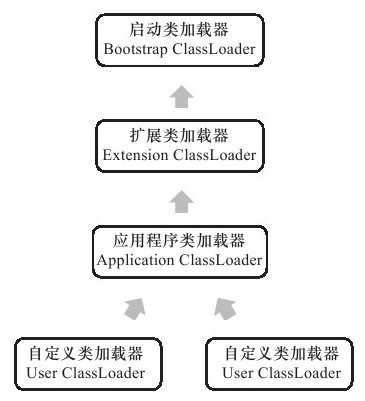

双亲委派机制要求除了顶层的启动类加载器之外，其余的类加载器都应该由自己的父类加载器。这里的类加载器之间的赋值关系一般不会以继承关系，而是使用组合（Composition)关系来服用父加载器的代码。

双亲委派机制的工作过程： **如果一个类加载器收到类加载的请求，他首先会把请求委派给父类加载器去完成，每一个层次的列加载器都是如此，因此所有的加载请求最终都应该传传送到顶层的地冬雷加载器中，只有当父类加载器反馈自己无法完成这个加载请求（搜索范围内未找到所需的类）时，子加载器才会尝试自己去加载。**这样做好处是Java类随着它的类加载器一起具备了一种带有优先级的层次关系。**当你尝试去编写一个与rt.jar类库种已有类重名的Java类，会发现可以正常编译，但永远无法被加载运行。**


双亲委派的例外情况：

1. 模型自身存在缺陷，双亲卫片很好的解决了各个类加载器的基础类的统一问题。但是**无法解决基础类想要回调用户代码的问题**。一个典型的例子便是JNDI服务，JNDI现在已经是Java的标准服务，它的代码由启动类加载器去加载（在JDK 1.3时放进去的rt.jar），但JNDI的目的就是对资源进行集中管理和查找，它需要调用由独立厂商实现并部署在应用程序的ClassPath下的JNDI接口提供者（SPI,Service Provider Interface）的代码，但启动类加载器不可能“认识”这些代码。

   为了解决这个问题，引入一个设计：**线程上下文类加载器**（Thread Context ClassLoader）。这个类加载器可以通过java,lang.Thread类的setContextClassLoader()方法进行设置，如果创建线程的时候还未设置，它将会从父线程中继承一个，如果在应用程序的全局范围内都没有设置过，则默认为应用程序类加载器。有了它，就可以使父类加载器请求子类加载器去完成类加载动作。

2. 用户堆程序动态性的追求而导致。比如代码的热部署等。


### 5.虚拟机字节码执行引擎

**执行引擎是虚拟机最核心的组成部件之一，虚拟机是一个相对于物理机的概念。这两种机器都具有代码执行能力，其区别是物理机的执行引擎是直接建立在处理器，硬件，指令集和操作系统层面上的。而虚拟机的执行引擎这是自己实现的，因此可以自行订制指令集与执行引擎的结构体系，并且能够执行那些不被硬件直接支持的指令集格式。**

从外观上看起来，所有的Java虚拟机的执行引擎都是一致的：输入的是字节码文件，处理过程是字节码解析的等效过程，输出的是执行结果。


#### **1.运行时栈帧结构**

每一个栈帧都包含了局部变量表，操作数栈，动态连接，方法返回地址和一些额外的附加信息，在编译程序代码的时候，栈帧种需要多大的局部变量表，多深的操作数栈，都已经是完全确定的了，因此一个栈帧需要分配多少内存，不会受到程序运行期变量数据影响，仅取决于虚拟机实现。

一个线程中的方法的调用链可能会很长，很多方法同时处于执行状态。对于执行引擎来说，在活动线程中，只有处于栈顶的栈帧才是有效的，称为栈顶栈帧（Current Stack Frame), 与这个栈帧相关连的方法称为当前方法（Current Method）。在概念模型上，典型的栈帧结构如图：

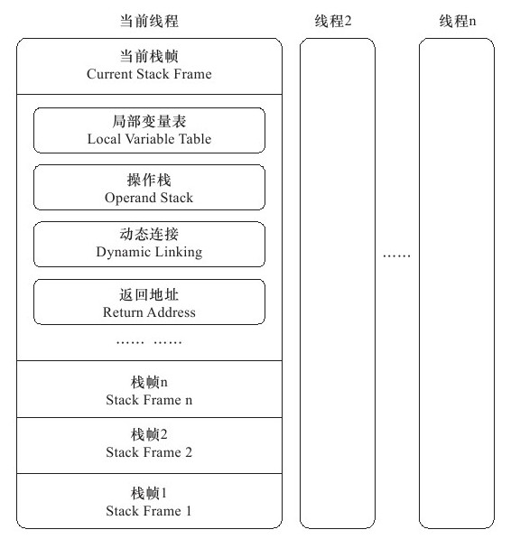


**局部变量表**

局部变量表是一组变量值存储空间，用于存放方法参数和方法内部定义的局部变量。局部变量表以变量曹（Slot）位最小单位。一个Slot可以存放一个32位以内的数据类型，Java种占用32位以内的数据类型有： boolean,  byte, char, short,  int, float, reference 和 returnAddress。 虚拟机通过索引定位的方式使用局部变量表，范围是0到最大的slot数量。如果访问的是32位数据类型的变量，索引n就代表了使用第n个Slot，如果是64位数据类型的变量，则说明会同时使用n和n+1两个Slot。对于两个相邻的共同存放一个64位数据的两个Slot，不允许采用任何方式单独访问其中的某一个。

为了尽可能节省栈帧空间，局部变量表的Slot是可以重用的，方法体种定义的变量，其作用于并不一定会覆盖整个方法体，如果当前字节码PC计数器的值已经超过某个变量的作用域，那么这个变量的slot就可以交给其他变量使用。不过这样在某些情况下会直接影响到系统的垃圾回收行为。


**操作数栈**

操作数栈（operand Stack)也称为操作栈，他是一个后入先出（LIFO）栈，同局部变量表一样，操作数栈的最大深度也是在编译的时候写入到Code 属性的max_stack数据项中。

操作数栈中元素的数据类型必须域字节码指令的序列严格匹配，在编译程序代码的时候，编译器要严格保证这一点。以idd指令为例，它用于整型数加法，它在执行时，最接近栈顶的两个与那束的数据元素类型必须为int类型。

另外在概念模型中，两个栈帧作为虚拟机栈的元素，是完全相互独立的。但是大部分虚拟机在实现时会做一些优化处理。令两个栈帧一部分重叠，这样进行方法调用时就可以共用一部分数据，无需进行额外的参数复制传递。

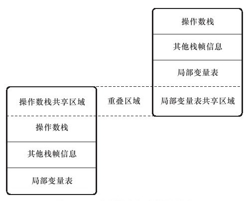


**方法返回地址**

一般来说，方法正常退出时，调用者的PC计数器的值可以作为返回值，栈帧中很可能会保存这个计数器值。而方法异常退出时，返回地址是要通过异常处理器来确定的。

方法退出的过程实际上就等同于把当前栈出栈，因此退出时可能执行的操作有：**恢复上层方法的局部变量表和操作数栈，把返回值（有的话）压入调用者栈帧的操作数栈中，调整PC计数器的值以指向方法调用指令后面的一条指令。**


#### 2. 方法调用

**一切方法调用在Class文件里面存储的都是符号引用，而不是方法在实际运行时内存布局中的入口地址（直接引用），这个特性给Java带来了更强大的动态扩展能力，但也使得Java方法调用过程变得相对复杂起来，需要到类加载期间，甚至运行期间才能确定目标方法的直接引用。**

所有方法调用中的目标方法在Class文件都是一个常量池中符号引用，在类加载的解析阶段，会将其中的一部份符号引用转化为直接引用，这种解析能成立的前提是：**方法在程序真正运行之前就有一个可确定的调用版本，并且这个方法的调用版本在运行期是不可改变的。Java中符和“编译器可知，运行期不可变”这个要求的方法，主要包括静态方法和私有方法两大类。前者与类型直接相关联，后者在外部不可被访问，这两种方法各自的特点决定了他们都不可能通过继承或者别的方式重写其他版本，因此都适合在类加载阶段进行解析。**

只要能被**invokestatic**和**invokespecial**指令调用的方法，都可以在解析阶段中确定唯一的调用版本，符合这个条件的有静态方法、私有方法、实例构造器、父类方法4类，它们在类加载的时候就会把符号引用解析为该方法的直接引用。这些方法可以称为非虚方法，与之相反，其他方法称为虚方法（除去final方法）。


#### 3.分派

解析调用一定是静态的过程，在编译器就完全确定，在类装载解析阶段就会把设计的符号引用全部转化为可确定的直接引用，不会延迟到运行期完成，而分派（Dispatch)调用则可能是静态的，也可能是动态的，跟风依据的宗量数可分为单分派和多分派。


**静态分派**

**所有依赖静态类型来定位方法执行版本的分派动作称为静态分派。典型应用是方法重载。静态分派发生在编译阶段，因此确定静态分派的动作实际上不是由虚拟机来执行的。另外编译器虽然能确定出方法的重载版本，但是在很多情况下这个重载版本并不是唯一的。往往只能确定一个更合适的版本。**


**动态分派**

动态分派和多态性的另外一个重要体现--重写（Override)有着很密切的关联。


### 6.动态类型语言支持


**动态类型语言的关键特征是它的类型检查的主体过程是在运行期而不是编译期。**比如：Clojure, Erlang, Groovy, JS, Lisp, Lua, PHP, Python, Ruby, Smaltalk。相对的，在编译器进行类型检查过程的语言（C++和Java)就是最常用的静态类型语言。

在静态语言中，符号引用包含了此方法定义在那个具体类型之中，方法的名字以及参数顺序，参数类型和方法返回值等信息，通过此符号引用，虚拟机可以翻译出这个方法的直接引用。而在JS等动态类型语言中，变量本身是没有类型的，变量的值才具有类型，编译时最多只能确定方法名称，参数，返回值等信息，而不会去确定方法所在的具体类型。 **“变量无类型而变量值才有类型”是动态语言的一个重要特征。**


**Java语言没有办单独的把一个函数(假设为排序)作为参数进行传递，普遍的做法是设计一个带有compare()方法的Comparator接口， 以实现了这个接口的对象作为参数，例如 Collections.sort()就是这样定义的：**

```java
void sort (List list, Comparator c)
```

在拥有Method Handle之后，Java语言也可以拥有类似函数指针或者委托的方法别名的工具了。


### 7.基于栈的字节码解释执行引擎

编译过程如下：

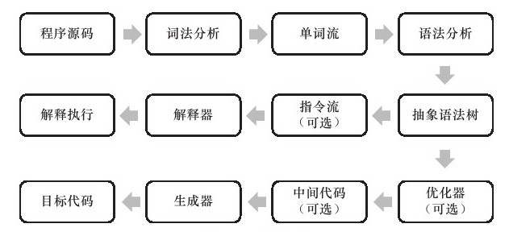

Java语言中，Java 编译器完成了程序代码经过了词法分析，语法分析到抽象语法树，再遍历语法树生成线性的字节码指令流的过程。因为这一部分动作是在Java虚拟机之外进行的，而解释器在虚拟机内部，所以Java程序的编译就是半独立的实现。

**Java编译器输出的指令流，基本上是一种基于栈的指令集架构（Instruct Set Architecture), 指令流中的指令大部分都是零地址指令，他们依赖操作数栈进行工作，与之相对的另外一套常用的指令集架构就是基于寄存器的指令集。**

举个最简单的例子，分别使用这两种指令集计算“1+1”的结果，

- 基于栈的指令集会是这样子的：

  iconst_1

  iconst_1

  iadd

  istore_0

  两条iconst_1指令连续吧两个常量1压入栈后，iadd指令把栈顶的两个字取出，相加，然后把结果放入栈顶，最后istore_0把栈顶的值放入局部变量表的第0个Slot中。

- 基于寄存器指令：

  mov eax,1

  add eax, 1

  mov指令把EAX寄存器的值设为1，然后add指令再把这个值加1，结果就保存在EAX寄存器中。

基于栈的指令集的主要优点是可移植，寄存器由硬件直接提供，程序直接依赖这些硬件寄存器则不可避免的受到硬件的约束。栈架构指令集的主要缺点是执行速度相对来说会稍慢一些。虽然栈架构指令集的代码非常紧凑，但是完成相同功能所需的指令数量一般回避寄存架构多，因为出栈，入栈本身就产生相当多的指令数量，更重要的是，栈在内存中，内存始终是执行速度的瓶颈。尽管虚拟机可以采取栈顶缓存的手段，把最常用的操作银色到寄存中避免直接访问内存。但仍是治标不治本。

   


## 3. 并发


### 1. Java内存结构与线程


处理器、高速缓存、主内存间的交互关系：

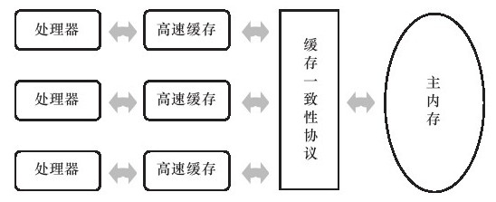

基于高速缓存的存储交互很好的解决了处理器与内存的速度矛盾，但是也为计算机系统带来了更高的复杂度，因为它引入了一个新的问题：缓存一致性（Cache Coherence)。在多处理器系统中，每个处理器都有自己的高速缓存，而他们又共享同一主内存（main memory),当多个处理器的运算任务都涉及同一块儿内存时，将导致各自的缓存数据可能不一致，最后同步到主内存时将以谁的缓存数据为主呢？这时候需要缓存一致性协议。


**主内存和工作内存**

Java内存模型模型的主要目标是定义程序中各个变量的访问规则，即在虚拟机中将变量存储到内存和从内存中取出变量这样的底层细节，这里指的变量包括了**实例字段，静态字段和构成数组对象的元素**，但不包括局部变量与方法参数，因为后者是线程私有的，不会被共享。

Java内存模型规定了所有的变量都存储在主内存（Main Memory)中（类比物理硬件的主内存），每条线程还有自己的工作内存(Working Memory,可以类比前面的处理器告诉缓存)。线程工作内存中保存了被该线程使用到的变量的主内存副本拷贝，线程对变量的操作必须在工作内存中进行，而不能直接读写主内存中的变量。不同线程之间也无法直接访问对方工作内存中的变量。线程间变量值的传递需要通过主内存来完成。，那从变量、主内存、工作内存的定义来看，主内存主要对应于Java堆中的对象实例数据部分[[6\]](ms-local-stream://EpubReader_FBD2370A598882A5B169F2FCD6A6A223C6F14B559C5281A3D06A5185DBFB9C/Content/OEBPS/Text/part0181.xhtml#ch6-back)，而工作内存则对应于虚拟机栈中的部分区域。

关于主内存与工作内存之间的交互协议，Java内存模型中定义了以下8中操作来完成，虚拟机必须保证下面提及的每一个操作都是原子的，不可再分的。

- lock(锁定)：作用于主内存的变量，它把一个变量标识为一条线程独占的状态。
- unlock(解锁)：作用于主内存的变量，将处于锁定状态的变量释放出来，释放后的变量才能被其他线程锁定。
- read： 作用于主内存的变量，将一个变量的值从主内存传输到线程的工作内存中，以便随后的load动作使用。
- load：作用于工作内存的变量，它把read操作从主内存中的得到的变量hi在放入到工作内存中的变量副本中。
- use：作用于工作内存的变量，它把工作内存中一个变量的值传递给执行引擎，每当虚拟机遇到一个需要使用到变量的值的字节码指令时将会执行这个操作。
- assign：作用于工作内存的变量，它把一个从执行引擎中接受到的值赋给工作内存的变量，每当虚拟机遇到一个给变量赋值的字节码指令时执行这个操作。
- store：作于工作内存的变量，它把工作内存中的一个变量的值传送到主内存中，以便随后的write操作使用。
- write：作用域主内存的变量，它把store操作从工作内存中的大哦的值放入发主内存的变量中。

如果呀把变量从主内存复制到工作内存，那就顺序执行read和load，将变量返回到主内存中，顺序执行 store和write。

Java内存模型还规定了在执行上述8种基本操作时必须满足如下规则：

- 不允许read和load,   store和write操作之一单独出现。
- 不允许一个线程丢弃它最近的assign操作，即变量在工作内存种改变了之后必须把改变化同步回主内存。
- 不允许一个线程无原因的（没有发生任何assign操作）把数据从线程的工作内存同步回主内存中。
- 对一个变量实施use, store操作之前，必须限制性过了assgin和load操作。
- 一个变量在同一时刻只允许一条线程对其进行lock操作，但lock操作可以被同一条线程重复执行多次，多次执行lock后，只有执行相同次数的unlock操作，变量才会解锁。
- 如果对一个变量执行lock操作，那将会清空工作内存中此变量的值，在执行引擎使用之前，需要重新执行load或者assign操作初始化值。
- 对一个变量执行unlock操作之前，必须先把此变量同步回主内存中。


**volatile型变量**

当一个变量被定义为volatile之后，则保证了此变量对所有线程的可见性。这里的“可见性”是指当一条线程修改了这个变量的值，新值对于其他线程来说是可以立即得知的。而普通变量不能做到这一点，普通变量的值在线程间传递均需要通过主内存来完成。

由于volatile变量只能保证可变性，在不符和以下两条规则的运算场景中。我们仍然要通过加锁（使用 synchronized或者 java.util.concurrent),我们仍然需要通过加锁来保证原子性。

- 运算结果并不依赖变量的当前值，或者能够确保只有单一的线程修改变量的值，
- 变量不需要与其他的状态变量共同参与不变约束。

使用volatile变量的第二个语义是禁止指令重排序优化，普通的变量仅仅会保证在该方法的执行过程中所有依赖赋值结果的地方都能获取到正确的结果，而不能保证变量赋值操作的顺序与程序代码中的执行顺序一致。因为在一个线程的方法执行过程中无法感知到这点，这也就是Java内存模型中描述的所谓的“线程内表现为串行的语义“

那为何说它禁止指令重排序呢？从硬件架构上讲，指令重排序是指CPU采用了允许将多条指令不按程序规定的顺序分开发送给各相应电路单元处理。但并不是说指令任意重排，CPU需要能正确处理指令依赖情况以保障程序能得出正确的执行结果。


**原子性，可见性与有序性**

Java内存模型是围绕着并发过程中如何处理原子性，可见性和有序性这3个特征来建立的。

- 原子性： Java内存模型直接定义了8种原子性变量操作。基本的数据类型的访问读写是具备原子性的。如果需要更大范围内的原子性保证，Java内存模型还提供了lock和unlock操作。

- 可见性（Visibility）：可见性是指当一个线程修改了共享变量的值，其他线程能够立即得知这个修改。**Java内存模型是通过在变量修改后将新值同步回主内存，在变量读取前从主内存刷新变量值这种依赖主内存作为传递媒介的方式来实现可见性的**，无论是普通变量还是volatile变量都是如此，普通变量与volatile变量的区别是，**volatile的特殊规则保证了新值能立即同步到主内存，以及每次使用前立即从主内存刷新。因此，可以说volatile保证了多线程操作时变量的可见性，而普通变量则不能保证这一点。**

  Java还有另外两个关键字可以实现可见性。synchronized和final。final的可见性是指： 被final修饰的字段在构造器中一旦初始化完成，并且构造器没有把this 的引用传递出去，那再其他线程中就能看到filnal字段的值。

- 有序性。Java程序中天然的有序性可以总结为一句话： 如果在本线程内观察，所有操作都是有序的。在一个线程中观察另一线程，那所有操作都是无序的。前半句指的是”线程内表现为串行的语义“， 后半句指”指令重排现象“和”工作内容与主内存同步延迟“现象。


**先行发生原则**

下面是Java内存模型下一些“天然的”先行发生关系，这些先行发生关系无须任何同步器协助就已经存在，可以在编码中直接使用。如果两个操作之间的关系不在此列，并且无法从下列规则推导出来的话，它们就没有顺序性保障，虚拟机可以对它们随意地进行重排序。

程序次序规则（Program Order Rule）：在一个线程内，按照程序代码顺序，书写在前面的操作先行发生于书写在后面的操作。准确地说，应该是控制流顺序而不是程序代码顺序，因为要考虑分支、循环等结构。    

管程锁定规则（Monitor Lock Rule）：一个unlock操作先行发生于后面对同一个锁的lock操作。这里必须强调的是同一个锁，而“后面”是指时间上的先后顺序。    

volatile变量规则（Volatile Variable Rule）：对一个volatile变量的写操作先行发生于后面对这个变量的读操作，这里的“后面”同样是指时间上的先后顺序。    

线程启动规则（Thread Start Rule）：Thread对象的start()方法先行发生于此线程的每一个动作

线程终止规则（Thread Termination Rule）：线程中的所有操作都先行发生于对此线程的终止检测，我们可以通过Thread.join()方法结束、Thread.isAlive()的返回值等手段检测到线程已经终止执行。

对象终结规则（Finalizer Rule）：一个对象的初始化完成（构造函数执行结束）先行发生于它的finalize()方法的开始。

传递性（Transitivity）：如果操作A先行发生于操作B，操作B先行发生于操作C，那就可以得出操作A先行发生于操作C的结论。


### 2.Java与线程

线程是比进程更轻量级的调度执行单位，线程的引入，可以把一个进程的资源分配和执行调度分开，各个线程既可以共享进行资源（内存地址，文件IO），又可以独立调度（线程是CPU调度的基本单位）。Java语言提供了在不同硬件和操作系统平台下对线程操作的统一处理，每个已经执行start()且还未结束的java.lang.Thread类的实例就代表了一个线程。Thread类的所有关键方法都声明为native。**在Java中，一个native方法往往意味着这个方法没有使用或无法使用平台无关的手段来实现。**

实现线程主要有3种方式：**使用内核线程实现、使用用户线程实现和使用用户线程加轻量级进程混合实现。**

1. 使用内核线程实现。程序一般不会直接去使用内核线程，而是去使用内核线程的一种高级接口——轻量级进程（Light Weight Process,LWP），轻量级进程就是我们通常意义上所讲的线程。
2. 使用用户线程实现。从广义上来讲，一个线程只要不是内核线程，就可以认为是用户线程（User Thread), 因此，从这个定义上来讲，轻量级进行也属于用户线程。狭义的用户线程指的是完全建立在用户空间的线程库上，系统内核不能感知线程存在的实现。用户线程的建立，同步，销毁和调度完全在用户态完成，不需要内核的帮助，更高效，也可以支持更大规模的线程数量。劣势在于，所有的现成的操作都需要自己实现，异常复杂，现在几乎没有程序会使用用户线程。
3. 使用用户线程加轻量级进程混合实现。。在这种混合实现下，既存在用户线程，也存在轻量级进程。用户线程还是完全建立在用户空间中，因此用户线程的创建、切换、析构等操作依然廉价，并且可以支持大规模的用户线程并发。而操作系统提供支持的轻量级进程则作为用户线程和内核线程之间的桥梁，这样可以使用内核提供的线程调度功能及处理器映射，并且用户线程的系统调用要通过轻量级线程来完成，大大降低了整个进程被完全阻塞的风险。


**Java线程调度**

线程调度是指系统为线程分配处理器使用权的过程，主要调度方式有两种，分别是协同式线程调度（Cooperative Threads-Scheduling)和抢占式线程调度。

如果使用协同式调度的多线程，线程的执行时间有线程本身来控制，线程把自己工作执行完了，要主动通知系统切换到另一个线程上。协同式多线程的一个最大好处是现实简单。切换操作对线程自己是可知的，所以没有线程同步的问题。它的坏处也很明显，线程执行的时间不可控，一个线程出现问题，那整个程序就一直阻塞在那里。

抢占式调度的多线程系统，每个线程由系统分配执行时间，线程的切换不由线程本身来决定。这种线程调度下，线程的执行时间可控，不会由线程阻塞进程的问题。Java使用的是抢占式调度。


Java定义了5种线程状态，在任意一个时间点，一个线程只能有且只有一种状态，这5种状态分别如下：

- 新键（new): 创建后尚未启动。
- 运行（runnable）： 包括了操作系统线程状态种的Runnin和Ready, 也就是处于此状态的线程有可能正在执行，也有可能等待着CPU为它分配执行时间。
- 无限期等待（Waiting):  处于这种状态的线程不会被分配CPU执行时间，他们要等待被其他线程显式的唤醒。以下方法会让线程陷入无期限的等待状态：
  - 没有设置Timeout参数的 Object,wait()方法。
  - 没有设置Timeout参数的Thread.join()方法。
  - LockSupport.park()方法。
- 期限等待（Timed Waiting), 处于这种状态的线程也不会被分配CPU执行时间，不过无须等待被其他线程显式地唤醒，在一定时间之后它们会由系统自动唤醒。以下方法会让线程进入限期等待状
  - Thread.sleep()方法。
  - 设置Timeout参数的 Object,wait()方法。
  - 设置Timeout参数的Thread.join()方法。
- 阻塞（Blocked）： 线程被阻塞了，“阻塞状态” 与 “等待状态”的区别是，“阻塞状态”在等待着获取一个排他锁，这个时间将在另外一个线程放弃这个锁的时候发生。而等待状态则是在等待一算时间后，或者唤醒动作的发生，在程序等待进入同步区域的时候，线程将进入到这个状态。
- 结束（Terminated）： 已终止线程的线程状态，线程已结束执行。

线程间的状态转换。

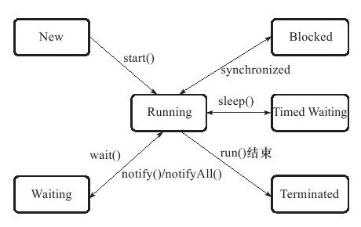


**线程安全**： **当多个线程访问一个对象时，如果不用考虑这些线程在运行时环境下的调度和交替执行，也不需要进行额外的同步，或者在调用方进行任何其他的协同操作，调用这个对象的行为都可以获得正确的结果，那么这个对象就是线程安全的。**


按照线程安全的“安全程度”由强至弱来排序，我们[[1\]](ms-local-stream://EpubReader_FBD2370A598882A5B169F2FCD6A6A223C6F14B559C5281A3D06A5185DBFB9C/Content/OEBPS/Text/part0192.xhtml#ch1-back)可以将Java语言中各种操作共享的数据分为以下5类**：不可变、绝对线程安全、相对线程安全、线程兼容和线程对立。**

- 不可变。不可变对象一定是线程安全的，无论是对象的方法实现还是方法调用者，都不需要采取任何的线程安全保障措施。保证对象行为不影响自己状态的途径有很多，其中最简单的就是把对象种带有状态的变量都声明为final。
- 绝对线程安全。符和上面线程安全的定义。在Java API中标注自己是线程安全的类，大多数都不是绝对的线程安全。
- 相对线程安全。通常意义讲的线程安全，它需要保证对这个对象单独的操作是线程安全的，我们在调用的时候不需要做额外的保障措施，但是对于一些特定顺序的连续调用，就可能需要调用端调用额外的同步手段来保证定调用的正确I性。在Java中，大部分的线程安全类都属于这种类型，Vector, HashTable, Collections的synchronizedCollection()方法包装的集合。
- 线程兼容。 **是指线程本身并不是线程安全的，到那时可以通过在调用杜纳正确的使用同步手段来保证对象在并发环境中可以安全的使用，Java API中的大部分类都是属于线程兼容的，如，与前面vector和HashTable对应的ArrayList和HashMap。**
- 线程对立。指无论调用端是否采取了同步措施，都无法在多线程环境中并发使用的代码。一个线程对立的例子是Thread类的suspend()和resume()方法，如果有两个线程同时持有一个线程对象，一个尝试去中断线程，另一个尝试去恢复线程，如果并发进行的话，无论调用时是否进行了同步，目标线程都是存在死锁风险的，如果suspend()中断的线程就是即将要执行resume()的那个线程，那就肯定要产生死锁了。也正是由于这个原因，suspend()和resume()方法已经被JDK声明废弃（@Deprecated）了。


### 3.线程安全的实现方法


**1.互斥同步**

同步是指在多个线程并发访问共享数据时，保证共享数据在同一个时刻只被一个（或者是一些，使用信号量的时候）线程使用**。而互斥是实现的同步的一种手段，临界区，互斥量和信息量都是主要的互斥实现方式。**

**在Java中最基本的互斥同步手段就是synchronized关键字。**synchronized关键字经过编译后，会在同步块儿的前后分别形成monitorenter和 monitorexit这两个字节码指令，这两个字节码指令都需要一个reference类型的参数来指明要锁定的和解锁的对象。根据虚拟机规范的要求，在执行monitorenter指令时，首先要尝试获取对象的锁，如果这个对象没有被锁定，或者当前线程已经拥有了那个对象的锁，把锁的计数器加一，相应的，在执行monitorexit指令时会将锁计数器减1，当计数器为0的时候，锁就被释放，如果获取对象锁失败，那当前线程就要阻塞等待，直到对象所被另外一个线程释放为止。

Java的线程是映射到操作系统的原生线程之上的，如果要阻塞或唤醒一个线程，都需要操作系统来帮忙完成，这就需要从用户态转换到核心态中，因此状态转换需要耗费很多的处理器时间。对于码简单的同步块（如被synchronized修饰的getter()或setter()方法），状态转换消耗的时间有可能比用户代码执行的时间还要长**。synchronized是Java语言中一个重量级（Heavyweight）的操作，有经验的程序员都会在确实必要的情况下才使用这种操作。**


公平锁是指多个线程在等待同一个锁时，必须按照申请锁的时间顺序来依次获得锁；而非公平锁则不保证这一点，在锁被释放时，任何一个等待锁的线程都有机会获得锁。synchronized中的锁是非公平的，ReentrantLock默认情况下也是非公平的，但可以通过带布尔值的构造函数要求使用公平锁。


**非阻塞同步**

互斥同步最主要的问题就是进行此线程阻塞和唤醒所带来的性能问题，因此这种同步也被称为阻塞同步（Blocking Synchronized)。从处理问题的方式来讲，属于一种悲观的并发策略。

非阻塞同步是一个基于冲突检测的乐观并发策略，通俗的讲，就是先进行操作，如果没有其他线程争用共享数据，那就成功了，如果有冲突，那再采取其他的补偿措施（最常见的是不断重试，直到成功），这种乐观的并发策略的许多实现并不需要把线程挂起。**这个策略要操作和冲突检测这两个步骤具备原子性，靠什么来保证呢？需要硬件指令来完成。**


**无同步方案**

可重入代码有一些共同的特征，例如不依赖存储在堆上的数据和公用的系统资源、用到的状态量都由参数中传入、不调用非可重入的方法等。通过一个简单的原则来判断代码是否具备可重入性：如果一个方法，它的返回结果是可以预测的，只要输入了相同的数据，就都能返回相同的结果，那它就满足可重入性的要求，当然也就是线程安全的。

线程本地存储（Thread Local Storage）：如果一段代码中所需要的数据必须与其他代码共享，那就看看这些共享数据的代码是否能保证在同一个线程中执行？如果能保证，我们就可以把共享数据的可见范围限制在同一个线程之内，这样，无须同步也能保证线程之间不出现数据争用的问题。符和这种特点的应用并不少见，大部分使用消费队列的架构模式，都会讲偿命的消费过程尽量在一个线程种消费完。这种处理方式的广泛使用使得很多web服务端的应用都可以使用线程本地存储来解决线程安全问题。


### 4.锁优化


**自旋锁与自适应自旋**

自旋等待不能代替阻塞，且先不说对处理器数量的要求，自选等待本身虽然避免了线程切换的开销，但它是要占用处理器时间的，如果锁被占用的时间很短，自旋的效果会非常好，反之，如果锁被占用时间很长，那自旋的线程只会白白处理处理器资源，而不会做任何工作，会带来资源上的浪费，因此，自旋等待的时间必须要有一定的限度，如果自选超过了限定的次数仍然没有成功获得锁，就应该使用传统的方式去挂起线程了，默认值是10次，用户可以使用参数 -XX:PreBlockSpin来更改。

在JDK1.6种引入了自适应的自旋锁，意味着自旋的时间不在固定了，而是由前一次在同一个锁上的自旋时间以及所的拥有者的状态来决定。如果在同一个锁对象上自旋等待刚刚成功获得过锁，并且持有锁的线程正在运行中，那么虚拟机就会认为这次自旋也很有可能再次成功，进而它将允许自旋等待持续相对更长的时间，比如100个循环。


**锁消除**

锁消除是指在虚拟机即时编译器运行时，对一些代码上要求同步，但是被检测到不可能存在共享数据竞争的锁进行消除。如果判断在一段代码中，堆上所有的数据都不会逃逸出去从而被其他线程访问到，码就可以把他们当作栈上的数据，认为他们是线程私有的，同步加锁自然就无法进行。


**锁粗化**

原则上，在编写代码时，总是推荐将同步块儿的作用范围限制的尽量小，只在共享数据的实际作用域种才进行同步，这样是为了使得需要同步的操作数尽可能变小。 **如果虚拟机探测到有这样一串零碎的操作都对同一个对象加锁，将会把加锁同步的范围扩展（粗化）到整个序列的外部。**


**轻量级锁**

1.6之中加入的新型锁机制，它名字中的“轻量级”是相对于使用操作系统互斥量来实现的传统锁而言的，因此传统的锁机制就称为“重量级”锁。轻量级锁的本意是在没有多线程竞争的前提下，减少传统的重量级锁使用操作系统使用互斥量产生的性能消耗。 

 在代码进入同步块的时候，如果此同步对象没有被锁定（锁标志位为“01”状态），虚拟机首先将在当前线程的栈帧中建立一个名为锁记录（Lock Record）的空间，用于存储锁对象目前的Mark Word的拷贝（官方把这份拷贝加了一个Displaced前缀，即Displaced Mark Word），虚拟机将使用CAS操作尝试将对象的Mark Word更新为指向Lock Record的指针。如果这个更新动作成功了，那么这个线程就拥有了该对象的锁，并且对象Mark Word的锁标志位（Mark Word的最后2bit）将转变为“00”，即表示此对象处于轻量级锁定状态。


**偏向锁**

偏向锁也是jdk1.6引入的一项优化，他的目的是消除数据在无竞争情况下的同步原语，进一步提高程序的运行性能。如果说轻量级锁是在无竞争的情况下使用CAS操作去消除同步使用的互斥量，那偏向锁就是在无竞争的情况下把整个同步都消除掉。

偏向锁的”偏“就是偏心的意思，它的意思是这个锁会偏向于第一个获得它的线程，如果在接下来的执行过程中，该说没有被其他的线程获取，则持有偏向锁的线程将永远不需要再进行同步。

当有另外一个线程去尝试获取这个锁时，偏向模式就宣告结束。根据锁对象目前是否处于被锁定的状态，撤销偏向（Revoke Bias）后恢复到未锁定（标志位为“01”）或轻量级锁定（标志位为“00”）的状态，后续的同步操作就如上面介绍的轻量级锁那样执行。偏向锁、轻量级锁的状态转化及对象Mark Word的关系如

锁状态和Mark Word状态转换的关系图。

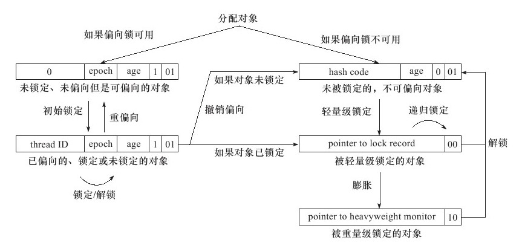


