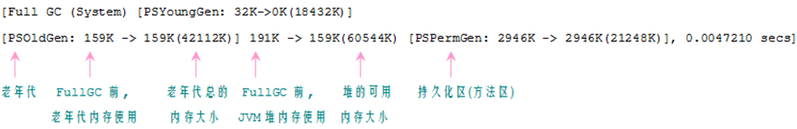
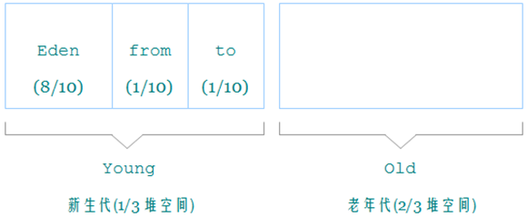

参考： **深入理解Java虚拟机：JVM高级特性与最佳实践（第2版）**

**Java的优势**：摆脱了硬件平台的约束。提供了一个相对安全的内存管理和访问机制，避免了绝大部分的内存泄漏和指针越界问题。它实现了热点代码检测和运行时编译及优化，这使得Java应用能随着运行时间的增加而获得更高的性能。它有一套完善的应用程序接口。

**HotSpot VM 的热点代码探测技术**：它可以通过执行计数器找出最具有编译价值的代码，然后通知JIT编译器以方法为单位进行编译，如果一个方法被频繁调用，或者方法种有效循环次数很多，将会分别触发标准编译和（栈上替换）编译动作，通过编译器与解释器恰当的协同工作，可以在最优化程序响应时间和最佳执行性能种取得平衡。

## 1 自动内存管理机制

### 1 Java 内存区域与内存溢出异常

Java运行时数据区：

- **程序计数器（program Counter Register）**
- **堆（Heap）**
- **方法区（Method Area)**
- **虚拟机栈（VM Stack）**
- **本地方法栈（Native Method Stack)**

**程序计数器**： 

是一块较小的内存空间，他可以看作是当前线程所执行的字节码的行号指示器。在虚拟机的概念模型中，字节码解释器工作时就是要通过改变这个计数器的值来选取下一条需要执行的字节码 指令， 分支，循环，跳转，异常处理，线程恢复等等基础功能都需要依赖这个计数器。

**由于Java虚拟机的多线程是通过线程轮流切换并分配处理器执行时间的方式来实现的，任何一个时刻都只会处理一条线程中的指令。因此为了线程切换后能够恢复到正确的执行位置，每条线程都需要有一个独立的程序计数器，各条线程之间的计数器互不影响，独立存储，这类区域被称为“线程私有的”的内存；**

**Java虚拟机栈**：

他也是**线程私有**的，生命周期与线程相同，每个方法在执行的同时都会创建一个栈帧（Stack Frame） 用于存储：**局部变量表，操作数栈，动态链接 ， 方法出口等信息。每一个方法从到那个用到执行完成的过程，就对应着一个栈帧在虚拟机中入栈到出栈的过程。**

局部变量表存放了编译器可知的各种基本数据类型( boolean, byte, char, short, int, float, long, double )， 对象引用(refrence类型)和 returnAddress类型（指向了一条字节码指令的地址）。

在Java虚拟机规范中，对这个区域规定了两种异常状况：如果线程请求的栈深度大于虚拟机所允许的深度，将抛出StackOverflowError异常； 如果虚拟机栈可以动态扩展，但扩展时无法申请到足够的内存，就会抛出OutOfMemoryError异常。

**以上两个区域都是线程私有的，线程之间不共享。**

**Java堆**

1. **此内存区域的唯一目的就是存放对像实例，所有的对象实例都在这里分配。**
2. **是被所有线程共享的一块内存区域。**
3. **Java堆是垃圾收集管理器的主要区域。**
4. **堆可以处于物理上不连续的内存空间中。只要逻辑上连续即可。**
5. **可扩展。通过 -Xmx控制。**

**方法区（Method Area）**

1. 是各线程共享的内存区域。
2. **存储已被虚拟机加载的类信息，常量，静态变量，即时编译器编译后的代码。**
3. 可以选择不实现垃圾收集。这区域的内存回收目标主要是针对常量池的回收和对类型的卸载。
4. **运行时常量池**： 是方法区的一部分，**class 文件除了有类的版本，字段，方法，接口等描述信息外，还有一项信息是存放编译器各种中字面量和符号引用。**

**对象的创建：**

虚拟机遇到一条new 指令，首先将检查这个指令的参数是否能够在常量池中定位到一个类的符号引用，并且检查这个符号引用代表的类是否已经被**加载，解析和初始化**过，如果没有则先执行对应的类加载过程。

通过类加载检查后，接下来迅即为新生对象分配内存，对象所需内存的大小在类加载完成后就可完全确定。为对象分配内存等同于把一块儿确定大小的内存从Java堆中划分出来，假设Java堆中的内存是绝对规整的，所有用过的内存都放在一边，未用过的在另一边，中间仅用一个指针作为分界点，那只需将指针向空闲空间那边挪动与对象大小相等的距离即可。这种分配方式称为**指针碰撞**（Bump the Pointer）。如果Java堆中内存并不规整，虚拟机就必须维护一个列表,记录哪些块儿是可用的，在分配时从列表中找到一块儿足够大的空间划分给对象实例，并更新列表上的记录，这种分配方式称为**空闲列表**（free list）。**而Java堆是否规整又由所采用的垃圾收集器是否带有压缩整理功能决定。**

内存分配完成后，虚拟机需要将分配到的内存空间都初始化为零值（不包括对象头），接下来要对对象进行必要的设置，例如这个对象是哪个类的实例、如何才能找到类的元数据信息、对象的哈希码、对象的GC分代年龄，线程持有的锁等信息。这些信息存放在对象的对象头（Object Header）之中。根据虚拟机当前的运行状态的不同，如是否启用偏向锁等，对象头会有不同的设置方式。

对象的内存布局：在HotSpot虚拟机中，对象在内存中的布局可以分为三个部分：

- 对象头（Header），包含两部分信息，第一部分用**于存储对象自身的运行时数据**，如hashCode，锁状态标志等。另一部分是类型指针，即对象指向它的类元数据的指针，**虚拟机通过这个指针来确定这个对象是哪个类的实例。**并不是所有的虚拟机实现都必须在对象数据上保留类型指针，换句话说，查找对象的元数据并不一定要经过对象本身，另外，如果对象是一个Java数组，那在对象头中还必须有一块用于记录数组长度的数据，因为虚拟机可以通过普通的Java对象的元数据信息确定Java对象的大小，但是从数组的元数据中却无法确定数组的大小。
- 实例数据（Instance Data)。对象真正存储的有效信息，程序代码中所定义的各种类型的字段内容。无论是从父类继承下来的，还是在子类中定义的，都需要记录下来，这部分的存储顺序会受到虚拟机分配策略参数的和字段在Java源码中定义顺序的影响。HotSpot的默认分配策略是，相同宽度的字段总是被分配到一起，在满足这个前提的情况下，在父类中定义的变量会出现在子类之前。
- 对齐填充（padding)，起到占位符作用。

**对象的访问定位**：

Java程序需要通过栈上的reference 数据来操作堆上的具体对象。主要有使用句柄和直接指针两种。

如果使用句柄访问的话，那么Java堆中将会划分处一块内存来作为句柄池，reference中存储的就是句柄地址。而句柄中包含了对象实例数据与类型数据各自的具体地址信息。如图：

如果使用直接指针访问，那么Java堆对象的布局中就必须考虑如何放置访问类型数据的相关信息，而reference中存储的就直接是对象地址，如图：

这两种对象访问方式各有优势，使用句柄来访问最大的好处就是reference中存储的是稳定的句柄地址，在对象被移动时只会改变句柄中的实例数据指针，而reference本身不需要修改。

使用直接指针的最大好处时速度更快，它节省了一次指针定位的时间开销，由于对象的访问十分频繁，这类开销积累起来之后也很大。

操作系统分配给每个进程的内存是有限制的，32位系统位2GB，虚拟机提供了参数来控制Java堆和方法区的这两部分内存的最大值，剩余内存位2GB 减去 Xmx(最大堆容量)， 再减去MaxPermSize(最大方法区容量)，程序计数器消耗可以忽略，如果虚拟机本身耗费的内存不计算在内，剩下的内存就由薰妮基栈和本地栈瓜分了。每个线程分配的站容量越大，可以建立的线程数量就越小。

### 2 垃圾收集器与内存分配策略

参考： https://www.jianshu.com/p/5261a62e4d29

了解gc和内存分配的原因：需要排查各种内存溢出，内存泄漏问题时，当垃圾回收成为系统达到更高并发量的瓶颈时，我们就需要堆这些自动化技术实施必要的监控和调节。

程序计数器，虚拟机栈，本地方法栈 的内存分配和回收都具有确定性，因为方法结束或者线程结束时内存就自然的随着回收了。而Java堆和方法区不一样，一个接口的多个实现类需要的内存可能不一样，一个方法的的多个分支需要的内存也不一样，我们只有处在程序运行期才能知道会创建了哪些对象，这部分内存的分配和回收都是动态的，也是垃圾收集器的主要关注目标。

常用的判断对象是否死亡的方法：

1. **引用计数法。** 实现简单，效率搞。但无法解决对象之间相互循环引用的问题。

2. **可达性分析算法。**主流商用语言（Java，C#等）的实现。基本思路是通过一系列的称为 “GC Roots”的对象作为起始点，从这些节点开始向下搜索，搜索所走过的路径称为**引用链**（reference chain），当一个对象到GC Root这个对象不可达时，则证明此对象时不可用的。

   在Java语言中，可作为GC Roots 的对象包括以下几种：

   - **虚拟机栈（栈帧中的本地变量表）中引用的对象。**
   - **方法区中类静态属性引用的对象。**
   - **方法区中常量引用的对象。**
   - **本地方法栈中JNI（即一般说的Native方法）引用的对象。**

   

在JDK1.2后，Java对引用概念进行了扩充将引用分为以下几个部分(强度逐次减弱)。

- 强引用（Strong reference)。在程序代码中普遍存在的，类似“ Object obj = new Object()" 这类的引用，只要强引用还在，垃圾回收器就永远不会回收掉被引用的对象。
- 软引用（soft reference), 用来描述一些有用但并非必须的对象，对于软引用关联着的对象，在系统将要发生内存溢出异常之前，将会把这些对象列进回收范围之中进行第二次回收，如果这回回收还没有足够的内存，才会抛出异常。
- 弱引用（weak reference)。强度比软引用更弱，被弱引用关联的对象只能生存到下一次垃圾回收发生之前，当垃圾收集器工作时，无论当前内存是否足够，都会回收掉制备弱引用关联的对象。
- 虚引用（phantom reference），一个对象是否有虚引用的存在，不会对其生存时间构成影响，也无法通过虚引用来获取一个实例对象，为一个对象设立虚引用关联的唯一目的就是能在这个对象被收集器回收时收到一个系统通知。

**关于 finalize() 方法**： 建议大家尽量避免使用它，因为它不是C/C++中的析构函数，而是Java刚诞生时为了使 C/C++程序员更容易接受它所做的一个妥协。它的运行代价高昂，不确定性大， 无法保证各个对象的调用顺序，finalize()能做的， 使用try-finaaly 或者其他方式都可以做的更好，可以完全忘记Java语言中这个方法的存在。

**回收方法区：** 方法区的垃圾回收主要有两部分内容，废弃常量和无用的类。回收废弃常量与回收Java堆中的对象非常类似，在当前系统中没有找到常量池中的常量的引用的话，就在在必要时将其回收。常量池中的其他类（接口），方法，字段的符号引用也与此类似。**判定一个类是否是无用的类需要同时满足下面三个条件**：

- **该类的所有实例都已经被回收，也就是Java堆中不存在该类的任何实例。**
- **加载该类的ClassLoader已经被回收。**
- **该类对应的java.lang.Class对象没有在任何地方被引用，无法在任何地方通过反射访问该类的方法。**

虚拟机可以对满足上述三个条件的无用类进行回收，但也不必然回收，仅仅是可以回收。是否对类进行回收，HotSpot虚拟机提供了-Xnoclassgc参数进行控制。

### 3垃圾收集算法

#### 1.标记-清除算法

最基础的收集算法（Mark-Sweep）。算法分为标记和清除两个阶段：首先标记出所有需要回收的对象，在标记后统一回收所有被标记的对象。或许算法都是针对此算法的不足而改进的。此算法的主要不足体现在两方面： 

- 效率问题，标记和清除两个过程的效率都不高。
- 空间问题, 标记清楚之后会产生大量的不连续的内存碎片。空间碎片太多可能会导致以后再程序运行过程中需要分配大对象时，无法找到足够的连续内存而不得不提前触发另一次垃圾收集动作。

#### 2.复制算法

复制算法是为了解决效率问题。它将可用内存按容量划分成大小相等的两块儿，每次只是用其中的一块儿，当这一块儿内存用完了，就将还存活着的对象复制到另外一块儿上去，然后后再把已经使用过的内存空间一次清理掉。这样使得每次都是对整个半区进行内存回收，内存分配时也就不用考虑内存碎片等复杂情况，只要移动堆顶指针，按顺序分配既可，实现简单，运行高效，只是这种算法代价是将内存缩小为原来的一半。

现在的商业虚拟机都是用的这种收集算法来回收新生代，由于新生代中的对象98%是朝生夕死，所以并不需要按照1：1的比例来划分内存空间，而是将内存分为一块儿较大的Eden空间和两块儿较小的Survivor空间，每次使用Eden 和 其中一块Survivor。当回收时，将Eden和Survivor中还存活着的对象一次性地复制到另外一块Survivor空间上，最后清理掉Eden和刚才用过的Survivor空间。HotSpot虚拟机默认**Eden和Survivor的大小比例是8:1，也就是每次新生代中可用内存空间为整个新生代容量的90%（80%+10%），只有10%的内存会被“浪费”。**

#### 3.标记-整理算法

复制收集算法再对象存活率较高的时就要进行较多的复制操作，效率将会变低，更关键的是，如果不想浪费50%的空间，就需要有额外的空间进行分配担保，以应对被使用的内存中所有对象都100%存活的极端情况。

标记-整理法，标记过程仍与之前一样，但后续步骤不是直接对可回收对象进行清理，而是让所有存活的对象都向一端移动，然后直接清理掉端边界以外的内存。

#### 4.分代收集算法

当前商业虚拟机的垃圾收集都采用”分代收集“算法。只是根据对象存活周期的不同将内存划为几块。一般是把Java堆分为新生代和老年代。在新生代中，每次垃圾收集时都发现有大批对象死去，只有少量存活，那就选用复制算法，只需要付出少量存活对象的对象的复制成本就可以完成收集。而老年代中因为对象存活率高，没有额外空间对它进行分配担保，就必须使用标记-整理法。

### 4.HotSpot收集器实现

安全区域是指在一段代码片段中，引用关系不会发生变化。在这个区域中的任意地方开始GC都是安全的。我们也可以把Safe Region看作是被扩展的SafePoint。在线程执行到Safe Region中的代码时，首先标识自己已经进入了safe region，那样，当着这段时间内JVM要发起GC时，就不用管标识自己为safe Region状态线程了。在线程要离开Safe Region时，它要检查系统是否已经完成了根节点枚举，如果完成了，那线程就继续执行，否则它就必须等待直到受到可以安全离开Safe Region的信号为止。

**Parallel Scavenge收集器：**

Parallel Scavenge收集器是一个新生代收集器，它也是使用复制算法的收集器，又是并行的多线程收集器。他的特点是它的关注点与其他收集器不同，CMS等收集器的关注点是尽可能缩短垃圾收集时用户线程的停顿时间。而Parallel Scavenge收集器目标则是达到一个可控制的吞吐量，即**吞吐量 = 运行用户代码时间/ (运行用户代码时间 + 垃圾收集时间)**。停顿时间越短就越适合需要与用户交互的程序，良好的响应速度能提升用户体验，而高吞吐量则可以高效率的利用CPU时间，尽快完成程序的运算任务，**主要适合在后台运算而不需要太多交互的任务**。Parallel Scavenge收集器，分别是控制最大垃圾手机时间的 -XX:MaxGCPauseMillis参数以及直接设置吞吐量大小的 -XX：GCTimeRatio 参数。

**CMS (Concurrent Mark Sweep)收集器**

它是以一个获得最短回收停顿时间为目标的收集器。这类应用尤其重视服务的响应速度。基于“标记-清除”算法实现的，整个过程包括：

1. 初始标记。
2. 并发标记。
3. 重新标记。
4. 并发清除。

其中初始标记，重新标记这两个步骤仍然需要“stop the world”, 初始标记仅仅只是标记一下GC Roots能直接关联到的对象，速度很快，并发标记阶段就是进行GC RootsTracing 的过程，而重新标记阶段则是为了修正并发标记期间因为用户程序继续运行而导致标记产生变动的那一部分对象的标记记录，这个阶段的停顿世纪那一般回避初始标记产生变动的那一部分对象的标记记录。这个阶段的停顿时间一般回避初始标记阶段稍长些，但远比并发标记的时间短。

由于整个过程中耗时最长的并发标记和并发清除过程收集器线程都可以与用户线程一起工作，所以从总体上来说，CMS收集器的内存回收过程是与用户线程一起并发执行的。

CMS的优点是并发收集，低停顿。但是有３个明显的缺点：

- CMS收集器对CPU资源非常敏感。这是面向并发设计的程序的通用毛病。CMS默认启动回收线程数量是（CPU数量 + 3）/4，也即当并发回收时，并发回收时垃圾收集线程占用不少于25%的CPU资源，占用资源比例随着CPU数量的增加而下降。当CPU不足4个（譬如2个）时，CMS对用户程序的影响就可能变得很大。
- CMS收集器无法处理浮动垃圾（Floating Garbage）。由于CMS并发清理阶段用户线程还在运行着，伴随着运行产生的这部分垃圾无法在当次收集中处理掉，这一部分就被称为“浮动垃圾”。在JDK1.6中，CMS 收集器的启动域值已经提升至92%。要是CMS云从期间预留的内存无法满足程序需要，
- CMS是一款基于“标记=清除”算法实现的收集器。会产生大量的空间碎片，给大对象的分配带来麻烦，导致提前触发Full GC。

**G1 收集器**

G1是一款面向服务端应用的垃圾收集器。与CMS相比，具有如下特点。

- **并行与并发**：G1 能充分利用多CPU。多核环境下的硬件又是，使用多个CPU来缩短stop-the-world停顿的时间，部分其他的收集器原本需要停顿的Java线程执行的GC动作，G1收集器仍然可以通过并发的方式让Java程序继续。

- **分代收集**：与其他收集器一样，分代概念在G1中依然得以保留，虽然G1可以不需要其他收集器配和就能独立管理整个GC堆，但他能够采用不同的方式去处理新创建的对象和已经存活了一段时间，熬过了多次GC的就对象以获得更好的收集效果。

- **空间整合**：与CMS的“标记-清理算法”不同，G1从整体上来看是基于“标记-整理”算法实现的收集器，从局部（两个Region之间）上来看是基于“复制”算法实现的，但无论如何，这两种算法都意味着G1运作期间不会长生内存空间碎片，这种特性有利于程序长时间运行。

- **可预测的停顿**：G1除了追求停顿外，还能建立可预测的停顿时间模型，能让使用者明确指定在一个长度为M毫秒的时间片段内，小号在垃圾收集时间上的时间不得超过N毫秒。

  在G1之前的其他收集器进行收集的范围都是整个新生代或者老年代，而G1不再是这样，使用G1收集器时，Java堆的内存布局就与其他收集器有很大差别，**它将整个Java堆划分层多个大小相同的独立区域（Region), 虽然话保留新生代和老年代的概念，但新生代和老年代不再是物理隔离的了，他们都是一部分Region(不需要连续)的集合。**

  G1之所以能建立可预测的停顿时间模型，是因为它可以有计划的避免在整个Java堆中进行整个全区域的垃圾收集。**G1跟踪各个Region里面垃圾堆积的价值大小（回收所获得的空间大小以及回收所需要时间的经验值），在后台维护一个优先列表，每次根据允许的收集时间，优先回收价值最大的Region(即Garbage-First的由来)。**这种使用Region划分内存空间以及由优先级的区域回收方式，保证了G1收集器在有限的时间内可以获得尽可能高的收集效率。

  在G1中，Region之间的对象引用以及其他收集器中的新生代与老年代之间的对象引用，虚拟机都是使用Remembered Set来避免全堆扫描的。G1中每个堆都有一个与之对应的Remember Set，虚拟机发现程序在对Reference类型的数据进行写操作时，会产生一个Write Barrier暂时中断写操作，检查reference引用对象是否处于不同的region之中，在分代的例子中就是检查是否老年代的对象是否引用了新生代的对象，如果是，变通过CardTable把相关引用信息记录到被引用对象所属的Region 的 Remember Set 之中，当金星内存回收时，在GC根节点的枚举范围内加入Remenber set 即可保证不对全堆扫描也不会有遗漏。

  **如果不计算维护Remembered Set的操作，G1收集器的运作和CMS的阶段划分是一样的，**

### 5 GC日志

"3324K-＞152K（3712K）"含义是 “GC前该区域内存区域已使用容量 -> GC 后该内存区域已使用容量（该内存区域总容量）” 而在方括号之外的 “3324K -> 152k (11904K )” 表示的是 “GC前Java对已使用容量 -> GC 后Java堆已使用容量（Java堆总容量）”

相关参数说明：

### 6. 内存分配与回收策略

**堆内存**

在Java中，堆被划分成两个不同的区域： **新生代（Young），老年代（Old)** 。新生代（Young）又被划分为三个区域： **Eden, From Survivor,  To Survivor**。

jdk1.6中，新老默认比例为1：2（该值可以通过参数 -XX: NewRatio来指定）。默认的 Edem: from: to = 8:1:1(可以通过参数 -XX: SurvivorRatio来设定)。Jvm每次只会使用Edem和其中一块儿 Survivor区域来为对象服务，无论何时，总有一块儿survivor空着，实际空间利用率是90%。

**GC堆**

GC分为两种： Minor GC， full GC(或者称为 Major GC)。

**Minor GC是发生在新生代中的垃圾收集动作，所采用的是复制算法。**当一个对象被判定死亡的时候，GC就有责任来回收掉这部分对象的内存空间，新生代是GC收集垃圾的频繁区域，当对象在Eden 和survivor（假设为from）出生后，在经过一次Minor GC 后，如果对象还在，并且能够被另外一块儿Survivor 区域所容纳（to）,则使用复制算法将这些复制算法将这些仍然还活着的对象复制到to 中去，然后清理Eden 和 from区域。并且将这些对象的年龄设置为1，以后对象在Survivor区每熬过一次 Minor GC ，就将对象的年龄 + 1， 当对象的年龄达到某个值时（默认是15岁，可以通过参数 -XX：MaxTenuringThreshold来设定），这些对象就会称为老年代。**Minor GC非常频繁，一般回收速度也比较快。**

**Full GC 是发生在老年代的垃圾收集动作，所采用的是标记-清除算法。**发生次数更少，而且会产生很多内存碎片，此后如果找不到足够空间为较大对象分配内存空间就会出发一次GC。

常见的内存分配策略：

1. **对象优先在Eden分配**。当Eden区没有足够空间进行分配时，虚拟机将发起一次Minor GC。
2. **大对象直接进入old区**。最典型的大对象就是那种很长的字符串以及数组，经常出现大对象容易导致内存还有不少空间时就提前出发垃圾回收。
3. **长期存活的对象进入old区。**
4. 动态对象年龄判定。，如果在Survivor空间中相同年龄所有对象大小的总和大于Survivor空间的一半，年龄大于或等于该年龄的对象就可以直接进入老年代，无须等到MaxTenuringThreshold中要求的年龄。
5. **空间分配担保。**在发生MInor GC之前，虚拟机会先检查老年代最大可用的连续空间是否大于新生代所有对象总空间。如果条件成立，那么Minor GC可以确保是安全的。如果不成立，那么会继续检查老年代最大可用的连续空间是否大于历次晋升到老年代对象的平均大小，如果大于，将尝试着进行一次Minor GC，尽管是有风险的，如果小于，或者HandlePromotionFailure设置不允许冒险，那这时也要改为进行一次Full GC。

### 7. 虚拟机性能监控工具

常见的JVM监控工具有：

1. jps 。虚拟机进程状况信息。

2. jstat。虚拟机统计信息监视工具。是用于见是虚拟机各种状态信息的命令行工具。它可以现实本地或者远程虚拟机进程中类装载，内存，垃圾收集，JIT编译等运行数据。

   

3. jinfo: Java配置信息工具（Configuration Info for Java）。作用是实时的查看和调整虚拟机各项参数，使用jps命令的 -v参数可以查看虚拟机启动是现实指定的参数列表。

4. jmap: Java内存映像工具。用于生成堆转储快照。

5. jhat: 与jmap搭配使用，来分析jmap生成的堆转储快照。

6. jstack:  Java的堆栈跟踪工具，用于生成虚拟机当前时刻的线程快照。线程快照就是当前虚拟机每一条线程正在执行的方法对战

7. JConsole 和 VisualJVM  ，可视化工具。

## 2. 虚拟机执行子系统

**各种不同平台的虚拟机与所有的平台都使用统一程序存储格式 -–字节码（ByteCode）是构成平台无关性的基石。 同时，虚拟机还有另外一个中立特性 --— 语言无关性。JVM的设计者从设计之初就考虑到JVM的规范问题。Jvm并不必然只能运行Java语言。时至今日，商业机构和开源机构已经在Java之外开发出一大批在JVM上运行的语言，如：Clojure,  Groovy,  JRuby, Jython, Scala, Kotlin等。**

**Java虚拟机不和包括Java在内的任何语言绑定， 它只与“ Class文件”这种特定的二进制文件格式所关联。 Class文件中包含Java虚拟机指令集和符号表以及其他若干辅助信息。基于安全考虑，Java虚拟机规范在Class文件中使用很多强制性的语法和结构化约束，任何一个功能性语言都可以表示为一个能被Java虚拟机所接受的有效Class文件。虚拟机并不关心Class的来源是何种语言。**如图：

Java语言中的各种变量，关键字和运算符号的语义最终都是由多条字节码命令组合而成，因此字节码命令所能提供的语义描述能力肯定会比Java语言本身更加强大。

### 1.Class类文件结构

**任何一个Class文件都对应着唯一一个类或者接口的定义信息，但反过来说，类或者接口并不一定都得定义在文件里面（比如类或接口也可以通过类加载器直接生成）。Class 文件是一组以8位字节为基础单位的二进制流，各个数据的项目严格按照顺序紧凑的排在Class文件中，中间没有添加任何分隔符，这使得整个Class文件存储的都是程序运行的必要数据。当需要占用8位字节以上空间的数据项时，则会按照高位在前的方式分割成若干个8位字节进行存储。**

Class文件采用一种类似C语言结构体的伪结构来存储数据，这种伪结构只有两种数据类型： **无符号数 和 表。**

- 无符号数： 属于基本的数据类型

- 表

  

