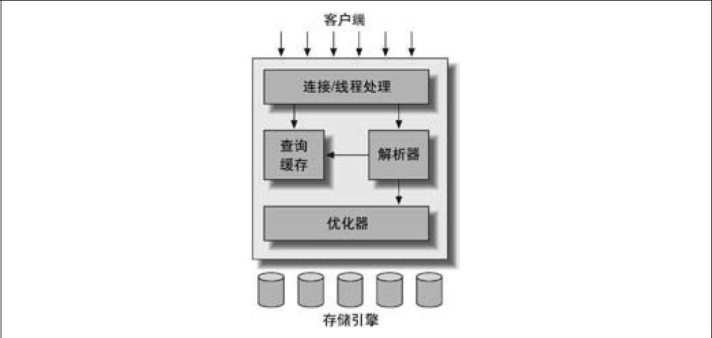
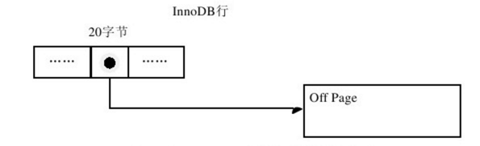
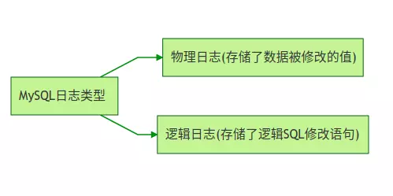
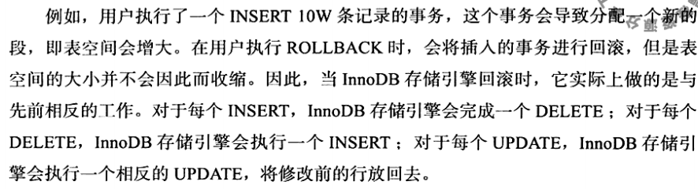

主要参考《Mysql技术内幕》和《高性能Mysql》 以及《learning MYSQL and MariaDB》.


## 1. Mysql体系结构和存储引擎

mysql服务器架构图




### 1. InnoDB存储引擎结构


InnoDB有多个内存块儿，可以认为这些内存块儿组成了一个大的内存池，负责如下工作：

- 维护所有进程/线程需要访问的多个内部数据结构。
- 缓存磁盘上的数据，方便快速的读取，同时在对磁盘文件的数据修改之前在这里缓存。
- 重做日志缓冲。


#### **后台线程**


InnoDB存储引擎是多线程的模型，后台有多个不同的线程，负责处理不同的任务。

1. Master Thread. 是一个非常核心的后台进程，主要负责将缓冲池中的数据异步刷新到磁盘，保证数据的一致性，包括脏页的刷新，合并插入缓冲， UNDO页的回收。
2. IO Thread。InnoDB  中大量使用AIO来处理IO请求，这样可以极大提高数据库性能，而 IO Thread 主要工作是负责这些IO请求的回调。
3. Purge Thread。 事务被提交后，其所使用的undolog 可能不再需要，因此需要Purge Thread 来回收已经使用并被回收的undo页。
4. Page Cleaner Thread. 作用是将脏页的刷新操作放到单独的线程中，减轻master的负担。


#### **缓冲池**

InnoDB 是基于磁盘储存的，并将其中的记录按照页的方式进行管理。缓冲池作为一块内存区域，通过内存的速度弥补磁盘的性能影响。

具体来说，缓冲池内缓冲的数据也类型有：**索引页，数据页，undo页，插入缓冲，自适应哈希索引，InnoDB存储的锁信息，数据字典信息。**


LRU list ,  Free List 和Flush list

通常来说，数据库中的缓冲池是通过 LRU（latest recent Used）来管理的，即最频繁使用的页在 LRU列表的前端，而最少使用的页在LRU页的后端，当缓冲池不能存放新读取到的页时，将首先释放LRU列表中的尾端页。InnoDB中缓冲池中页的默认大小是16K。

InnoDB对LRU做了一些优化，加入了midpoint 位置，新读取到的页，虽然是最新访问的页，但并不是直接放到LRU列表的首端，而是默认放在midPonit的位置，默认是在63%(5/8)长度的位置。在midpoint 之后的列表称为old列表，之前的列表称为 new 列表，可以简单的理解为在 new列表中的列都是最活跃的数据。之所以这样妥协，是为了减少全表扫描这一类的操作对 LRU列表的影响。


InnoDB存储引擎从1.0x版本开始支持压缩也的功能，即将原本16K的页压缩为1k, 2k, 4k, 8k。对于非16K的页，是通过unzip_LRU 列表来管理的。


**重做日志缓冲**

InnoDB内存区域除了有缓冲池外，还有重做日志缓冲（redo log buffer), InnoDB首先在将重做日志信息放在这个缓冲区，然后按照一定的频率将其刷新到重做日志文件。重做日志缓冲一般不需要设置的很大，用户只需要保证每秒产生的事务量大小在这个缓冲大小之内即可。


**checkpoint技术**

如果在从缓冲池中将页的新版本刷新到磁盘时，发生了宕机，那么数据就不能恢复了，为了避免发生数据丢失的问题，当前事务数据库系统普遍都采用了Write Ahead log 策略，即当事务提交时，先写重做日志，再修改页。一但宕机，可以通过重做日志来完成数据的恢复，这也是事务ACID中D(Durability持久性)的要求。

checkpoint技术的目的是为了解决以下几个问题：

- 缩短数据库的恢复时间，
- 缓冲池不够用时，将脏页刷新到磁盘上。
- 重做日志不可用时，刷新脏页。

当数据库发生宕机时，数据库不需要重做所有的日志，因为Checkpoint之前的也都已经刷新回磁盘。故数据库只需要对Checkpoint 后的重做日志进行恢复，这样就大大缩短了恢复时间。此外，当缓冲池不够用时，根据LRU算法会溢出最近少使用的页，若此页为脏页，那么需要强制执行checkpoint,将脏页也就是页的新版本刷回磁盘。

重做日志出现不可用的情况是因为当前事务数据库系统对重做日志的设计都是循环使用的，并不是让其无限增大。

在InnoDB存储引擎内部有两种chekpoint:

- Sharp checkpoint
- Fuzzy checkpoint

Sharp Checkpoint 发生在数据库光鄙视将所有的脏页都刷新会磁盘，这是默认工作方式，但是若在数据库运行时也进行sharp checkpoint，那么数据库的可用性就会受到很大的影响，故在InnoDB内部使用FuzzyCheckpoint 进行页的刷新，即只刷新一部分脏页。


**master thread**

master thread 具有最高的线程优先级别，其内部由多个循环组成： 主循环loop, 后台循环，刷新循环（flush loop), 暂停循环（suspend loop) 。

大多数操作都在Loop中，其中两个大部分的操作是----每秒钟的操作和每10秒的操作，伪代码如下：

```java
void master_thread(){
		loop;
  	for(int i=0; i< 10; i++){
    		do thing once per second;
      	sleep 1 second if necessay
  	}
    do things once per ten seconds;
    goto loop;
}
```


每秒一次的操作包括：（innodb_io_capacity 默认为200）

- 日志缓冲刷新到磁盘，即使这个事务话没有严格提交（总是）。
- 最多进行 innodb_io_capacity * 0.05 个合并插入缓冲（可能）。
- 至多刷新innodb_io_capacity 个 InnoDB的缓冲池中的脏页到磁盘（可能）。
- 如果当前没有用户活动，切换到backgroud loop。

每十秒的操作包括：

- 刷新innodb_io_capacity 个脏页到磁盘(可能)。
- 合并至多5个到插入缓冲。（总是）
- 将日志缓冲刷新到磁盘。（总是）
- 删除无用的Undo 页（总是）
- 刷新100个或者10个脏页到磁盘上。（总是）

backgroud loop，若当前没有用户活动，或者数据库关闭，就是切换到这个循环，会执行以下操作：

- 删除无用的Undo页。（总是）
- 合并20个插入缓冲。（总是）
- 跳回到主循环。（总是）
- 不断刷新100个页直到符合条件。

若 flush loop也没有什么事情，InnoDB存储引擎就会切换到suspend loop,将 Master thread 挂起，等待事件的发生。

完整Master Thread的伪代码如下：

```java
void master_thread(){
    goto loop;
    
    loop:
    for(int i=0; i<10; i++){
        thread_sleep(1);
        do log buffer flush to disk;
        if(last_one_second_ios < 5% innodb_io_capacity)
            do merge 5% innodb_io_capacity insert buffer
    }
}
```


#### InnoDB的关键特性

- **插写缓存（Insert buffer)**
- **两次写（Double Write)**
- **自适应哈希索引（Adaptive Hash Index)**
- **异步IO（Async IO)**
- **刷新邻接表（Flush Neighbor Page)**

在InnoDB中组件是唯一的标识符，通常应用程序中记录的插入程序是按照主键递增的顺序进行插入的，因此插入**聚集索引（primary key)**一般是顺序的，不需要磁盘的随机读取。在一般情况下，不需要随机读取另一个页中的记录，因此，对于这一类情况下的插入操作，速度是非常快的。

但是不可能每张表上只有一个聚集索引，更多情况下，一张表中有多个非聚的辅助索引（secondary index)。比如如下定义一张表：

```mysql
create table t(a int auto_increment,
               b varchar(20),
               primary key (a),
               key(b)
              );
```

b字段不是唯一的，用户需要按照b字段进行查找，在这样情况下，产生了一个非聚集且不唯一的索引，进行插入操作时，数据页的存放还是按照主键 a 进行顺序存放的，但是对于非聚集索引叶子节点的插入不再是顺序的了，这时候就需要离散的访问非聚集索引页。由于随机存储的存在而导致了插入操作的性能下降。

**InnoDB开创性的设计Insert Buffer,  对于非聚集索引的插入或者更新操作，不是每一次直接插入到索引页中，而是先判断插入非聚集索引页是否在缓冲池内，若在，则直接插入，若不在，则先放入到一个Insert Buffer对象中，好似欺骗。然后再以一定的频率和情况进行Insert Buffer和辅助索引页子节点的merge操作，这时通常能将多个插入合并到一个操作中（因为在一个索引页中），这就大大提高了对于非聚集索引插入的性能，**

InsertBuffer的使用需要满足两个条件：

- **索引是辅助索引（secondary index)**
- **索引不是唯一的（unique).**   辅助索引不能是唯一的，因为在插入缓冲时，数据库并不去查找索引页来判断插入记录的唯一性。如果去查找肯定有会有离散读取的情况发生，从而导致 insert buffer失去意义。

目前insertBuffer存在一个问题：在写密集情况下，插入操作会占用过多的缓冲池内存，默认可以占用1/2。 


**两次写**

如果说 insert Buffer 带给InnoDB是性能上的提升，那么double write 带来的是数据页的可靠性。

doublewrite 由两部分组成，一部分是内存中的 doublewrite buffer， 大小为2M，另一部分是物理磁盘上共享表空间中连续的128个页，即两个区（extent), 大小同样为2M， 在对缓冲池的脏页进行刷新时，并不直接写磁盘，而是会通过memcpy函数将脏页先复制到内存中的doubleWrite buffer ，之后通过 doublewrite Buffer 再分两次，每次1MB顺序的写入共享表空间的物理磁盘上，然后调用 fsync 函数，同步磁盘，避免缓冲写带来的问题，在这个过程中，因为doublewrite页是连续的，因此，这个过程是顺序写，开销不大。在完成doublewrite页的写入后，再将buffer写入到各个表空间文件中，此时的写入则是离散的。


**自适应哈希索引**

哈希是非常快的查找方法，一般情况下查找时间复杂度为O(1)， 而B+ 数的查找次数，取决于 树的高度，在生产环境中，一般为3~4层。故需要 3到4次查询。

InnoDB存储引擎会监控对表上各索引页的查询，如果观察到建立哈希索引能够带来速度提升，则建立哈希索引。称为 **自适应哈希索引**（Adaptive Hash Index,  AHI）。 AHI是通过缓冲池的B+树页来构造，因此建立的速度很快，而且不需要对整张表构建哈希索引。InnoDB存储引擎会自动根据访问的频率和模式来自动地为某些热点建立哈希索引。

AHI有一个要求，那就是对这个页的连续访问模式必须是一致的，访问模式一致指的是查询条件一致。 


**刷新邻接页**

当刷新一个脏页时，InnoDB存储引擎会检测该页所在区的所有页，如果是脏页，那么一起进行刷新，这样做的好处显而易见，通过AIO可以将多个IO合并为一个IO操作。


### 2文件系统

构成MySQL和InnoDB存储引擎表的各种类型文件有以下这些：

- **参数文件**：告诉MySQL实例启动时在哪里可以找到数据库文件，并且指定某些初始化参数。简单来说，可以将数据库参数看成一个键值对（key/value）,可以通过show variables 查看所有的参数。MySQL数据库中参数通常可以分为两类：
  - dynamic参数：可以通过set命令在实例运行中队实例参数进行修改。
  - static参数: 在整个实例的生命周期内都不可更改，等同于 read-only
- **日志文件**： 用来记录MySQL实例对某种条件做出响应时写入的文件，如 错误日志文件， 二进制日志文件，慢查询日志文件
- **socket文件**：当用UNIX域socket方式进行连接的需要的文件。
- **pid 文件**：Mysql实例的进程ID文件。
- **MySQL表结构文件**：用来存放MySQL表结构定义文件。
- **存储引擎文件**：因为MySQL表存储引擎的问题，每个存储引擎都有自己的文件来保存各种数据，这些存储引擎真正的记录和索引等数据。


## ２.表


### 1.表结构


**简单说，表是关于特定实体的数据集合，这也是关系型数据库的核心。**在InnoDB存储引擎中，表都是根据主键顺序存放，这种存储方式被称为**索引组织表(index organized table)**, 每张表都一个主键(Primary key), 如果在创建时没有显式的定义主键，则InnoDB存储引擎会按如下方法选择或者创建主键：

- **首先判断表中是否有非空的唯一索引(unique not null), 如果有，则该列为主键。**

- **如果不符合上述条件，InnoDB存储引擎自动创建一个6字节大小的指针。**

- **当表中有多个非空唯一索引是，InnoDB存储引擎将选择建表时第一个定义的的非空唯一索引为主键，注意，这里主键的选择是根据定义索引的顺序，而不是建表时列的顺序。**

  ```mysql
  create table z(a int not null, b int null, c int not null, d int not null, unique key(b), unique key(C), unique key(d));
  ```

  上面创建了一张表，b,c,d都有唯一索引，唯一不同的是b列允许null值，又因为没有显式定义主键，因此会选择第一个非空索引列 即c列作为主键。


从InnoDB存储引擎的逻辑存储结构来看，所有数据都被逻辑的存放在一个空间中，称之为表空间（tablespace）。表空间又由段（segment）,区（extent), 页（page，有时也被称为block)组成。存储结构大致如图：


**表空间**

表空间是InnoDB存储引擎逻辑结果最高层，如果用户启用参数 innodb_file_per_table，则每张表可以单独当知啊一个表空间内，每张表空间内存放的是 数据， 索引 和 插入缓冲 Bitmap页， 其他类的数据，如回滚信息，插入缓冲索引页，系统事务信息等还是放在原来的共享表空间内。

**段**

表空间由各个段组成，常见的段有数据段，索引段，回滚段等**，因为InnoDB存储引擎是索引组织的。因此数据段即为 B+树的叶子节点，索引段即为B+树的非索引节点。回滚段比较特殊。**

**区**

区是由连续页组成的空间，在任何情况下每个区的大小都是1MB，默认情况下，InnoDB存储引擎页的大小为16K，一个区一共有64个连续页。


**页**

页是InnoDB存储引擎的磁盘管理的最小单位，默认每个页的大小是16k, 可以通过innodb_page_size参数进行修改。常见的页类型有：

- 数据页（B-tree Node)
- undo 页（undo Log page)
- 系统页（ System Page)
- 事务数据页（Transaction system Page)
- 插入缓冲位图页（Insert Buffer Bitmap)
- 插入缓冲空闲列表页
- 未压缩的二进制大对象页
- 压缩的二进制对象页


**行**

InnoDB存储引擎是面向列，也就是数据按行存放。


**compact行记录格式**

其设计目标是高效的存储数据，简单来说，一个页中存放的行数据越多，其性能就越高。


最后的部分就是实际存储每个列的部分。需要注意的是，null不占该部分的任何空间，即null除了占有Null 标志位，实际存储不占有任何空间。另外，每一行除了用户定义的列外，还有两个隐藏列，事务ID列和回滚指针，分别为６字节和７字节的大小，若InnoDB表没有定义主键，每行还会增加一个6字节。

**Mysql官方手册定义的65535长度是指 varchar列的长度总和， 单位是字节， 如果采用utf-8格式的话，长度总和会更短。如果列的长度综合超过了这个长度，依然无法创建。因为在innoDB存储引擎的页为16K, 即16384字节，因此在一般情况下，innoDB 的数据都是存放在页类型为B-tree的 node 中，但是当发生溢出时，数据存放在页类型为 Uncompress BLOG 页中。**

**InnoDB存储引擎在页内部是通过一种链表的结构来串联各个行记录的。**


 **Compressed与Dynamic行记录格式**

InnoDB Plugin引入了新的文件格式（file format，可以理解为新的页格式），对于以前支持的Compact和Redundant格式将其称为Antelope文件格式，新的文件格式称为Barracuda。Barracuda文件格式下拥有两种新的行记录格式Compressed和Dynamic两种。新的两种格式对于存放BLOB的数据采用了完全的行溢出的方式，在数据页中只存放20个字节的指针，实际的数据都存放在BLOB Page中，而之前的Compact和Redundant两种格式会存放768个前缀字节。

下图是Barracuda文件格式的溢出行：



Compressed行记录格式的另一个功能就是，存储在其中的行数据会以zlib的算法进行压缩，因此对于BLOB、TEXT、VARCHAR这类大长度类型的数据能进行非常有效的存储。


**InnoDB存储引擎数据页结构**

页是InnoDB存储引擎管理数据库的最小磁盘单位，页类型为 B-tree Node 的页存放的即是 表中行的实际数据了。

InnoDB数据页由以下7个部分组成

- File header
- Page header
- Infimun 和 Supremum Records
- User Records(用户记录，即行记录)
- Free space
- Page directory
- File Trailer(文件结尾信息)

其中User Record， Free space, Page Directory 这些部分为实际的行记录存储空间，因此大小是动态的。


fileHeader主要是记录一些头信息。


该部分用来记录数据页的状态信息。


**infimum 和 Supremum Record**

在InnoDB存储引擎中，每个数据页中由两个虚拟的行记录，用来限定记录的边界。 infimum是比该页中任何主键值都还要小的指 ，Supremum是比任何可能大的值还要大的值。这两个值在页创建时被建立，并且在任何情况下不会被删除。 


FreeSpace 也是个链表数据结构，在一条记录被删除后，该孔家你会被加入到空闲链表中。

**page Directory**

存放记录中的相对位置（页相对位置，而非偏移量），有时候这些记录指针被称为 Slot(槽)，在innodb中并不是每个记录都拥有一个Slot, InnoDB存储引擎的槽是一个稀疏目录（sparse directory），**即一个槽中可能包含多个记录。当记录被插入或者删除时需要对槽进行分裂或平衡的操作。在Slots 中记录按照索引键值顺序存放，这样可以利用二叉查找树迅速找到记录的指针。**

**file Trailer**

为了检测页是否已经完整的写入到磁盘中（如写入过程发生的磁盘损坏，关机等）。


### 2 约束

参考： https://www.cnblogs.com/Eva-J/articles/9687915.html

关系型数据库系统和文件系统 的一个不点是，关系型数据库本身能够保证存储数据的完整性，不需要应用程序的控制，而文件系统一般需要在程序端进行控制。约束机制能够保证数据库数据的完整性。一般来说，数据完整性有以下3种形式：

1. **实体完整性保证了表中有一个主键。在InnoDB存储引擎中，用户可以定义 Primary Key 或 Unique key约束来保证实体的完整性，用户还可以通过编写一个触发器来保证数据完整性。**
2. **域完整性保证数据每列的值满足特定条件。**在InnoDB存储引擎中可以通过以下途径保证：
   - 选择合适的数据类型确保一个数据值满足特定条件。
   - 外键（Foreign Key)约束。
   - 编写触发器。
   - 考虑用default 约束作为强制域完整性的一个方面。
3. 参照完整性保证了两张表之间的关系。InnoDB存储引擎支持外键，允许用户定义外键以强制参照完整性，也可以通过编写触发器强制执行。对于 InnoDB 存储引擎本身，提供了以下几种约束：
   - Primary Key
   - Unique key
   - Foreign key
   - Default
   - not null


约束的创建可以采用以下两种方式：

- 建表时就进行约束定义。 
- 利用alter table 命令创建约束。


约束和索引的区别：**当用户创建了一个唯一的索引就创建了一个唯一的约束，但是约束和索引概念不同，约束更像是一个逻辑的概念，用来保证数据的完整性，而索引是一个数据结构，既有逻辑上的概念，还代表着物理存储的方式。**


**ENUM 和SET 约束**

MySQL 数据库不支持传统的Check 约束，但是通过ENUM和　SET类型可以解决部分这样的约束请求，例如表上有一个性别类型，规定域的范围只能是male 或者 female, 在这种情况下可以用ENUM类型来约束。比如 create table a(id int, sex ENUM('male', 'female')) ;

set 是一个字符串对象，可以有零个或者多个值，其值来自表创建时规定的允许的一列值，set成员的set 列值时各成员之间用逗号（’，‘）隔开，所以Set 成员值本身不能包含逗号。


**对于传统check 约束支持的连续值的范围约束或者更复杂的约束，ENUM 和 SET类型还是无能为例，这时需要用户通过触发器来实现。**


**触发器与约束**

触发器的作用是在执行insert, delete 和 update 命令之前自动调用SQL命令或存储过程。语法如下：

```
mysql> create [definer = { user | current_user}]
    -> trigger trigger_name before|after insert|update|delete
    -> on tal_name for each row trigger_stmt;
```

最多可以为一个表建立6个触发器，即分别为insert , update, delete的before 和 after 各定义一个，表示实是在每行操作之前还是之后触发，当前mysql数据库只支持for each row 的触发方式，即按每行的方式进行触发。**通过触发器可以让用户实现MySQL本身并不支持的一些特性，比如 对传统的 check约束的支持，物化视图，高级复制， 升级等特性。**


**外键约束**

```mysql
#表类型必须是innodb存储引擎，且被关联的字段，即references指定的另外一个表的字段，必须保证唯一
create table department(
id int primary key,
name varchar(20) not null
)engine=innodb;


#dpt_id外键，关联父表（department主键id），同步更新，同步删除
create table employee(
id int primary key,
name varchar(20) not null,
dep_id int, 
foreign key(dep_id)
references department(id)
on delete cascade    # 级连删除
on update cascade    # 级连更新
) engine=innodb;

```

一般来说，称被引用的表为父表，引用的表为子表。外键定义时的 on  delete和 on update 表示在对附表进行 delete 和 update时，对子表自动进行的操作。一般来说，可定义的子表操作有：

- **cascade**
- **set null**
- **no action**
- **restrict**

**cascade表示当父表发生delete 或 update操作时，对相应的子表中的数据也进行相应的 delete 或者 update 操作，set null 表示当父表发生delete 或 update操作时， 相应的子表中的数据被更新为null 值，但是子表中相对应的列必须允许被定义为Null 值， No action 表示当父表发生delete 或 update操作时，抛出错误，不允许这类操作发生。 restrict 表示当父表发生delete 或 update操作时，抛出错误，不允许这类操作发生。与 no act默认模式是restrict。**

在InnoDB存储引擎中，对于建立外键的列，会自动的为该列加上一个索引，这样可以避免外键列上无索引而导致的死锁问题。并且MySQL数据库的外键是即时检查的。


### 3.视图


**在MySQL数据库中，视图（View）是一个命名的虚表，它由一个SQL查询来定义，可以当作表来使用，与持久表不同的是，视图中的数据没有实际的物理存储。**

**视图就像是一个窗口，通过这个窗口可以看到系统专门提供的数据，这样用户只需要看到和关系对自己有用的数据。对其中所引用的基础表来说，视图的作用类似于筛选，定义视图的筛选来自其他数据库的一个或多个表，或者其他视图，通过视图查询没有任何限制，通过他们进行数据修改时的限制的也很少。**视图的主要作用有：

1. 简单性。简化用户对数据的理解和操作。那些经常被使用的查询可以被定义为视图，从而使得用户不必为以后的每次操作都指定全部条件。
2. 安全性。可以防止未授权用户查看特定的行或列，权限用户只能看到表中特定行的方法如下：
   1. 在表中增加一个标志用户名的列。
   2. 建立视图，是用户只能看到标有自己用户名的行。
   3. 把视图授权给其他用户。
3. 逻辑数据独立性。 视图可以使应用程序和数据库表在一定程度上独立。有了视图，程序可以不必一定建立在表上，视图可以在以下几个方面使得数据和程序独立：
   - 如果应用建立在数据库表上，当数据库表发生变化时，可以在表上建立视图，通过视图屏蔽表的变化，从而应用程序可以不动。
   - 如果应用建立在数据库表上，当应用发生变化时，可以在表上建立视图，通过视图屏蔽应用的变化，从而使数据库表不动。


#### **创建视图**

视图可以建立在一张表上，也可以建立在多张表上。创建视图需要有**create view 权限， 同时应该有查询涉及的列的select权限。**可以使用下面的查询语句查询是否有权限：

```mysql
#查询是否有权限
select select_priv, create_view_priv from mysql.user where user='root';

#创建视图语法
create or replace [algorithm={undefined|merge|temptable} VIEW 视图名[ (属性清单) ]] as select 语句 with [cascaded|local] check option;
# create or replace 表示当视图不存在时创建，存在时修改。
#ALGORITHM是可选参数，表示视图选择的算法；
#“视图名”参数表示要创建的视图名称；
# 属性清单是可选参数，指定视图中各个属性的名词，默认情况下与select 语句中查询的属性相同。
# select语句是一个完整的查询语句， 表示从某个表中查出某些满足条件的记录，将这些记录导入到视图中。
#with check option 是可选参数，表示更新视图是要保证在该视图的权限范围内。
```


创建视图时需要注意以下几点：

1. 运行创建视图的语句需要用户有创建视图（create view）的权限，若添加了[ or replace] 还需要用户具有删除视图（drop view)的权限。
2. select 语句不能包含from子句中的子查询。
3. select 语句不能引用系统或者用户变量。
4. select 语句不能引用预处理语句参数。
5. 在存储子程序内，定义不能引用子程序参数或者局部变量。
6. 定义中引用的表或者视图必须存在。
7. 在定义中不能引用temporary表， 不能创建temporary视图。
8. 不能将触发程序与视图关联在一起。
9. 在视图定义中允许使用order by，但是，如果从特定视图进行了选择，而该视图使用了具有自己order by 的语句，它将被忽略。


查看视图的几种方式：

1. desc 视图名；
2. show table status like '视图名';
3. show create view 视图名; 


**修改, 更新 视图**

alter  view 语句改变了视图的定义，包括被索引视图，但不影响所依赖的存储过程或者触发器。该语句与create view 有着同样的限制，如果删除并重建一个视图，就必须为它分配权限。

```mysql
alter view [algorithm={merge|temptable|undefined}]
view view_name[(column_list)] 
as select_statement with [cascaded|local] check option;
```

**对视图的更新其实就是对表的更新，更新视图是指通过视图来插入（INSERT）、更新（UPDATE）和删除（DELETE）表中的数据。**因为视图是一个虚拟表，其中没有数据。通过视图更新时，都是转换到基本表来更新。更新视图时，只能更新权限范围内的数据。超出了范围，就不能更新。并非所有视图都可以更新，以下几种情况不可更新：

```mysql
# 1.视图中包含count(), max(), sum(), mix()等函数。
create view book_view1(a_sort, a_book) as select sort, books, count(name) from tb_books;
# 2.视图中包含union, union all, distinct, group by和 having关键字的。
create view book_view1(a_sort, a_book) as select sort, books from tb_book group by id;
# 3.常量视图，例如：
create view book_view1 as select 'Aric' as a_book;
# 4.视图中的select 包含子查询，
create view book_view1 (a_sort) as select (select name from tb_book);
# 5.由不可更新的视图导出的视图
create view book_view1 as select * from book_view2;
# 6.创建视图时， algorithm为 temptable类型
create algorithm=temptable view book_view1 as select * from tb_book;
# 7.视图对应的表上存在没有默认值的列，而且该列没有包含在视图里。例如，表中包含的name字段没有默认值，但是视图中不包含该字段，那么这个视图也是不能更新的。因为，在更新视图时，这个没有默认值的记录将没有值插入，也没有NULL值插入。数据库系统是不会允许这样的情况出现的，其会阻止这个视图更新。

```

上面的这么多情况其实都是一种情况，**规则就是，视图的数据和基本表不一样了。**一般情况下，最好将视图作为查询数据的虚拟表，而不要通过视图更新数据，因为诸多限制可能会导致更新失败。


**删除视图**

DROP VIEW语句的语法如下：

DROP VIEW IF EXISTS ＜视图名＞ [RESTRICT|CASCADE]

IF EXISTS参数指判断视图是否存在，如果存在则执行，不存在则不执行；“视图名列表”参数表示要删除的视图的名称和列表，各个视图名称之间用逗号隔开。该语句从数据字典中删除指定的视图定义；如果该视图导出了其他视图，则使用CASCADE级联删除，或者先显式删除导出的视图，再删除该视图；删除基表时，由该基表导出的所有视图定义都必须显式删除。


### 4. 分区表

在MySQL中，InnoDB存储引擎长期支持表空间的概念，并且MySQL在分区引入之前，就能配位存储不同的数据库使用不同的物理路径。分区（partion）更进一步，它允许你通过设置各种规则将一个表的各个分区垮文件系统存储。实际上，不同位置的不同表分区是作为一个单独的表来存储的。用户所选择的，实现数据分割的规则被称为分区函数。最常见的是水平分区，即将表的不同元组分配到不同的物理分区上。MySQL目前不支持垂直分区。此外，MySQL数据库的分区是局部分区索引，一个分区中既存放了数据，又存放了索引，而全局分区是指，数据存放在各个分区中，但是所有数据的索引放在一个对象中。

分区主要用于 数据库高可用性管理。在OLTP应用中，对分区的使用应该非常小心。

```mysql
# 查询表内各个分区的row数量
select table_name, partition_name, table_rows from information_schema.partitions where table_schema=database() and table_name = 't_hash'\G;
```

当前MySQL数据库支持以下几种类型的分区：

- range分区：行数据基本属于一个给定的连续区间的列值被放入分区。对于插入的值应该严格遵守分区的定义，当插入值不在分区中定义的值时，会抛出异常。range分区主要用于日期列的分区。

  ```mysql
  #创建range分区
  create table t(id int)engine=innodb partition by range(id)( partition p0 values less than(10), partition p1 values less than (20));
  #添加partition， maxvalue可以理解为正无穷
  alter table t add partition (partition p2 values less than maxvalue); 
  
  #建立子分区
  #子分区
  create table ts(id int, purchased Date)
  partition by range(YEAR(purchased))
  subpartition by hash(TO_DAYS(purchased))
  subpartitions 2(
  	partition p0 values less than(1990),
  	partition p1 values less than(2000),
  	partition p2 values less than maxvalue
  );
  # 表 ts 有3个range分区，这3个分区的每一个 p0, p1, p2又被进一步分成了两个子分区，实际上，整个表被分成了3 *2 = 6个分区，在每个range分区内使用了hash分区。
  ```

  子分区有一些注意点：

  - 每个分区的子分区数必须相同。
  - 如果在一个分区表上的任何分区使用subpartiton来明确定义任何子分区，那么就必须定义所有的子分区。
  - 每个subpartition子句必须包含一个之分区的名称。

- list分区： 和range分区类似，只是List分区面向离散的值。

  ```mysql
  # 创建list分区表
  create table t1(
  a int, b int) engine=innodb
  partition by List(a)(
  partition p0 values in (1,3,5,7,9),
  partition p1 values in (2,4,6,8,10)
  );
  ```

  

- hash分区：根据用户自定义的表达式的返回值来进行分区，返回值不能为负值。partition by hash(expr) 中，expr是一个返回一个整数的表达式，它可以仅仅是字段类型为MySQ类型的列名。此外用户可以再添加一个 partitions num，其中num非负，表示将要被分割成分区的数量，默认是1.

  ```mysql
  create table t_hash(
  a int, b datetime) engine = innodb
  partition by hash(year(b))
  partitions 4;
  
  ```

  

- key分区：根据mysql数据库提供的哈希函数来进行分区。

- column分区。上面的4种分区，分区条件是数据必须是整型（integer），不是的话，需要通过 year(), to_days()等函数将其转化为整型。而columns分区可以直接利用列来作为分区对象，并且支持更多的数据类型。可以通过 range column(b)  这种形式。目前支持的类型有：

  - 所有的整型类型。如 int, smallint, tinyint, bigint.不支持float,  decimal
  - 日期类型，如 date 和 datetime
  - 字符串类型, 如 char,  varchar,  binary 和 varbinary。blog 和text类型不支持。

**不论创建何种类型的分区，如果表中存在主键或唯一索引时，分区列必须是唯一索引的一个组成部分。**

**null值的处理**： MySQL数据库允许对Null值做分区，MySQL的分区总是将null 值视为小于任意一个非null 值， 这和 MySQL中处理null 值的  order by 操作是一样的。

- 对于range分区，会将null放入最左边的分区。但是删除该最左边分区时，null值的记录仍然还在。
- 对于 list分区，需要显式指定null放在哪个分区中。
- **hash 和 key 分区中，任何分区函数都会将含有null值的记录返回0.**


分区对数据库管理系统实现并行处理有着重要的影响，如果对数据进行分区，则很容易进行并行处理，MySQL的分区会给系统带来以下的一些优点：

1. 与单个磁盘或者文件系统分区相比，单个表可以存储更多的数据。
2. 对于带where 的条件查询语句，可以得到更大的优化，只需要查询某些分区。
3. 一些聚合函数，比如 SUM() 和 count()，能够很容易并行执行。
4. 通过并行I/O, 可以大大提高查询效率。


## 3. 索引与算法

http://blog.codinglabs.org/articles/theory-of-mysql-index.html

用来加快查询的技术很多，其中最重要的是索引。通常索引能够快速提高查询速度。如果不适用索引，MYSQL必须从第一条记录开始然后读完整个表直到找出相关的行。表越大，花费的时间越多。数据本身的组织结构不可能完全满足各种数据结构，在数据之外，数据路系统还维护着特定查找算法的数据结构，这些数据结构以某种方式指向数据，这样姐可以在这些数据结构上实现高级查找算法，这种数据结构就是索引。

官方定义： **索引(index)是帮助Mysql高效获取数据的数据结构。**


数据库查询是数据库的最主要的功能之一。索引实在Mysql 的存储引擎层引起的，而不是在服务层实现。MySQL目前提供3种索引：

- **B-Tree 索引：最常见的索引类型。**
- **Hash索引：只有Memory引擎支持， 使用场景简单。**
- **Full-text (全文索引)：主要用于全文索引。**


### 1. B+树

B+树就是传统意义上的索引，这是目前关系型数据库查找最为常用和有效的索引。B+ 树的构造类似于二叉树，根据键值快速找到数据。B代表Balance 而非 binary。由二叉平衡树演化而来。


#### 1.**B树**

一个m阶的B树具有如下几个特征：

1. **根节点至少有两个子女。**
2. **每个中间节点都包含k-1个元素，其中 m/2 <= k <= m**
3. **每一个叶子节点都包含k-1个元素，其中 m/2 <= k <= m**
4. **所有叶子节点都为同一层。**
5. **每个节点中元素从小到大排列，节点当中k-1个元素正好是k个孩子包含的元素的值域划分。**

B树与平衡二叉树很类似，是一种多路自平衡搜索树。在B-Tree中按key检索数据的算法非常直观：从根节点开始进行二分查找，如果找到则返回对应节点的data,否则对相应区间的指针指向的节点递归进行查找，直到找到节点或者 Null 节点。伪代码如下：

```java
BTree_Search(node, key){
  	if(node == null) return null;
  	foreach(node.key){
        if(node.key[i] == key) return node.data[i];
        	if (node.key[i] > key) return BTree_Search(point[i] -> node);
  	}
    return BTree_Search(point[i+1] -> node);
}
data = BTree_Search(root, my_key);
```


B+树相比b树的特点是，中间节点不存储data,只存储key, data存放在叶节点中。B+Tree中叶节点和内节点一般大小不同。这点与B-Tree不同，虽然B-Tree中不同节点存放的key和指针可能数量不一致，但是每个节点的域和上限是一致的，所以在实现中B-Tree往往对每个节点申请同等大小的空间。**一般来说 B+Tree比 BTree更适合实现外存储索引结构。**

一般在数据库系统或者文件系统中使用的B+树结构都对经典B+树进行了优化，增加了顺序访问指针。


做这个优化的目的是为了提高区间访问的性能，例如图4中如果要查询key为从18到49的所有数据记录，当找到18后，只需顺着节点和指针顺序遍历就可以一次性访问到所有数据节点，极大提到了区间查询效率。


#### 2.B+树性能

一般来说，索引本身也很大，往往以索引文件的形式存储在磁盘上，这样，索引过程就会产生I/O消耗，相比内存存取，IO存取的消耗要高几个数量级，所以评价一个数据结构作为索引的优劣的最重要指标就是在查找过程中磁盘I/O操作次数的渐进复杂度。

 **局部性原理与磁盘预读**

由于存储介质的特性，磁盘本身存取就比主存慢很多，再加上机械运动耗费，磁盘的存取速度往往是主存的几百分分之一，因此为了提高效率，要尽量减少磁盘I/O。为了达到这个目的，磁盘往往不是严格按需读取，而是每次都会预读，即使只需要一个字节，磁盘也会从这个位置开始，顺序向后读取一定长度的数据放入内存。这样做的理论依据是计算机科学中著名的局部性原理：

- **当一个数据被用到时，其附近的数据也通常会马上被使用。**
- **程序运行期间所需要的数据通常比较集中。**

由于磁盘顺序读取的效率很高（不需要寻道时间，只需很少的旋转时间），因此对于具有局部性的程序来说，预读可以提高I/O效率。

预读的长度一般为页（page）的整倍数。页是计算机管理存储器的逻辑块，硬件及操作系统往往将主存和磁盘存储区分割为连续的大小相等的块，每个存储块称为一页（在许多操作系统中，页得大小通常为4k），主存和磁盘以页为单位交换数据。当程序要读取的数据不在主存中时，会触发一个缺页异常，此时系统会向磁盘发出读盘信号，磁盘会找到数据的起始位置并向后连续读取一页或几页载入内存中，然后异常返回，程序继续运行。

**B+树的性能分析**

**检索一次最多需要访问h（树深度）个节点，数据库系统的设计者利用磁盘预读原理，将一个节点的大小设为等于一个页，这样每个节点只需一次I/O就可完全载入。B-Tree中一次检索最多需要h-1次I/O（根节点常驻内存），渐进复杂度为O(h)=O(logdN)O(h)=O(logdN)。一般实际应用中，出度d是非常大的数字，通常超过100，因此h非常小（通常不超过3）。而红黑树这种结构，h更深，由于逻辑上很近的节点（父子）物理上可能很远，无法利用局部性，I/O渐进复杂度为O(h)。**


#### 3. InnoDB索引实现

MyISAM中，索引文件和数据文件是分离的，索引文件仅保留数据地址，称为非聚集式的。而**在InnoDB存储引擎中，表数据本身就是按 B+ Tree组织的一个索引结构，这棵树的叶节点的data域保存了完整的数据记录，这个索引的key是数据表的主键，因此InnoDB表数据文件本身就是主索引，称为聚集式索引。**


InnoDB存储引擎要求表必须有主键（MyISAM 可以没有），如果没有显式指定的话，系统会指定选择一个可以唯一标识数据记录的列作为主键，如果不存在这种列，则MySQL会自动为InnoDB表生成一个隐含字段作为主键，这个字段长度为6个字节，类型为长整型。

第二个与MyISAM索引的不同是InnoDB的辅助索引data域存储相应记录主键的值而不是地址。换句话说，InnoDB的所有辅助索引都引用主键作为data域。例如，图11为定义在Col3上的一个辅助索引：


了解不同存储引擎的索引实现方式对于正确使用和优化索引都非常有帮助，例如知道了InnoDB的索引实现后，就很容易明白为什么不建议使用过长的字段作为主键，因为所有辅助索引都引用主索引，过长的主索引会令辅助索引变得过大。再例如，用非单调的字段作为主键在InnoDB中不是个好主意，因为InnoDB数据文件本身是一颗B+Tree，非单调的主键会造成在插入新记录时数据文件为了维持B+Tree的特性而频繁的分裂调整，十分低效，而使用自增字段作为主键则是一个很好的选择。


**索引优化策略**

既然索引可以加快查询速度，那么是不是只要是查询需要，就建上索引，答案是否定的。因为索引虽然加快了查询速度，但索引也是有代价的：索引文件本身要消耗存储空间，同时索引会加重插入，删除和修改记录的负担，另外mysql在运行时也要消耗资源维护索引，索引并非越多越好，一般两种情况下不建议建索引：

1. 表记录比较少，例如一两千条甚至只有几百条的，直接全表扫描就行。
2. 索引的选择性较低。所谓索引的选择性，是指不重复的索引值与表记录数的比值。选择性的取值范围为(0, 1]，选择性越高的索引价值越大，这是由B+Tree的性质决定的。


**在使用InnoDB存储引擎时，如果没有特别的需要，请永远使用一个与业务无关的自增字段作为主键。**这样能形成一个紧凑的索引的结构，近似顺序填满，由于每次插入时也不需要移动已有数据，因此效率很高，也不会增加很多开销在索引维护上。


#### 4. B+树操作


B+树结构主要用于磁盘，页的拆分意味着磁盘的操作，所以应该尽可能的减少页的拆分动作，因此B+树同样提供了类似平衡二叉树的旋转操作功能（Rotation）。


**删除操作**

B+树使用填充因子(fill factor) 来控制树的删除变化，50%是填充因子可设的最小值。B+树的删除操作同样必须保证删除后叶子节点中的记录依然有序，同插入一样，删除需要考虑三种情况，不同的是，删除根据填充因子的变化来衡量。


 


**辅助索引**

聚集索引就是按照每张表的主键构造一颗B+树，同时叶子节点中存放的即为整张表的行记录数据，也将据集索引的叶子节点称为数据页。据集索引的这个特性决定了索引组织表中数据也是索引的一部分。同B+树结构一样，每个数据页都是通过一个双向链表来实现链接。因此聚集索引的存储并不是物理上连续的，而是逻辑上连续的。

**对于辅助索引（secondary index，也称非聚集索引），叶子节点并不包含行记录的全部数据。叶子节点除了包含键值以外，每个叶子节点中的索引行中还包含了一个书签（bookmark)。该书签用来告诉InnoDB存储引擎在哪里可以找到与索引相对应的行数据。由于InnoDB存储引擎表是索引组织表。因此InnoDB存储引擎存储引擎的辅助索引的书签就是相应的行数据的聚集索引键。**

辅助索引的存在并不影响数据在聚集索引中的组织，因此每张表上可以有多个辅助索引。当通过辅助索引来寻找数据时，InnoDB存储引擎会遍历辅助索引并通过叶级别的指针获得指向主键索引的主键，然后再通过主键索引来找到一个完整的行记录。 


**索引的管理**

索引的创建和删除可以通过两种方法，一种是alter table  另一种是 create/drop index:

```mysql
alter table tbl_name add {index|key} {index_name} {index_type} {index_col_name, ...} {index_option} ...
alter table tbl_name drop primary key | drop {index|key} index_name;

create [unique] index index_name [index_type] on tbl_name  (index_col_name, ...);
drop index index_name on tbl_name;
```


对于辅助索引的创建，InnoDB存储引擎的存储引擎会对创建索引的表加上一个S锁。在创建过程中，不需要重建表。并且数据库的可用性也得到了提高，删除操作就更简单了，InnoDB存储引擎只需要更新内部视图，并将辅助索引的空间标记为可用，同时删除mysql数据库内部视图上对该表的索引定义即可。


**cardinality 统计**

在InnoDB存储引擎种，Cardinality统计信息的更新发生在两个操中：insert 和 update，但是不可能每次发生insert和 update 就去更新Cardinality信息， 这样会增加数据路系统的负荷，同时对于大表而言，时间上也不允许。InnoDB存储引擎内部对更新Cardinality信息的策略为(出现任意一种即触发)：

- 表中1/16的数据已经发生变化。 
- stat_modifed_counter > 2000000.

考虑InnoDB存储引擎如何对Cardinality信息进行统计和更新，通过采样的方法。默认InnoDB存储引擎对8个叶子节点（Leaf Page) 进行采样，采样过程如下：

1. 取得B+树索引中叶子节点的数量，记为A。
2. 随机取得B+树索引中的８个叶子节点，统计每个页中的不同记录的个数，即为p1, p2,.....p8。
3. 根据采样信息给出Cardinality的预估值： Cardinality=(P1+P2+....+P8) * A/8。


### 2. B+树的使用


### 3. 哈希算法

hash索引效率非常高，一次定位。但是hash 索引本身的特殊性也带来了很多弊端，主要有：

1.  **Hash 索引仅仅能满足 ”=“ ， ”in“,  和 ” <=>“ 查询， 不能使用范围查询。** hash索引比较时进行过Hash运算之后的比较， 不能使用范围查询。因为hash运算没有保序性。

2. hash索引无法被用来避免数据的排序操作。理由同上。

3. hash 索引不能利用部分索引键查询。对于组合索引，hash 索引在计算hash值的时候是组合索引键合并后再一起计算hash值，而不是单独计算hash值。所以无法利用组合索引中的一部分索引。

4. hash 索引在任何时候都不能避免表扫描。由于不同的索引键可能存在相同的hash值，所以即使满足某个hash键值的数据的记录条数，也不能直接完成查询，还是要通过访问表中的实际数据进行相应的比较，并得到相应的结果。

5. hash索引遇到大量hash值相等的情况下，性能并不一定会比B-tree索引高。

   对于选择性比较低的索引键，如果创建 Hash 索引，那么将会存在大量记录指针信息存于同一个 Hash 值相关联。这样要定位某一条记录时就会非常麻烦，会浪费多次表数据的访问，而造成整体性能低下


### 4.全文检索

https://www.jianshu.com/p/645402711dac

mysql 支持在 char,  varchar, text类型上建立全文索引。支持三种模式的全文检索模式：

1. 自然语言模式，通过match against 传递某个特定的字符串进行检索。

   ```mysql
   select * from table where match(fulltext_field) 
   against('find_key'  in natural language mode
   |in boolean mode 
   |with query expansion
   |in natural language mode with query expansion);
   
   #示例
   mysql> select * from articles where match(title, body) against ('MySQL数据库' in natural language mode);
   ```

2. 布尔模式： 可以为检索的字符串增加操作符，

   - ”+“ 表示必须包含
   - ”-“ 表示必须排除
   - ” * “  通配符
   - ” > “ 表示出现该单词时增加相关性 
   - “<”表示出现该单词时降低相关性
   - “~”允许出现该单词，但是出现时相关性为负
   - “""”表示短语
   - no operation 表示 find word 是可选的，如果出现，相关性会更高。

3. 查询扩展模式。引用场景是查询的关键字太短，用户需要implied knowledge（隐含知识时）进行。该查询会执行两次检索，第一次使用给定的短语进行检索，第二次结合第一次相关性比较高的进行检索。


## 4. 锁


### **普通锁**


InnoDB存储引擎中锁的类型中实现了如下两种标准的行级锁：

- 共享锁（S lock), 允许事务读一行数据。
- 排他锁（X lock）允许事务删除或更新一行数据。

如果一个事务 T1 已经获得了行r的共享锁，那么另外的事务T2 就可以立即获得行r的共享锁，因为读取不改变行r的数据，称这种情况为锁兼容（Lock Compatible）。但是如果有其他的事务t3想获得r的排他锁，则其必须等待事务t1， t2释放行r 的共享锁，这种情况称为锁不兼容。


此外，InnoDB存储引擎支持多粒度（granular）锁定，这种锁定允许事务在行级别上的锁和表级别上的锁同时存在，为了支持不同力度上进行加锁的操作，InnoDB存储引擎支持一种额外的锁方式，称之为意向锁（Intention Lock), **意向锁时将锁定的对象分为多个层次，意向锁意味着事务希望咋i更细粒度（fine granularity）上进行加锁。若将上锁的对象看成是一棵树，那对最下层对象（最细粒度对象）上锁，首先需要对粗粒度的对象上锁。**对象的层次结构如下：


InnoDB存储引擎中支持意向锁设计比较简练，其意向锁即为表级别的锁，设计目的主要是为了见是下一行被请求的锁类型，其支持两种意向锁：

1. 意向共享锁（IS lock）,事务想要获得一张表中某几行的共享锁
2. 意向排他锁（IX lock), 事务想要获得一张表中某几行的排他锁。

由于InnoDB存储引擎支持的是行级别的锁，因此意向锁其实不会阻塞除全表扫描以外的任何请求，故表级别意向锁与行级别意向锁的兼容性如表所示。


如果一个事务请求的锁模式与当前的锁兼容，InnoDB存储引擎就将请求的锁授予该事务，反之，如果两者不兼容，该事务就要等待锁释放。意向锁是InnoDB存储引擎自动添加的，不需用户干预，对于update, delete和 insert语句，InnoDB存储引擎会自动给涉及的数据集加上排他锁（X），对于普通的select 语句，InnoDB存储引擎不会加任何锁，事务可以通过以下语句显式给记录集加共享锁或排他锁。

```mysql
#共享锁（S）  
#主要用在需要在数据依存关系时确认某行记录是否存在的。并确保没有人对这个记录进行UPDATE或者DELETE操作。但是如果当前事务也需要对该记录进行更新操作，则很有可能造成死锁。
select * from table_name where ... lock in share mode;
#排他锁（X)
#对于锁定行记录需要进行更新操作的，应使用排他锁
select * from table_name where ... for update;
```


MySQL三种级别的锁的特性：

- **表级锁**：开销小，加锁快；不会出现死锁；锁定粒度大，发生锁冲突的概率最高，并发度最低；
- **行级锁**：开销大，加锁慢；会出现死锁；锁定粒度最小，发生锁冲突的概率最低，并发度也最高；    
- **页面锁**：开销和加锁时间界于表锁和行锁之间；会出现死锁；锁定粒度界于表锁和行锁之间，并发度一般。

适用： 从说锁的角度来说，表级锁更适合以查询为主，只有少量按索引条件更新数据的引用。行级索引更适合于有大量按索引条件并发更新数据，同时又有并发查询的任务，如一些在线事务处理（OLTP）系统。

MySQL内部有两组专门的状态变量记录系统内部锁资源争用情况：

- Table_locks_immediate：产生表级锁定的次数；
- Table_locks_waited：出现表级锁定争用而发生等待的次数；

两个状态值都是从系统启动后开始记录，出现一次对应的事件则数量加1。如果这里的Table_locks_waited状态值比较高，那么说明系统中表级锁定争用现象比较严重，就需要进一步分析为什么会有较多的锁定资源争用了。


**InnoDB行锁的实现方式**

1. **InnoDB行锁是通过给索引上的索引项加锁来实现的，只有通过索引条件检索数据，InnoDB才使用行级锁，否则则使用表锁。**在实际应用中，要特别注意InnoDB行锁的这一特性，不然的话，可能导致大量的锁冲突，从而影响并发性能。
2. 由于MySQL的行锁是针对索引加的锁，不是针对记录的，所以虽然是访问不同行的记录，但是如果是使用相同的索引键，是会出现锁冲突的。
3. 当表有多个索引的时候，不同的事务可以使用不同的索引锁定不同的行，不论是使用主键索引，唯一索引，还是普通索引，InnoDB都会使用行锁对数据加锁。
4. 即使在条件中使用了索引字段 ，但是否使用索引来检索数据是由MySQL通过判断不同的执行计划的代价决定的，如果MySQL认为全表扫描效率更高，就不会使用索引，这时候InnoDB将使用表锁而不是行锁，因此，在分析锁冲突时，别忘了检查SQL的执行计划，以确认是否真正使用了索引。


**间隙锁**

当我们使用范围条件而不是相等条件检索数据，并请求共享或者排他锁时，InnoDB存储引擎会给符和条件的已有数据记录的索引项加锁。对于简直在条件范围但并不存在的记录，叫做”间隙“（GAP） InnoDB存储引擎也会对这个间隙加锁，即间隙锁。使用间隙锁的目的：

1. 防止幻读，以满足相关隔离级别的要求。**幻读问题是指在同一事务下，连续执行两次同样的SQL语句可能会导致不同的结果，第二次的SQL语句可能会返回之前不存在的行。**
2. 为了满足其恢复和复制的需要。


### **死锁**

https://www.cnblogs.com/luyucheng/p/6297752.html

ＭyISAM 表锁是deadlock free的， 这是因为总是一次性获得所需的全部锁，要么全部满足，要么等待，因此不会出现死锁。但在InnoDB存储引擎中，除单个SQL组成的事务外，锁是逐步获得的。当两个事务都需要对方的排他锁才能继续完成事务，就会造成循环死锁。 

**当InnoDB检测到系统中产生了死锁之后，InnoDB会通过相应的判断来选这产生死锁的两个事务中较小的事务来回滚，而让另外一个较大的事务成功完成。如果判断事务大小？InnoDB存储引擎发现死锁后，会计算除两个事务各自插入，更新，或者删除的数据量来判定两个事务的大小。**有一点需要注意的就是，当产生死锁的场景中涉及到不止InnoDB存储引擎的时候，InnoDB是没办法检测到该死锁的，这时候就只能通过锁定超时限制参数InnoDB_lock_wait_timeout来解决。

对于死锁检测，InnoDB存储引擎采用了 wait-for graph（等待图）的方式来进行死锁检测，wait-for graph要求数据库保存以下两种信息：

- 锁的信息链表
- 事务等待链表

通过上述链表可以构造出一张图，而这个图种若存在回路，就代表死锁。


通常来说，死锁都是应用设计的问题，通过调整业务流程，数据库对象设计，事务大小，以及访问数据库的SQL句法，绝大部分死锁都可以避免。常用的一些准则有：

1. 在应用中，如果不同程序会并发存取多个表，应尽量约定以相同的顺序访问表。
2. 在程序以批量方式处理数据的时候，如果事先对数据排序，保证每个线程按照固定的顺序来处理记录，可以降低死锁概率。
3. 在事务中，如果要更新记录，应该直接申请足够级别的锁，即排他锁，而不应该先申请共享锁，更新时在申请排他锁，因为当用户申请排他锁时，其他事务可能又已经获得相同记录的共享锁，从而造成锁冲突，甚至死锁。

对合理使用InnoDB存储引擎表锁的一些建议：

1. 尽可能让所有的数据检索都通过索引来完成，从而避免InnoDB存储引擎因为无法通过索引键加锁而升级为表级锁定。
2. 合理设计索引，让InnoDB在索引键上面加锁的时候尽可能准确，尽可能的缩小锁定范围，避免造成不必要的索引而影响其他Query的执行。
3. 尽可能减少基于范围的数据检索过滤条件，避免因为间隙锁带来的负面影响而锁定了不该锁定的记录。
4. 控制事务的大小，减少锁定的资源量和锁定时间长度。
5. 在业务环境允许的情况下，尽量使用较低级别的事务隔离，以减少MySQL因为事务隔离级别带来的附加层多。

```mysql
mysql> show status like 'InnoDB_row_lock%';
+-------------------------------+-------+
| Variable_name                 | Value |
+-------------------------------+-------+
| InnoDB_row_lock_current_waits | 0     |
| InnoDB_row_lock_time          | 0     |
| InnoDB_row_lock_time_avg      | 0     |
| InnoDB_row_lock_time_max      | 0     |
| InnoDB_row_lock_waits         | 0     |
+-------------------------------+-------+
#InnoDB_row_lock_current_waits：当前正在等待锁定的数量；
#InnoDB_row_lock_time：从系统启动到现在锁定总时间长度；
#InnoDB_row_lock_time_avg：每次等待所花平均时间；
#InnoDB_row_lock_time_max：从系统启动到现在等待最常的一次所花的时间；
#InnoDB_row_lock_waits：系统启动后到现在总共等待的次数；
```


### **锁问题**


通过锁机制可以实现事务的隔离性，使得事务可以并发工作。但是也带来其他问题，主要有3个：

1. **脏读。**首先理解一下脏数据和脏页的区别，这是两个不同的概念。脏页是指在缓冲池中已经被修改的页，但是还没有被刷新到磁盘之中（刷新之前，日志被写入到重做日志文件中了），而所谓的脏数据是指事务对缓冲池中行记录进行修改，并且还没有被提交。脏页是因为数据库实例内存和磁盘的异步造成的，这并不影响数据的一致性。而如果一个事务可以读取到另一个事务中未提交的脏数据，那就显然违反了数据库的隔离性。
2. **不可重复读。**是指在一个事务内多次读取同一个数据集合。在这个事务还没结束时，另一个事务也访问该数据，并做一些DML操作。不可重复读和脏读的区别是: 脏读是读到未提交的数据，而不可重复读读到的是已经提交的数据，但是都违反了事务一致性要求。
3. **丢失更新。** 简单来实一个事务的更新操作会被另一个事务的更新操作覆盖，从而导致数据的不一致。


## 5. 事务

### 1.事务的分类

InnoDB存储引擎完全符合ACID特性：

- **原子性（automicity）。** 原子性是指整个数据库事务是不可分割的工作单位。只有使事务中所有的数据库操作都成功执行，才算是整个事务成功，其中任何一个SQL语句执行失败，已经执行成功的SQL语句也必须撤销，数据库状态应该退回到执行事务前的状态。
- **一致性（consistency)。**指事务将数据库从一种状态转变为下一种一致的状态，在事务开始之前和事务结束之后，数据库的完整性约束没有被破坏。
- **隔离性（isolation）。** 事务的隔离性要求每个读写事务的对象对其他事务的操作对象能相互分离，即该事务提交前对其他事务都不可见，通常这使用锁来实现，当前数据库系统都提供一种粒度锁（granular lock）的策略，允许事务锁仅锁住一个实体对象的子集，以此提高事务之间的并发度。
- **持久性（durability）。**事务一旦提交，其结果就是永久性的。


从事务理论上，事务可以分成以下几类：

1. **扁平事务（Flat Transaction）**。最简单的事务，所有操作都处于同一层次，其由begin work 开始，由 commit work 或 rollback work 结束，其间的操作是原子的，要么都执行，要么都回滚。

   

2. **带保存点的扁平事务（Flat Transactions with Savapoint）**, 除了支持扁平事务支持外的操作，保存点用来通知系统应该记住当前事务的状态，当发生错误时，回滚到保存点状态。

   

   保存点在事务内部是递增的。当事务通过rollback work:2 命令发出部分回滚命令，事务会回滚到保存点2，此时事务还是活跃的，要完全回滚事务，还需要再执行一次 rollback work。

3. **链事务（Chained Transaction）**。在提交一个事务时，释放不需要的数据对象，将必要的处理上下文隐式的传给下一个要开始的事务。注意，提交事务操作和开始下一个事务操作将合并为一个原子操作，这意味着下一个事务将看到上一个事务的结果，就好像在一个事务中进行的一样。

   **链事务和带保存点的扁平事务不同的是，带保存点的扁平事务能回滚到任意正确的保存点，而链事务的回滚仅限于当前事务，即恢复到最近一个的保存点。对于锁的处理也不同，链事务在执行commit后即释放了当前事务所持有的锁，而带保存点的扁平事务不影响迄今为止所持有的锁。**

   

4. **嵌套事务（Nested Transaction）。**是一个层次结构框架，由一个顶层事务控制着各个层次的事务，下面的被称为子事务。**任何事务都需要在顶层事务提交后才真正的提交。**

   


### 2. 事务的实现

首先 InnoDB存储引擎有 buffer pool( **bp**), 对InnoDB的任何修改操作都会首先在bp的page上进行，然后这样的页面将被标记为dirty并被放到专门的flush list上，后续将由master thread或专门的刷脏线程阶段性的将这些页面写入磁盘（disk or ssd）。为了避免数据丢失，InnoDB存储引擎将所有对页面的修改操作写入了一个专门软件，并在数据库启动时从此文件进行恢复操作。这个文件就是 redo log 。


**事务的隔离性由锁实现。原子性，一致性，持久性通过数据库的 redo log 和 undo log 来完成， redo log 称为重做日志， 保证事务的原子性和持久性， undo log用来保证事务的一致性。两者都可以看作是一种恢复操作，redo 恢复提交事务修改的页操作， 而undo回滚行记录到某个特定版本。redo 通常是物理日志， 记录的是页的物理修改操作，undo 是逻辑日志，根据每行记录进行记录。**



**log文件**

Redo log文件包含一组log files，其会被循环使用。Redo log文件的大小和数目可以通过特定的参数设置

在InnoDB存储引擎中，redo log都是以512个字节存储的，这意味着redo log都是以 block块儿的形式保存。


**恢复**

InnoDB存储引擎在启动时，不管上次数据库运行时是否正常关闭，都会尝试进行恢复操作，因为 redo log是物理日志，因此恢复的速度比逻辑日志，二进制日志都要快很多，与此同时，InnoDB存储引擎自身也会对恢复进行一定程度的优化，提高恢复速度。


**undo **

事务在对数据库进行修改时，InnoDB存储引擎不但会产生redo 还会产生undo, 这样如果用户执行的事务或者语句失败，又或者用户用一条rollback语句请求回滚，就可以利用这些undo log回滚到修改之前的样子。

由于并发的原因，undo 是一个逻辑日志，只是将数据库恢复到原来的样子，所有修改都被逻辑的取消了，但是数据结构和页本身在回滚之后可能大不相同，如果回滚到事务开始的样子，会影响到其他的正在对相同页处理的事务的工作。

除了回滚操作，undo 的另一个作用是MVCC， 即在InnoDB存储引擎存储引擎中MVCC的实现是通过undo 来完成，当用户读取一行记录时，若该记录已经被其他事务占用，当前事务可以通过Undo读取之前的行版本信息，以此实现非锁定读取。


### 3. 事务控制语句

MySQL命令行的默认设置中，事务都是自动提交的（auto commit）,即执行SQL语句后马上执行commit。用户可以使用的死于控制语句有：

- **start transaction | begin**： 显式的开启一个事务。
- **commit**:  提交事务，使得对数据库的修改变为永久。
- **rollback**: 结束用户事务，撤销正在进行的所有的未提交的修改。
- **savepoint identifer**:  savepoint 允许在事务中创建一个保存点，一个事务中可以有多个savepoint。
- **release savepoint  identifier**:  删除一个事务的保存点，当没有保存点时抛出异常。
- **rollback to [savepoint] identifer**: 这个语句与 savepoint一起使用，将食物回滚到标记点。
- **set transaction**: 这个语句用来设置事务的隔离级别。InnoDB存储引擎提供的事务隔离级别有：read uncommitted,  read commited, repeatble read,  serializable


**隐式提交的SQL语句**

以下这些SQL语句会产生一个隐式的提交操作：

- DDL语句：alter databse ...... upgrade data directory name,  create/alter event,  create/alter procedure,  create/alter table,  create/alter view,  create database,  create/alter index, create trigger,  drop table/database/event/index/procedure/table/trigger,  truncate table;
- 用来隐式修改MySQL架构的操作： create/drop/grant/rename user,    revoke,  set password
- 管理语句： analyze/check/optimize/repair table, change index,  load index into cache；


**事务的隔离级别**

sql标准定义了4种隔离级别。

- read uncommitted,  称为浏览访问（browse access)
- read commited, 称为游标稳定（ cursor stability)
- repeatble-read,  重复读
- serializable  隔离

隔离级别越低，事务请求的锁越少或保持锁的时间就越短。大部分数据库默认是read uncommited。  MySQL默认的是 repeatable-read


补充：

1. 事务隔离级别未读提交时，写数据只会锁住相应的行。
2. 事务隔离级别为可重复读时，如果检索条件有索引（包括主键索引）的时候，默认加锁方式是next-key 锁， 如果检索条件没有索引，更新数据时会锁住整张表。一个间隙被事务加了锁，其他事务是不能在这个间隙插入记录的，这样可以防止幻读。
3. 事务隔离级别为串行化时，读写数据都会锁住整张表
4. 隔离级别越高，越能够保证数据完整一致性，但是对并发的影响就越大。


