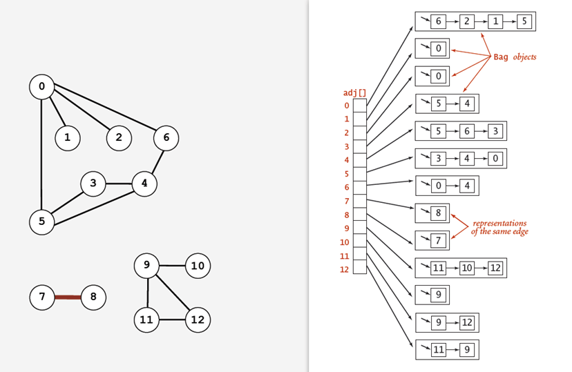
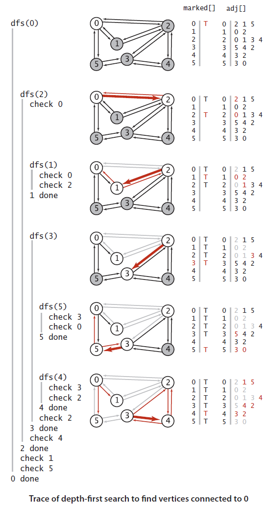
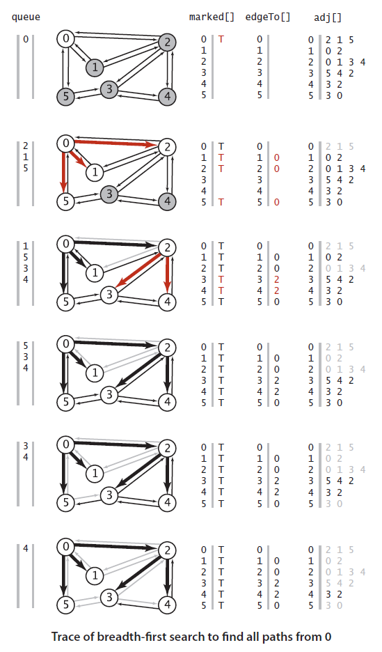
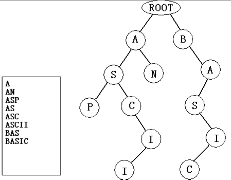

## 图

### 1.无向图

https://www.cnblogs.com/yangecnu/p/Introduce-Undirected-Graphs.html

#### 1.定义

定义：图是由一组顶点和一组能够将两个顶点相连的边组成的。

图的定义允许图包含有自环和平行边（连接同一对顶点的两条边），含有平行边的图称为**多重图**，而没有平行边或者自环的是**简单图**。

定义：如果从任意一个顶点都存在一条路径到达另一个任意顶点，我们称这幅图是**连通图**。一副**非连通图**由若干连通的部分组成，他们都是其**极大连通子图**。

定义：**树是一幅无环连通图**。互不相连的树组成的集合叫做**森林**。连通图的生成树是他的一副子图，它含有图中的所有顶点且是一棵树。

当且仅当一幅含有V个节点的图G含有下列5个条件之一时，它就是一棵树：

- G含有V-1条边且不含有环。
- G有V-1条边且是连通的。
- G是连通的，但删除任意一条边都会使他不再连通。
- G是无环图，但是添加任意一条边都会产生一条环。
- G中的任意一对顶点之间仅存一条简单路径。


#### 2.无向图的API

| public class      | Graph                 |                                     |
| ----------------- | --------------------- | ----------------------------------- |
| void              | Graph(int V)          | 创建一个含有V个顶点但是不含有边的图 |
| void              | Graph(In in)          | 从标准输入流in读入一幅图            |
| int               | V()                   | 顶点数                              |
| int               | E()                   | 边数                                |
| void              | addEage(int v, int w) | 向图中添加一条边v - w               |
| Iterable<Integer> | adj(int v)            | 和v相邻的所有顶点                   |
| String            | toString()            | 对象的字符串表示                    |

```java
//计算所有顶点的最大度数
public static int maxDegree(Graph G){
    int max = 0;
    for (int v = 0; V < G.V(); v ++)
        if(degree(G, v) > max)
            max = degree(G,v);
    return max;
}

//计算v的度数
public static int degree(Graph G, int v){
    int degree = 0;
    for (int w : G.adj(V)) degree ++;
    return degree;
}

//图的字符串输出
public String toString(){
    String s = V + " Vertice, " + E + "edges\n";
    for (int v = 0; v < V; v++){
        s = s + V + ": ";
        for(int w : this.adj(v))
            s += w + " ";
        s += "\n";
    }
    return s;
}
```


#### 3.Graph实现

实现图的数据结构：**邻接表数组**。使用一个以顶点为索引的列表数组，其中每个元素都是和该顶点相邻的定点列表（即**链表**）。使用邻接表数组是因为它满足处理图的两个基本要求：

- 他必须要能处理顶点和边数量超大的图大型图。
- Gragh的实例方法实现的一定要快。

使用邻接表来实现Graph的性能有以下特点：

- 使用的空间和V+E成正比。

- 添加一条边所需的时间是常数。

- **遍历顶点v的所有相邻点所需的时间和v的度数成正比**（处理每个相邻顶点所需的时间为常数）。

  



**Graph数据类型**

```java
public class Graph{
    private final int V;  //顶点数目
    private int E; 			//边的数目
    private Bags<Integer>[] adj;	//邻接表
    
    public Gragh(int V){
        this.V = V;
        this.E = 0;
        adj = (Bags<Integer>[]) new Bags[V];
        for (int v = 0; v < V; v++)
            adj[v] = new Bags<Integer>();
    }
    
    public Graph(In in){
        this(in, readInt());
        int E = in.readInt();
        for(int i = 0; i < E; i++){
            //添加一条边
            int v = in.readInt();
            int w = in.readInt();
            addEdge(v,w);
        }
    }
    
    public int V(){return V;}
    public int E(){return E;}
    public void addEage(int v, int w){
		adj[v].add(w);   //将w添加到v的链表中
        adj[w].add(v);
        E ++;
    }
    
    public Iterable<Integer> adj(int v) {return adj[v];}      
}
```


#### 4.搜索策略

**深度优先 VS 广度优先**

深度优先.解决**走迷宫问题**。只需要一个递归方法就可以遍历所有顶点。在访问其中一个顶点时：

1. **将它标记为已访问。**
2. **递归访问它的所有未被标记过的邻居顶点。**

深度优先走迷宫示意图：


这样能保证，如果图是连通的 ，每个邻接链表中的元素都会被检查到。

```java
// 深度优先
public class DepthFirstSearch{
   	private boolean[] marked;
    private int count;
    public DepthFirstSearch(Grapg G, int s){
        marked = new boolean[G.V()];
        dfs(G,s);
    }
    
    public void dfs(Graph G, int v){
	    marked[v] = true;
        count ++;
        for (int w : G.adj(v))
            if (!marked[w]) 
                dfs(G,w);
    }
    
    public boolean marked(int w) {return marked[w];}
    public int count() {return count;}
} 
```




**广度优先：**

解决**最短路径查找**问题。他使用了一个FIFO队列来保存所有已经被标记过但其邻接表还未被检查过的顶点。先将起点加入到队列，然后重复以下步骤直到队列为空：

1. 取队列中的下一个顶点v并标记它。
2. 将与v相邻的所有未被标记过的顶点加入队列。

 


在这个过程中，它现实的使用了一个队列，结果是一个数组eageTo[]，也是一颗用父链接表示的根节点为s的树，它表示了s到每个与s连通的顶点的最短路径。每经过一次循环，计数器就会加1，当有顶点为被标记时，将其标记，并把计数器的值赋给它，即为到根节点的最短路径。

```java
//广度优先
public class BreadthFirstPaths{
    private boolean[] marked;  //到达该顶点的最短路径是已知的吗
    private int[] edgeTo;   //到达该路径上的已知路径上的最后一点。
    private int s; //起点
    
    public BreadthFirstPaths（Graph G, int s){
        marked = new boolean[G.V()];
        edgeTo = new int[G.V()];
        this.s = s;
        bfs(G,s);
    }
    
    private void bfs(Grapg G, int s){
	    Queue<Integer> queue = new Queue<Integer>();
        marked[s] = true;
        queue.enqueue(s);
        while(!queue.isEmpty()){
            int v = queue.dequeue();
            for(int w : G.adj(v))
                if (!marked[w]){
                    edgeTo[w] = v;
                    marked[w] = true;
                    queue.enqueue(w);
                }
        }
    }
    
    public boolean hasPathTo(int v){
       return marked[v];
    }
}
```

#### 5.DFS的3种遍历策略

在深度优先搜索的时候，以Node的访问顺序，定义了三种不同的搜索策略：

- 前序遍历：结点 --—> 左子树 --—> 右子树
- 中序遍历：左子树--—> 结点 --—> 右子树
- 后序遍历：左子树 --—> 右子树 --—> 结点


### 2.有向图

**定义**：有向路径由一系列顶点组成，对于其中每个顶点你都存在着一条有向边，从他指向序列中的下一个顶点，有向环为一条至少含有一条边且起点和终点相同的有向路径。简单有向环是一条不含有重复的顶点和边的环。路径或者环的长度即为其中所包含的边数。


**拓扑排序：**优先级限制下的调度问题等价于计算有向无环图中的所有顶点的拓扑顺序。当且仅当一幅图是有向无环图时它才能进行拓扑排序。**对一个有向无环图(Directed Acyclic Graph简称DAG)G进行拓扑排序，是将G中所有顶点排成一个线性序列，使得图中任意一对顶点u和v，若边(u,v)∈E(G)，则u在线性序列中出现在v之前。** 通常，我们把这种顶点表示活动、边表示活动间先后关系的有向图称做顶点活动网(Activity On Vertex   network)，简称AOV网。 

#### 1.拓扑排序的实现步骤

1. 在有向图中选一个没有前驱的顶点并且输出
2. 从图中删除该顶点和所有以它为尾的弧（白话就是：删除所有和它有关的边）
3. 重复上述两步，直至所有顶点输出，或者当前图中不存在无前驱的顶点为止，后者代表我们的有向图是有环的，因此，也可以通过拓扑排序来判断一个图是否有环。


#### 2.拓扑算法实现

1. Kahn算法。使用一个栈保存入度为0 的顶点，然后输出栈顶元素并且将和栈顶元素有关的边删除，减少和栈顶元素有关的顶点的入度数量并且把入度减少到0的顶点也入栈。（上面排序的实现）。
2. DFS，深度优先搜索即可。


#### 3.强连通分量

有向图中, u可达v不一定意味着v可达u. 相互可达则属于同一个强连通分量(Strongly Connected Component, SCC)，有向图和它的转置的强连通分量相同，所有SCC构成一个DAG。有向图之间的强联通性是一种顶点之间的等价关系。具有着以下性质：**自反性；对称性；传递性**

**Kosaraju算法**

算法步骤

1. 调用DFS(G), 计算出每个结点的f[u]（离源节点的深度）。

2. 计算GT.

3. 调用DFS(GT), 在主循环中按照f[u]递减的顺序执行DFS-VISIT, 则得到的每个DFS树恰好对应于一个SCC

4. 运行时间：O(n+m).

   算法示例: 先把f[u]排序成postI数组, 然而在GT上DFS。


 Tarjan算法的操作原理如下：

1. Tarjan算法基于定理：在任何深度优先搜索中，同一强连通分量内的所有顶点均在同一棵深度优先搜索树中。也就是说，强连通分量一定是有向图的某个深搜树子树。
2. 可以证明，当一个点既是强连通子图Ⅰ中的点，又是强连通子图Ⅱ中的点，则它是强连通子图Ⅰ∪Ⅱ中的点。
3. 这样，我们用low值记录该点所在强连通子图对应的搜索子树的根节点的Dfn值。注意，该子树中的元素在栈中一定是相邻的，且根节点在栈中一定位于所有子树元素的最下方。
4. 强连通分量是由若干个环组成的。所以，当有环形成时（也就是搜索的下一个点已在栈中），我们将这一条路径的low值统一，即这条路径上的点属于同一个强连通分量。
5. 如果遍历完整个搜索树后某个点的dfn值等于low值，则它是该搜索子树的根。这时，它以上（包括它自己）一直到栈顶的所有元素组成一个强连通分量。 


### 3.最小生成树

#### 1.定义

定义：图的**生成树**是他的一个含有其所有顶点的无环连通子图。一幅加权图的**最小生成树**（MST）是它的一颗权值（树中所有边的权值之和）最小的生成树。

定义：图的一种切分是将图的所有顶点分为两个非空且不重叠的两个集合。横切边是一条睑裂两个属于不同几何的顶点的边。

切分定理：在一幅加权图中，给定任意的切分，他的横切边中的权重最小者必然属于图的最小生成树。切分定理是解决最小生成树问题的所有算法基础：**使用切分定理找到最小声生成数的一条边，不断重复找到最小生成树的所有边。**

#### 2.API

加权无向图的API表示

```java
//首先是加权边的API表示
public class Edge implements Comparble<Edge>{
    Edge(int v, int w, double w){} //用于初始化的构造器
    double weight() {} //边的权重
    int either(){} // 边两边的顶点之一
    int other(int v){} // 另一个顶点
    int compareTo(Edge that)(){} //将这条边与that比较
    String(){} // 对象的字符串输出表示
}

//加权无向图的API表示
public class EdgeWeightedGraph{
	EdgeWightedGraph(int V){}
    EdgeWeightedGraph(In in){}
    int V(){}  //图的顶点数
    int E(){}  //图的边数
    void addEdge(Edge e){}  //添加边
    Iterable<Edge> adj(int v){}  //和v相关的所有边
    Iterable<Edge> edges(){}  //图的所有边（忽略自环）
    Stirng toString(){}   //对象的字符串表示       
}
```

#### 3.算法实现

**prim算法**

此算法可以称为“**加点法”**，每次迭代选择代价最小的边对应的点，加入到最小生成树中。算法从某一个顶点s开始，逐渐长大覆盖整个连通网的所有顶点。

1. 图的所有顶点集合为V；初始令集合u={s}, v=V−u;
2. 在两个集合u,v。能够组成的边中，选择一条代价最小的边(u0,v0)，加入到最小生成树中，并把v0并入到集合u中。
3. 重复上述步骤，直到最小生成树有n-1条边或者n个顶点为止。


**Kruskal算法**

此算法可以称为**“加边法**”，初始最小生成树边数为0，每迭代一次就选择一条满足条件的最小代价边，加入到最小生成树的边集合里。

1. 把图中的所有边按代价从小到大排序；
2. 把图中的n个顶点看成独立的n棵树组成的森林；
3. 按权值从小到大选择边，所选的边连接的两个顶点ui,vi。应属于两颗不同的树，则成为最小生成树的一条边，并将这两颗树合并作为一颗树。
4. 重复(3),直到所有顶点都在一颗树内或者有n-1条边为止。


### 4.最短路径问题

一个定义明确且可以解决加权有向图的最短路径问题要能：

1. 对于从起点不可达的顶点，最短路径为正无穷。
2. 对于从起点可达但是路径上某个顶点属于一个负权重环的顶点，其最短路径为负无穷
3. 对于其他所有顶点，计算最短路径的权重（以及最短路径树）。

#### 1.Dijkstra算法

Dijkstra算法是一种贪心策略，使用广度优先搜索去解决赋权有向图或者无向图的单源最短路径问题（无法解决负权重问题）。

1. 声明一个数组dist来保存源点到各个顶点的最短距离和一个保存已经找到最短路径的顶点的集合，初始时，原点S的路径权重被赋给0(dis[s]=0)。
2. 若顶点s存在能够直接到达的边(s,m)，则把dis[m]设为w(s,m),同时把所有其他不可达顶点路径长度设为无限大。
3. 然后从dis数组中选择最小值，则该值就是源点s到该值对应的顶点的最短路径，并把该点加入到T中，完成一个节点。
4. 看新加入的顶点是否可以到达其他顶点并且看看通过该顶点到其他点的路径长度是否比源点直接到达短，如果是就替换这些顶点在dis中的值。
5. ，再从dis[]中寻找到最小的值，重复上述动作，直到T中包含图中所有顶点。


#### 2.Floyd算法

弗洛伊德算法是解决任意两点间的最短路径的一种算法，可以正确处理有向图或有向图或负权（但不可存在负权回路)的最短路径问题，同时也被用于计算有向图的传递闭包。

通过Floyd计算图G(V,E)中各个顶点的最短路径时，需要引入两个矩阵。矩阵S中的元素a[i, j]表示顶点i(第i个顶点)到顶点j(第j个顶点)的距离。矩阵P中的元素b[i, j]，表示顶点i到顶点j经过了b[i][j]记录的值所表示的顶点。假设图G中顶点个数为N，则需要对矩阵D和矩阵P进行N次更新。

1. 矩阵D中的顶点a[i, j]的值为顶点i到顶点j的权值，不相邻则设为正无穷。矩阵P的值为顶点b[i, j]的j的值。
2. 如果”a[i, j]的距离” > “a[i, 0]+a[0, j]”   (a[i, 0]+a[0, j]表示”i与j之间经过第1个顶点的距离”)，则更新a[i, j]为”a[i, 0]+a[0, j]”,更新b[i, j]=b[i, 0]。
3. 第k次更新时，如果”a[i, j]的距离” > “a[i, k-1]+a[k-1, j]”，则更新a[i, j]为”a[i, k-1]+a[k-1, j]”,b[i, j]=b[i, k-1]。
4. 更新N次之后，操作完成！


#### 3.SPFA算法

它的原理是对图进行V-1次松弛操作，得到所有可能的最短路径。**其优于迪科斯彻算法的方面是边的权值可以为负数、实现简单，缺点是时间复杂度过高，高达  O(VE)。但算法可以进行若干种优化，提高了效率。**

算法的思路：

我们用数组dis记录每个结点的最短路径估计值，用邻接表或邻接矩阵来存储图G。我们采取的方法是动态逼近法：设立一个**先进先出的队列**用来保存待优化的结点，优化时每次取出队首结点u，并且用u点当前的最短路径估计值对离开u点所指向的结点v进行松弛操作，如果v点的最短路径估计值有所调整，且v点不在当前的队列中，就将v点放入队尾。这样不断从队列中取出结点来进行松弛操作，直至队列空为止.

**带有负环的有向图是没有最短路径的**，所以在执行算法时候要判断是否带有负环。一般方法是：如果某个点进入队列的次数超过N次这存在负环（N为图的顶点数）

```java
private void relax(EdgeWeightedDIGraph G, int v){
    for (DirectedEdge e : G.adj()){
		int w = e.to();
        if (distTo[w] > distTo[v] + e.weight()){
            distTo[w] = distTo[v] + e.weight();
            edgeTo[w] = e;
            if (!onQ[w]){
                queue.enqueue(w);
                onQ[w] = true;
            }
        }
        findNegativeCycle();
    }
}
```

加权有向图中的负权重环检测问题一个实践就是汇率市场的套汇问题。当存在负权重环时即可以通过汇率的不同牟利，一个负权重环就是一个套利机会。


## 字符串

### 1.字符串排序

**低位优先排序**：字符串的低位优先排序算法目的就是将一组字符串按照从右到左的顺序依次比较指定索引位置的字符大小并排序。根据上述字符串的分组算法的逻辑，很容易使用下面的代码实现：下面的代码实质上就是将一组字符串按照倒数第一个字符分组（最后一个字符相同的，分组前后相对顺序不变），接着再按照倒数第二个字符分组（倒数第二个字符相同的，分组前后相对顺序不变），直到最终按照倒数第n个字符分组完毕。

**高位优先排序算法**：与低位优先排序相反，高位优先排序按照从左到右的顺序比较并排序。高位优先算法使用了两个辅助数组：一个用来将数据分类的临时数组，和一个用来保存将会被转化为切分索引的统计频率的数组（count[]。即使在最坏情况下，他的运行时间也是线性的。

**字符串的三向快速排序**：改进的高位优先排序。根据键的首字母进行三向切分，仅在中间字数组中的下一个字符（因为键的首字母都与切分字符相同）继续递归排序。他是高位优先和快排的结合。是不稳定排序。

```java
public class Quick3string{
    private static int charAt(String s, int d){
		if (d < s.length()) { 
            return s.charAt(d);}
        else
            return -1;
    }  
    public static void sort(String[] a) { sort(a,0, a.length - 1, 0);}
	public static void sort(String[] a, int lo, int hi, int d){
		if (hi <= lo) return;
        int lt = lo, gt = hi;
        int v = charAt(a[lo], d);
        int i = lo + 1;
        while (i <= gt){
            int v = charAt(a[i], d);
            if (t < v) exch(a, lt++, i++);
            else if (t > v) exch(a, i, gt--);
            else i++;
        }
        sort(a, lo, lt-1, d);
        if (v >= 0) sort(a, lt, gt, d+1);
        sort(a, gt+1, hi, d);
    }
    
    public void exch(String[] s, int i, int j){
        String temp = a[i];  a[i] = a[j];  a[j] = temp;
    }
}
```

### 2.单词查找树

和各种查找树一样，单词查找树也是由链接的节点所组成的数据结构。每个节点都有一个父节点，同时含有R条链接，其中R为字母表的大小。单词查找树一般都会大量的空链接。又被称为**字典树**，是一种有序树，用于保存关联数组，其中的键通常是字符串，Trie可以看做是确定有限状态自动机（DFA）。**与二叉树不同，键不是直接保存在节点中，而是由节点在树中的位置决定**。一个节点的所有子孙都有相同的前缀，也就是这个节点对应的字符串，而根节点对应空字符串。



**Trie树的优点是最大限度减少了无谓的字符串比较，查询效率比较高，核心思想是用空间换时间，利用字符串的公共前缀来降低查询时间的开销已达到提高效率的目的。**

单词查找树有以下性能：

1. **插入，查找所需的时间与被查找的键的长度成正比，复杂度为O(N)。**
2. **查找未命中只需检查若干个字符。**
3. **对于英文字母的字典树，其空间复杂度是26^n^级别的， 数字的字典树的空间复杂度是10^n^级别。**

执行查找的方式就是在单词查找树中从根节点开始检查某条路径上的所有节点。当到达树中表示尾字符的节点或者一个空链接。此时可能会出现两种情况：

- 在到达键的尾字符之前就遇上了一个空链接，这种情况下，单词查找树中不存在与键的尾字符相对应的节点，因此还需要为键中还未被检查的每个字符创建一个对应的节点并将键的值保存到最后一个字符的节点中。
- 在遇到空链接之前就到达了键的尾字符，在这种情况下，和关联数组一样，将该节点的值设为键所对应的值（无论是否为空）

**节点的表示**：每个节点都包含有R（出现的字符个数）个链接数组和一个值（value值，为空则表示从根节点到该处的前缀字符（可认为是key,非显式的存储于字典树中）不存在于该字典树中，查询不到。）。绝大部分链接数组中的值都为空链接。

基于单词查找树的符号表

```java
public class TrieST<Value>{
	private static int R = 26;
	private Node root;
    
    private static class Node{   //节点构成
        private Object val;
        private Node[] next = new Node[R];  //链接数组
    }
    
    //实现查找功能
    public Value get(String key){   
		Node x = get(key, root, 0);
        if (x == null) return null;
        return (Value) x.val;
    }
    
    private Node get(Node x, String key, int d){
        //返回以x作为根节点的子单词查找树中与key相关的联的值
        if (x == null) return null;
        if (d == key.length()) return x;
        char c = key.charAt(d);  //找到第d个字符所对应子单词的查找树
        return get(x.next[c], key,  d+1); //递归
    }
    
    public void put(String key, Value val){
        root = put(root, key, val 0);
    }
    
    //如果key存在于以x为根节点的子单词查找树中这更新与它相关的值。
    private Node put(Node x, String key, Value val, int d){
        if (x == null) x = new Node();
        if (d == key.length()) { x.val = val; return x;} 
        char c  = key.charAt(d);  //找到第d个字符所对应的子单词查找树
        x.next[c] = put(x.next[c], key, val, d+1);
        return x;
    }
    
    //实现查找所有键，因为字符和键都是隐式的表示在查找树中，所以可以用一个队列来表示，和深度优先递     //归遍历方法是去查找所有键。并且提供一个参数pre，可以定位查找以pre为前缀的所有的键。
    
    public Iterable<String> keys(){
		return keyWithPrefix("");
    }
    
    public Iterable<String> keyWithPrefix(String pre){
		Queue<String> q = new Queue<String>();
        collect(get(root, pre, 0), pre, q);
        return q;
    }
    
    public void collect(Node x, String pre, Queue<String> q){
        if (x == null)  return;
        if (x.val != null)  q.enqueue(x.val);
        for (char c = 0; c < R; c++)
            collect(x.next[c], pre + c, q);
    }
    
    //找到给定字符的最长键前缀。
    public String longestPrefixOf(String s){
        int length = search(root, s, 0, 0);
        return s.substring(0, length);
    }
    
    private int search(Node x, String s, int d, int length){
        if (x == null) return length;
        if (x.val != null) length = d;
        if (d == s.length()) return length;
    	char c = s.charAt(d);
        return search(x.next[c], s, d+1, length);
    }
    
    //删除操作。。同理
    private Node delete(Node x, String key, int d){}
}
```

```java
import java.util.ArrayList;  
import java.util.List;  

class Trie {  
    /** 单词查找树根节点，根节点为一个空的节点 */  
    private Vertex root = new Vertex();   
    /** 单词查找树的节点(内部类) */  
    private class Vertex {  
        /** 单词出现次数统计 */  
        int wordCount;  
        /** 以某个前缀开头的单词，它的出现次数 */  
        int prefixCount;  
        /** 子节点用数组表示 */  
        Vertex[] vertexs = new Vertex[26];  
         /** 树节点的构造函数 */
        public Vertex() {  
            wordCount = 0;  
            prefixCount = 0;  
        }  
    }
    
    public Trie() {} /*空的构造函数*/
    
    public void addWord(String word) { addWord(root, word.toLowerCase()); }  
    /** * 向单词查找树添加一个新单词 
     * @param root  单词查找树节点 
     * @param word  单词 
     */  
    private void addWord(Vertex vertex, String word) {  
        if (word.length() == 0) {  
            vertex.wordCount++;  
        } else if (word.length() > 0) {  
            vertex.prefixCount++;  
            char c = word.charAt(0);  
            int index = c - 'a';  
            if (null == vertex.vertexs[index]) {  
                vertex.vertexs[index] = new Vertex();  
            }  
            addWord(vertex.vertexs[index], word.substring(1));  
        }  
    }  

    public int countWord(String word) {   return countWord(root, word);   }  
    /** 
     * 统计某个单词出现次数 
     * @param root  单词查找树节点 
     * @param word 单词 
     * @return 出现次数 
     */  
    private int countWord(Vertex vertex, String word) {  
        if (word.length() == 0) { return vertex.wordCount; } 
        else {  
           char c = word.charAt(0);  
           int index = c - 'a';  
           if (null == vertex.vertexs[index]) { return 0; }
           else {return countWord(vertex.vertexs[index], word.substring(1));} 
        }  
    }  
  
    /**  统计以某个前缀开始的单词，它的出现次数 
     * @param word  前缀 
     * @return 出现次数 
     */  
    public int countPrefix(String word) {  return countPrefix(root, word);  } 
    
    /** 统计以某个前缀开始的单词，它的出现次数(前缀本身不算在内) 
     * @param root 单词查找树节点 
     * @param word 前缀 
     * @return 出现次数  */  
    private int countPrefix(Vertex vertex, String prefixSegment) {  
        if (prefixSegment.length() == 0) {  
            return vertex.prefixCount;  
        } else {  
            char c = prefixSegment.charAt(0);  
            int index = c - 'a';  
            if (null == vertex.vertexs[index]) { return 0; } 
            else { return countPrefix(vertex.vertexs[index], prefixSegment.substring(1));}  
        }  
    }  

    public List<String> listAllWords() {  
        List<String> allWords = new ArrayList<String>();  
        return depthSearchWords(allWords, root, "");  
    }  
  
    /** 递归生成所有单词 
     * @param allWords 单词集合 
     * @param vertex 单词查找树的节点 
     * @param wordSegment 单词片段 
     * @return 单词集合 
     */   
    private List<String> depthSearchWords(List<String> allWords, Vertex vertex,  String wordSegment) {  
        Vertex[] vertexs = vertex.vertexs;  
        for (int i = 0; i < vertexs.length; i++) {  
            if (null != vertexs[i]) {  
                if (vertexs[i].wordCount > 0) {  
                    allWords.add(wordSegment + (char)(i + 'a'));  
                    if(vertexs[i].prefixCount > 0){  
                        depthSearchWords(allWords, vertexs[i], wordSegment + (char)(i + 'a'));  
                    }
                } else {  
                    depthSearchWords(allWords, vertexs[i], wordSegment + (char)(i + 'a'));  
                }  
            }  
        }  
        return allWords;  
    }  
}  

public class Main {  
    public static void main(String[] args) {  
        Trie trie = new Trie();  
        trie.addWord("abc");  
        trie.addWord("abcd");  
        trie.addWord("abcde");  
        trie.addWord("abcdef");  
        System.out.println(trie.countPrefix("abc"));  
        System.out.println(trie.countWord("abc"));  
        System.out.println(trie.listAllWords());  
    }  
}  
```

**命题**：字母表的大小为R， 在一颗由N个随机键构造的单词查找树中，未命中的查找平均所需检查的节点数量为  ~ log~R~N. 这也说明**查找未命中的成本与键的长度无关**。在一颗由100万个随机键构成的单词查找树中，未命中的查找也只需要查找3~4个节点。


### 3.三向单词查找树

为了避免单词查找树对空间的国度消耗而设计。每个节点都含有一个字符（当前节点存储的key），三条连接和一个值(value)。这三条链接分别对应着当前字母小于，等于和大于节点字母的所有键。字符是显式的表示在节点中，只有沿着中间链接前进时才会根据字符找到表中的键。

在查找中，如果选中中链接，这继续处理下一个字符，若不匹配，选择左链接或者右链接，但当前字符（key）不变，直到找到了中链接继续换下一个字符，或者遇到空链接结束查找 。**这种实现方式等价于将R向单词查找树中的每一个节点实现为以非空链接所对应的的字符作为键的二叉查找树。**

使用三向单词查找树的最大好处是他能够很好的适应实际应用中可能出现的被查找键的不规则性（即键的分布极度不均衡的情况）。比如车牌号这种，第一位是字母，后几位是数字。


### 4.子字符串查找

**暴力字串查找**：在最坏情况下，暴力子串查找算法在长度为N的文本中查找长度为M的模式需要查找 O(MN) 次。

常用的是KMP字符串查找算法，它能够让查找次数不超过 M+N 次。可以将KMP算法看做一胎由模式字符串构造的能够扫描文本的有限状态自动机。他可以根据文本中的字符改变自身的状态。当且仅当自动机达到停止状态时它才找到一个匹配。算法本身就是模拟这种自动机。这种自动机很容易模拟的原因是它是确定性的，每种状态的转换都是完全由文本中的字符决定的。

对于正则表达式而言，因为或操作和闭包的存在，自动机甚至无法知道需要检测多少字符才会失败。这里需要非确定性的自动机：**当面对匹配模式的多种可能时，自动机能够猜出正确的转换。**


## 其他算法

### 动态规划

理解动态规划：计算A[i+1]只需要知道A[0…i]的值，无需知道A[0…i]是通过何种途径计算得到的，只需要知道他们当前的值，计算A[i+1]也不会改变A[1,…n]的值（无后效性），如果将A[0….n]当成一个整体，则可认为动态规划是马尔可夫过程。

动态规划算法分为以下4个步骤：

1. **描述最优解的结构**
2. **递归定义最优解的值**
3. **按自底向上的方式计算最优解的值。**
4. **由计算出的结果构造一个最优解。**


动态规划与分治法之间的区别：

1. **分治法是指将问题分成一些独立的子问题，递归的求解各子问题。**
2. **动态规划适用于这些子问题不是独立的情况，也就是各子问题包含公共子问题。**

采用动态规范方法的最优化问题中的两个要素：最优子结构和重叠子结构。

**最优子结构**：如果问题的最优解所包含的子问题的解也是最优的，我们就称该问题具有最优子结构性质，即满足最优化原理。

**重叠子问题**：子问题重叠性质是指在用递归算法自定向下对问题进行求解时，每次产生的问题并不总是新问题，有些子问题会被重复计算多次，动态规划算法真是利用了这种子问题的重叠性质，对每一个子问题只计算一次，然后将其计算结果保存在一个表格中。再次需要时查询即可。


**动态规划解决问题**：

等号约定，C1是S1的最右侧字符，C2是S2的最右侧字符，S1‘是从S1中去除C1的部分，S2’是从S2中去除C2的部分

LCS(S1,S2)等于：

1. LCS（S1，S2’）
2. LCS（S1’，S2）
3. 如果C1不等于C2：LCS（S1’，S2’）；如果C1等于C2：LCS（S1’，S2’）+C1

边界终止条件：如果S1和S2都是空串，则结果也是空串。

同样我们需要构建一个矩阵来存储动态规划过程中子问题的解。这个矩阵C中每个数字代表了该行和该列之前的LCS的长度。与上面刚刚分析出的状态转移议程相对应，矩阵的每个格子里面的数字应该这么填，它等于以下三项的最大值：

1. 上面一个个里面的数字，
2. 左边一个格子里面的数字
3. 左上角那个格子里面的数字（如果C1不等于C２(￣▽￣)“）；左上角那个格子里的数字+1（如果C1等于C2）

如果只是要统计最长公共子序列（不要求连续）的长度，则只需要这一个矩阵就可以了，如果还需要得到最长公共子序列具体序列的话，则还需一个矩阵D（和C一样大），专门用于存放C中的每个数字的变化轨迹，这样沿着C矩阵的轨迹就可找出公共子序列了。

```java

```


**0-1背包问题**

给定一组多个（）物品，每种物品都有自己的重量（）和价值（），在限定的总重量/总容量（）内，选择其中若干个（也即每种物品可以选0个或1个），设计选择方案使得物品的总价值最高。

? 更加抽象的话：

给定正整数、给定正整数，求解0-1规划问题：

 ， s.t.  ，  。给定一组多个（）物品，每种物品都有自己的重量（）和价值（），在限定的总重量/总容量（）内，选择其中若干个（也即每种物品可以选0个或1个），设计选择方案使得物品的总价值最高。

? 更加抽象的话：

给定正整数、给定正整数，求解0-1规划问题：

 ， s.t.  ，  。

定义子问题  为：在前  个物品中挑选总重量不超过  的物品，每种物品至多只能挑选1个，使得总价值最大；这时的最优值记作  ，其中  ，  。

考虑第  个物品，无外乎两种可能：选，或者不选。


### 数据压缩

**对于无规律的任意比特流，是找不到合适压缩算法的。实际要求的无损压缩算法必须尽量利用被压缩的数据流中的已知结构。**一般是由具备以下特征的数据：

- **小规模的字母表**
- **较长的连续相同的位或字符。**
- **频繁使用的字符**
- **较长的连续使用的位或字符。**


#### 游程编码

比特流中最简单冗余的一种形式就是一长串重复的比特。可以使用数字表示0和1交替出现的次数。因为0和1是交替出现的，比如00011000就可用数字323（111011）进行压缩，数字越长，压缩率越大，一般需要确定表示数据的最大的比特位。在二进制图像文本存储时很常见（一般限定7位或者8位最大表示数字位255）。

#### 霍夫曼编码

核心思想：**用较短的比特表示出现频率高的字符，用较长的比特表示出现频率低的字符。**Huffman编码构造了一棵能够将比特流最小化的单词查找树。

```java

```


huffman树：在权重位w1, w2,w3,…wn的n个叶子节点的所有二叉树中，带权路径长度WPL最小的二叉树成为huffman树或者最优二叉树。


其中，n表示叶子结点的数目，wi和li分别表示叶子结点ki的权值和树根结点到叶子结点ki之间的路径长度，路径长度等于路径上的节点数减去1。

Huffman树的构造：

1. 根据给定的n个权值{w1,w2,…,wn}构成二叉树集合F={T1,T2,…,Tn},其中每棵二叉树Ti中只有一个带权为wi的根结点,其左右子树为空。
2. 在F中选取两棵根节点权值最小的书作为左右子树构造一棵新的二叉树。且置新的二叉树的根节点的权值位左右子树根节点的权值之和。
3. 在F中删除这两棵树。同时将新的二叉树加入到F中。
4. 重复23直到F只含有一棵树为止。

注意点：具有相同带全节点的哈夫曼树不唯一；包含n个叶子节点的哈夫曼树共有2n-1个节点。


译码的唯一性问题：**要求任一字符的编码都不能是另一字符编码的前缀**。这种编码成为前缀编码（非前缀码）。在压缩编码中要考虑的两个问题是：

- **数据的最小冗余编码问题**
- **译码的唯一性问题**

Huffman编码即完满解决了这两个问题。以二进制前缀编码为例。以字符作为叶子节点构造二叉树，而后将二叉树中节点引向其左边的分支标记0，引向右边的分支标记为1.每个字符的编码即为从根到每个叶子的路径上得到的0，1序列。如此得到的即为二进制前缀编码。可以保证**，任意一个叶子节点都不可能在其他叶子节点的路径中**。


### 后缀排序

后缀排序是一种高效的利用排序算法找出字符串中最长重复子字符串。用Java的substring()方法创建一个由字符串s的所有后缀字符串（由字符串的所有位置开始得到的后缀字符串）组成的数组，然后将该数组排序。算法的关键在于原字符串的每个字串都是数组某个后缀字符串的前缀。在排序之后，最长重复字串会出现在数组中的相邻位置。因此只需要遍历排序后的数组一遍即可在相邻元素中找到最长的公共字串。


### 网络流算法

定义：**一个流量网络是一张边的权重（容量）为正的加权有向图。一个st - 流量网络有两个已知顶点。即起点s和终点t。 s-t流量网络中的st-流量配置是由一组和每条边相关联的值组成的集合，这个值被称为边的流量，说过所有边的流量均小于等于边的容量且满足每个顶点的局部平衡（除 s 和 t 外净流量为零），则称这种流量配置方案是可行的。最大st流量就是指找到使得从 s 到 t 的流量最大的配置。**


流量网络的API

```java
//流量网络中边的API
public class FlowEdge(int v, int w, double cap){
    int from(){} //边的起始顶点
    int to() {} //边的目的顶点
    int other(int v) {} //边的另一个顶点
    double capacity() {} //边的容量
    double flow() {} //边中的流量 
    double residualCapacityTo(int v) {} //v的剩余容量
    double addResidualFlowTo(int v, double delta) {} //将v的流量增加delta
    String toString(){}
}

//流量网络API
public class Flownetwork{
    Flownetwork(int V) {} // 创建一个含有V个顶点的空网络
    int V() {}  // 顶点的总数
    int E(){} // 边的总数
    void addEgde(FlowEdge e) {} //向流量网络中添加边e
    Iterable<FlowEdge> adj(int v){} // 从v中指出的边
    Iterable<FlowEdge> edges() //流量网络的所有边
    String toString()    
}
```


**增广路径算法**: 

最大流量—最小切分定理：令f为一个 s-t 流量网络，以下三种条件是等价的：

- 存在某个 s-t 切分，其容量和f的流量相等。
- f达到了最大流量。
- f中已经不存在任何增广路径。


所有的增广路径算法的构造是基于增广路径定理的：

​        *定理一(增广路径定理)：**流x是最大流当且仅当这个残留网络不包含其他增广路经**。*  