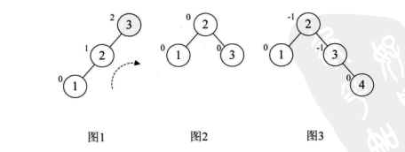
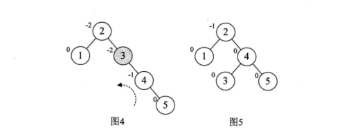
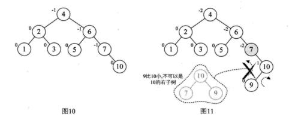
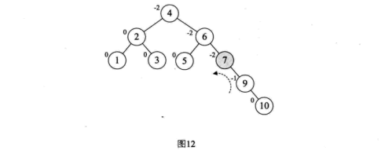
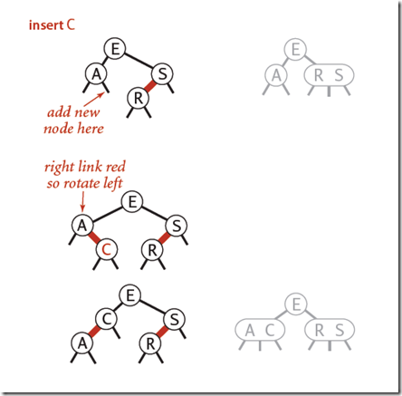
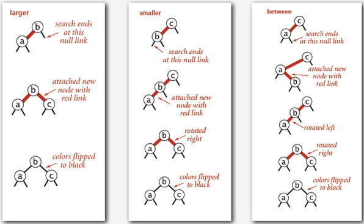
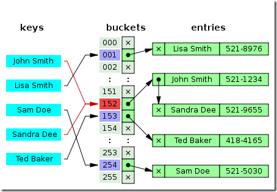

#### 1.API

简单的一个抽象数据类型符号表如下（完全类比dict）：

public class ST <Key, Value>

| ST()                      | 生成一张新表                         |
| ------------------------- | ------------------------------------ |
| value put(Key key)        | j将键存入符号表中。                  |
| Value get(Key key)        | 获取key对应的值（若不存在则返回null) |
| void delete(Key key)      | 从表中删除key及其对应的值            |
| boolean contains(Key key) | key在表中是否有对应的值              |
| boolean isEmpty()         | 表是否为空                           |
| int Size()                | 表中的键值对数量                     |
| Iterable<key> keys()      | 表中所有键的集合                     |

由于Key要求一致性，不能有重复，因此不可以使用不可变数据类型作为键。对于实现了compareTo的符号性表，还可以实现更多的api，构建一个有序表，比如排序等等。

**键的等值性**：

**Java的一条最佳实践就是位或所有Comparable类型中的compareTo()方法和equals()方法的一致性，为了避免任何潜在的二义性，在有序表中，应该避免使用equals()方法。**

一种常见的统计文本中最大词频的单词和和出现次数的FrequencyCounter是一类常见的应用，他的一些特性也是许多其他符号表应用的共性:

- **混合使用查找和插入操作**
- **大量的不同键**
- **查找操作比插入操作多的多。**
- **查找和插入的使用模式并非随机。**


**成本总结**：

|          算法          | 复杂度(查找) | 复杂度(插入) | 特点                                                         |
| :--------------------: | ------------ | ------------ | :----------------------------------------------------------- |
|  顺序查找（无序链表）  | N/2          | N            | 适用于小型问题                                               |
|  二分查找（有序数组）  | logN         | N            | 插入操作不够快                                               |
|    二叉查找树(BST)     |              |              | 能够进行有序性相关操作，但是没有性能上界保证，链接需要额外空间 |
| 平滑二叉查找树(红黑树) |              |              | 最优的查找和插入效率，能够进行有序性相关操作，链接需要额外空间。 |
|         散列表         |              |              | 能够快速查找和插入常见数据类型。缺点是需要计算每种类型的数据的散列，不能进行有序性操作> |


#### 2.**顺序查找**

一种替代实现方法是用无序链表来实现的顺序查找，每个结点存储键值对，put()和get()操作都是通过遍历链表来完成。这种方法也被称为**顺序查找**：在查找中我们一个一个的顺序遍历符号表中的所有键并使用equals()方法来寻找与被查找的键的键匹配的键。


```java
public class SequentialSearchST<Key, Value>{
    private Node first; //首节点
    private class Node{
        Key key;
        Value value;
        Node next;
        public Node(Key key, Value value, Node next){
            this.key = key; this.value = value; this.next = next;
        } 
    }
    
    public static boolean isEmpty(){
        return first == null;
    } 
    
    public Value get(Key key){
		//查找给定的键，返回相关联的值
        for(Node x = first; x != null; x = x.next){
            if (key.equals(x.key))  return x.value;
        }
        return null;
    }
    
    public void put(Key key, Value value){
        //查找给定的键，找到则更新其值，否则在表中新建节点。
        for (Node x = first; x != null; x = x.next){
            if (key.equals(x.key)){
                x.value = value； return;}
        }
    	first = new Node(key, value, first);
    }
	//待实现size(), keys() 和delete()方法、
}

```


**二分查找：必须采用顺序存储结构；必须按照关键字大小有序排列。**可以使用迭代实现。


#### 3.BST

数据表示：我们嵌套定义私有类来表示二叉树的节点。每个节点含有一个键，一个值，一条左链接，一条右链接，一个结点计数器。

基于二叉树查找的符号表模板(主要通过递归实现)：

```java
public class BST<key extends Comparable<Key>, Value>{
    private Node root;
    
    private class Node{
    	  private Key key;
        private Value val;
        private Node left, right;
        private int N;
        
        public Node(Key key, Value val, int N){
            this.key = key;
            this.val = val;
            this.N = N;
        }
    }
       
    //每个公有方法都对应一个私有方法，它接受一个额外的链接作为参数指向某个节点。
    public int size() {return root.N;}    
    private int size(Node x){
        if (x == null) return 0;
        else return x.N;
    }
    
    public Value get(Key key) {return get(root, key);}
    private Value get(Node x, Key key){
        if (x == null) return null;
        int cmp = key.compareTo(x.key);
        if (cmp < 0) return get(x.left, key);  //递归查找
        else if (cmp > 0) return get(x.right, key);  //递归查找
        else return x.val;
    }    
    
    public void put(Key key, Value val){
        root = put(root, key, val);//查找key，找到则更新他的值，否则为他创建一个新的节点
    }    
    public Node put(Node x, Key key, Value val){
        //如果key存在于以x为根节点的子树中则更新他的值，
        //否则以Key和val为键值对的新节点插入到该子树中
    	if (x == null) return new Node(key, val, 1);
        int cmp = key.compareTo(x.key);
        if (cmp < 0) return put(x.left, key, val);  //递归查找
        else if (cmp > 0) return put(x.right, key, val);  //递归查找
        else x.val = val;
        x.N = size(x.left) + size(x.right) + 1;
    }
    
    public Key min() {return min(root).key;}
    public Node min(Node x){
        if (x.left == null) return x;
        else return min(x.left);
    }
    
    public Key max() {return max(root).key;}
    public Node max(Node x){
        if (x.right == null) return x;
        else return max(x.right);
    }
    
    //向下取整函数，选择小于Key，离key最近的节点的value,
    public Key floor(Key key){
        Node x = floor(root, key);
        if (x == null) return null;
        else return x,key;
    }
        
    private Node floor(Node x, Key key){
        if (x == null) return null;
        int cmp = key.compareTo(x.key);
        if (cmp == 0) return x;
        if (cmp < 0) return floor(x.left, key);
        Node t = floor(x.right, key);
        if (t != null) return t;
        else return x;
    }
    
    //实现select() 和 rank(), rank是select的逆方法，他会返回给定键的排名。他的实现和select类
    //似，如果给定的键和根节点的键相等，我们返回左字树中的节点众数t；如果给定的键小于根节点，我们
    //会返回该键在左字树中的排名（递归计算）， 如果给定的键大于根节点，我们会返回t+1（根节点）加上
    //它在右字树中的排名
    
    public Key select(int k){return select(root, K).key;}
    private Node select(Node x, int k){...}
        
    public int rank(Key key) { return rank(root, key);}
    public int rank(Node x, Key key){...}
    //实现删除最大键最小键操作和删除任意键值操作
    .......
}
```


在二叉查找树中：

- 若任意节点的左子树不空，则左子树上所有结点的值均小于它的根结点的值；
- 任意节点的右子树不空，则右子树上所有结点的值均大于它的根结点的值；
- 任意节点的左、右子树也分别为二叉查找树。
- 没有键值相等的节点（no duplicate nodes）。

二叉树的遍历方式：

1. 前序遍历 
   1. 访问根节点。
   2. 先序遍历左子树。
   3. 先序遍历右子树。
2. 中序遍历
   1. 先序遍历左子树。
   2. 遍历根节点。
   3. 先序遍历右子树。
3. 后序遍历
   1. 先序遍历左子树。
   2. 先序遍历右子树。
   3. 遍历根节点。

```java
private void inOrder(BSTNode<T> tree) {
    if(tree != null) {  //前序遍历。
        inOrder(tree.left);
        System.out.print(tree.key+" ");
        inOrder(tree.right);
    }
}

public void inOrder() {
    inOrder(mRoot);
}
```

System.out.print(tree.key+” “);  这条放在不同的位置就构成了前序，中序，后序遍历，不变的是左边永远都比右边的先遍历。


#### 4.平衡二叉树

参考：https://www.cnblogs.com/zhujunxxxxx/p/3348798.html

**平衡二叉树，是一种二叉排序树**，其中每个节点的左子树和右子树的高度差至多等于1，它是一种高度平衡的二叉排序树，高度平衡的意思是，要么它的左子树和右子树都是平衡二叉树，且左子树和右子树的深度之差的绝对值不超过1。将二叉树上结点的左子树深度减去右子树深度的值称为平衡因子BF，那么平衡二叉树上的所有结点的平衡因子只可能是-1、0和1。只要二叉树上有一个结点的平衡因子的绝对值大于1，则该二叉树就是不平衡的。 


平衡二叉树构建的基本思想就是在构建二叉排序树的过程中，每当插入一个节点时，先检查是否因为插入儿破坏了树的平衡性，若是，则找出最小不平衡子树。在保持二叉树特性的前提下，调整最小不平衡子树中个节点之间的链接关系，进行相应的旋转，使之成为新的平衡子树。



然后再增加结点4，平衡因子没有改变，如上图图3。增加结点5时，结点3的BF值为-2，说明要旋转了。由于BF是负值，对这棵最小平衡子树进行左旋（逆时针旋转），如下图图4，此时整个树又达到了平衡。



当增加结点10时，结构无变化，如图10所示。再增加结点9，此时结点7的BF变成了-2，理论上只需要旋转最小不平衡树7、9、10即可，但是，如果左旋转后，结点9变成了10的右孩子，这是不符合二叉排序树的特性的，此时不能简单的左旋。



需要先进行一次旋转，使之符和有序二叉树的定义，再进行旋转。



可以发现，当最小不平衡树根节点的平衡因子BF大于1时，就右旋，小于-1时就左旋。如果插入时，最小不平衡子树的BF与它的子树的BF符号相反时，就需要对节点先进行一次旋转以使得符号相同后，再反向旋转一次才能完成平衡操作。


#### 5.红黑树

http://www.cnblogs.com/yangecnu/p/Introduce-Red-Black-Tree.html

http://www.sohu.com/a/201923614_466939

**BST在极端情况下的性能很糟糕，理性情况下我们希望能够保持二分查找树的平衡性，这样无论如何构造他，运行时间都是对数级别的。**

##### 2-3查找树


定义。一颗2-3查找树或为一颗空树，或由以下节点组成：

- 2节点，含有一个键（及其对应的值）和两条链条，左链指向的2-3树中键都是小于该节点，右链指向的2-3树中键都大于该节点。

- 3-节点，含有两个键（及其对应的值）和三条链条，左链指向的2-3树中的键都是小于该节点，中链指向的2-3树中的键都位于该节点的两个键之间，右链指向的2-3树中的键都大于该节点。

  

我们使用2-3树的主要原因在于他能在插入后继续保持树的平衡，**向树中插入新节点时，如果未命中的查找结束于一个2-节点，我们只需要将这个2节点替换为3节点，将要插入的键保存于其中。**如果未命中的查找落于3节点中，向一个父节点为2节点的的3节点中插入新键时， 构造一个临时4节点并分解为两个二节点，并将中间节点值转移到父节点上，使父节点成为一个3节点即可。  向一个父节点为3节点的的3节点中插入新键：同样构造一个临时4节点并分解他，由于父节点是3节点，最终转化成一个新的3节点的父节点和两个新的2节点的子节点。每次转化都是将4节点的中节点上移到父节点中，然后再对父节点进行拆分。如果父节点在转移前是三节点则一直递归上移到根节点，直到中间找到二节点，将该二节点转为三节点就可以了，而如果一直上移到根节点也是三节点，则将新键插入到根节点形成四节点，再将该4节点分解为3个二节点，树高整体加一。

**分解根节点**：如果从插入节点到根节点的路径上全都是3-节点，我们的根节点最终变成了一个临时的4-节点。然后我们将临时的4-节点分解为3个2-节点，使得树高加1.

这种动态变化的核心能确保能够无论如何插入新节点，树都是平衡的，所有的局部变换都不会影响整棵树的平衡性。即：**任意空链接到根节点的路径长度都是相等的。** 因为插入操作的核心思想是，二节点可以变三节点，树高不变，**但三节点要变四节点然后分解为二节点增加树高的情况只能发生在根节点，这样就保证了树高度的增加是统一的，**不会有哪个节点的高度因为插入了新节点而不同。


和标准的二叉树**由上向下**生长不同的是，2-3的生长是**由下向上**的。即使在最坏情况下，一颗大小为N的2-3树中，查找和插入的操作访问的节点数也不会超过**log~2~N**.  最好情况时是所有节点都为3节点，这样的平均查找次数就为 log~3~N,  大概是最坏情况效率的0.631倍。具体来说，对于一个一百万个节点的2-3树，树的高度为12-20之间，对于10亿个节点的2-3树，树的高度为18-30之间。


##### 红黑树

http://www.cnblogs.com/skywang12345/p/3310928.html

https://www.cnblogs.com/skywang12345/p/3245399.html

定义。红黑树是一种含有红黑链并满足下列条件的二叉查找树：

- **红链接均为左链接。**（默认定义，确保不会出现红色右连接。）
- **没有任何一个链接同时和两条红链接相连。**（否则就是4节点了。）
- **该树是完美红黑平衡的，即任意空链接到根节点的路径上的黑链数量是相同的**。（因为红链不真正代表左连接，而只是一个三节点的表示，所以黑链数量相等确保了该树的度是logN。）


另一种形式的定义，红河hi书或者是一颗空树，或者是具有以下性质的二叉查找树：

1. **节点非黑即红**
2. **根节点是黑色**
3. **所有的NULL节点称为叶子节点，且认为颜色为黑。**
4. **所有红节点的子节点都为黑色。**
5. **从任一节点到其叶子节点的所有路径上都包含相同数目的黑节点。**

两种定义一种是定义节点，一种是定义连接。


这些性质的目的都是为了保证红黑树的平衡。

满足这样的红黑树和相应的2-3树是一一对应的。可以将其看作是2-3树的另一种表示形式：

**红黑树是2-3树的一种简单高效的实现，他巧妙地使用颜色标记来替代2-3树中比较难处理的3-node节点问题。**


**红黑树背后的基本思想是用标准的二叉查找树（完全由2-节点构成）和一些额外的信息（替换3节点）来表示2-3树。我们将树中的连接分为两种类型：红链接将两个2-节点连接起来构成一个3节点，黑链接则是2-3树中的普通链接。确切的说，我们将3节点表示为由一条左斜的红色链接相连的两个2-节点。这种表示法的一个优点是，我们无需改变就可以直接使用标准二叉树的get()方法，对于任意的2-3树，只要对节点进行转换，就可以立即派生出相应的红黑树。**

```java
//红黑树的实现
//在二叉树的每一个节点上增加一个新的表示颜色的标记，该标记表示该节点指向其父节点的颜色。


public class RBT<key extends Comparable<Key>, Value>{
  	private const bool RED = true;   //
	private const bool BLACK = false;  //
    private Node root;
    
    private class Node{
    	private Key key;
        private Value val;
        private Node left, right;
        private int N;
        private bool color //比BST的Node只多了这一个属性
        public Node(Key key, Value val, int N){
            this.key = key;
            this.val = val;
            this.N = N;
        }
    }   
    
    private bool IsRed(Node node){  //判断是二节点还是三节点
        if (node ==null) return false;
        return node.color;
        }
    
    public Value get(Key key){
    	return get(root, key);
    }
    private Value get(Node node, Key key){
    	if (node == null) return null;
        cmp = key.compareTo(node.Key);
       	if (cmp > 0) return get(node.rigth, key);
        else if (cmp < o) return get(node.left, key);
        else return node.value;
    }
    ...  //其他部分都和BST一致
        
    //左旋转
    private Node RotateLeft(Node h){
    	Node x = h.right;
        h.right = x.left;
        x.left = h;
        x.color = h.color;
        h.color = RED;
        retrun x;
    }
    //右旋转
	private Node RotateRight(Node h){
    	Node x = h.Left;
   		h.Left = x.Right;
    	x.Right = h;
    	x.Color = h.Color;
    	h.Color = RED;
    	return x;
	}
}
```


**红黑树的旋转**:

旋转又分为左旋和右旋。通常左旋操作用于将一个向右倾斜的红色链接旋转为向左链接，该操作实际上是将红线链接的两个节点中一个较大的。**旋转操作就是对应着2-3树的平衡过程。**，通过左旋和右旋来动态实现红黑树的平衡。

这是左旋的动态表示，右旋正好相反。


**颜色反转**

当出现一个临时的4-node的时候，即一个节点的两个子节点均为红色，如下图：

[](https://images0.cnblogs.com/blog/94031/201403/270025057181167.png) [](https://images0.cnblogs.com/blog/94031/201403/270025083746221.png)

这其实是个A，E，S 4-node连接，我们需要将E提升至父节点，操作方法很简单，就是把E对子节点的连线设置为黑色，自己的颜色设置为红色。

**颜色反转即对应着2-3树的4节点分裂过程。**

根节点总是黑色，颜色转换最后可能会让根节点也变成红色，这也很可能出现在很大的红黑树中，严格来说红色的根节点说明根节点是一个3-节点的一部分，但是实际情况并不是这样，因此我们每次插入后都要将根节点设为黑色。注意，**每当根节点由红变黑时，树的黑链接高度就会加一。**


对红黑树的完整插入操作如下，与2-3树一一对应：



**往一个3-node节点底部插入新的节点的操作步骤：**



标准的插入操作步骤如下：

1. 执行标准的二叉树插入操作，**新插入的节点元素用红色表示**。
2. 如果需要，对4-node节点进行旋转操作（如果新插入的节点在父节点的右子节点，则进行左旋操作）。
3. 如果需要，调用FlipColor方法将红色节点提升。
4. 如果需要，左旋操作使红色节点左倾。
5. 递归的调用1和2，直到实现平衡。

```java
//插入的put方法实现
public class RBT<key extends Comparable<Key>, Value>{
	......;
    public void put(Key key, Value value){
        root = put(root, key, value);
        root.color = BLACK;
    }
    
    private Node put(Node h, Key key, Value value){
        if(h == null) return new Node(key, value, 1, RED);
        int cmp = key,compareTo(h,key);
        if (cmp > 0) return get(h.rigth, key);
        else if (cmp < o) return get(h.left, key);
        else h.value;
        
        //平衡化操作
        if (IsRed(h.right) && !IsRed(h.left)) h = RotateLeft(h);
    	if (IsRed(h.right) && IsRed(h.left.left)) h = RotateRight(h);
    	if (IsRed(h.left) && IsRed(h.right)) h = FlipColor(h);
        
        h.Number = Size(h.left) + Size(h.right) +1;
        return h;
    }
    
    private int Size(Node node){
        if (node == null) return 0;
        return node.Number;
    }
}
```


以升序插入构建红黑树：


以降序插入构建红黑树：


随机插入构建红黑树

[](https://images0.cnblogs.com/blog/94031/201403/270027029521251.gif)


#### 6.B树

具体参见博客https://www.cnblogs.com/yangecnu/p/Introduce-B-Tree-and-B-Plus-Tree.html。

B树（B-tree）是一种树状数据结构，它能够存储数据、对其进行排序并允许以O(log n)的时间复杂度运行进行查找、顺序读取、插入和删除的数据结构。B树，概括来说是一个节点可以拥有多于2个子节点的二叉查找树。与自平衡二叉查找树不同，B-树为系统最优化**大块数据的读和写操作**。B-tree算法减少定位记录时所经历的中间过程，从而加快存取速度。普遍运用在**数据库**和**文件系统**。”

B树可以看作是对2-3树的一种扩展，即它允许每个节点有M- 1个子节点。

- 根节点至少有两个节点
- 每个节点有M-1个key，并且以升序排序 。
- 位于M-1和M key的子节点的值位于M-1 和M key对应的Value之间
- 其它节点至少有M/2个子节点

B树的插入及平衡化操作和2-3树很相似，这里就不介绍了。下面是往B树中依次插入

**6 10 4 14 5 11 15 3 2 12 1 7 8 8 6 3 6 21 5 15 15 6 32 23 45 65 7 8 6 5 4** 

的演示动画：

 

**B+**树是对B树的一种变形树，它与B树的差异在于：

- 有k个子结点的结点必然有k个关键码；
- 非叶结点仅具有索引作用，跟记录有关的信息均存放在叶结点中。
- 树的所有叶结点构成一个有序链表，可以按照关键码排序的次序遍历全部记录。

如下图，是一个B+树:

[](https://images0.cnblogs.com/blog/94031/201403/290050025784094.png)


下图是B+树的插入动画：

 

B和B+树的区别在于，B+树的非叶子结点只包含导航信息，不包含实际的值，所有的叶子结点和相连的节点使用链表相连，便于区间查找和遍历。

B+ 树的优点在于：

- 由于B+树在内部节点上不好含数据信息，因此在内存页中能够存放更多的key。 数据存放的更加紧密，具有更好的空间局部性。因此访问叶子几点上关联的数据也具有更好的缓存命中率。
- B+树的叶子结点都是相链的，因此对整棵树的便利只需要一次线性遍历叶子结点即可。而且由于数据顺序排列并且相连，所以便于区间查找和搜索。而B树则需要进行每一层的递归遍历。相邻的元素可能在内存中不相邻，所以缓存命中性没有B+树好。

但是B树也有优点，其优点在于，由于B树的每一个节点都包含key和value，因此经常访问的元素可能离根节点更近，因此访问也更迅速。下面是B 树和B+树的区别图：

[](https://images0.cnblogs.com/blog/94031/201403/290050064379149.png)


#### 7.哈希表

**java的约定**：每种数据类型都需要相应的散列函数，于是Java令所有的数据类型都继承了一个能够返回一个32比特整数的hashCode()方法。每一种数据类型的hashCode()都必须和equals()方法一致，即二者对于相同比较对象的返回结果必须一样。如果是自定义的数据类型定义散列函数，那就需要同时重写hashCode()和equals()两个方法。默认散列函数会返回对象的内存地址，但这只适用于很少的地方。

**哈希表是一个在时间和空间上做出权衡的经典例子**。如果没有内存限制，那么可以直接将键作为数组的索引。那么所有的查找时间复杂度为O(1)；如果没有时间限制，那么我们可以使用无序数组并进行顺序查找，这样只需要很少的内存。哈希表使用了适度的时间和空间来在这两个极端之间找到了平衡。只需要调整哈希函数算法即可在时间和空间上做出取舍。

一个优秀的哈希函数（散列函数）需要满足以下特性：

1. **一致性；**等价的键必然产生相等的散列值。
2. **高效性；**计算简便。
3. **均匀性**。均匀的散列所有的键。

两种散列表的处理方式：

1. **拉链法**。将大小为M的数组中的每个元素都指向一条链表，表中的每个节点都存储了哈希值为该元素的索引的键值对。

   

   基于拉链法的散列表

   ```java
   public class SeparateChainingHashST<key, Value>{
       private int N;  //键值对总数
       private int M;  //哈希表大小
       priavte SequentialSearchST<key, Value>[] st;
       
       public SeparateChainingHashST（）{this(997);}
       public SeparateChainingHashST（int M）{
           //创建M条链表
           this.M = M;
           st = (SequentialSearchST<key, Value>[]) new SequentialSearchST<key, Value>[M];
           for (int i = 0; i＜M; i++)
               st[i] = new SequentialSearchST();
       }
       
       private int hash(Key key){
           //hash方法来计算key的哈希值， 这里首先通过取与&操作，将符号位去除，然后采用除留余数法将key应到到0-M-1的范围，这也是我们的查找表数组索引的范围。
           return (key.hashCode() & 0x7ffffff) % M;
       }
       
       private Value get(Key key){
           return (Value) st[hash(key)].get(key);
       }
       
       private void put(Key key, Value val){ st[hash(key)].put(key, val); }   
   }
   ```

   **此方法对选择合适的数组大小M以及散列函数是关键。**

   散列最主要的目的在于均匀的将键散布开，因此在计算散列后键的顺序信息就丢失了。拉链法只适用于键的顺序并不重要的应用中。

   实现基于拉链表的散列表，目标是选择适当的数组大小M，使得既不会因为空链表而浪费内存空间，也不会因为链表太而在查找上浪费太多时间。拉链表的优点在于，这种数组大小M的选择不是关键性的，如果存入的键多于预期，那么查找的时间只会比选择更大的数组稍长，另外，我们也可以使用更高效的结构来代替链表存储。如果存入的键少于预期，索然有些浪费空间，但是查找速度就会很快。所以当内存不紧张时，我们可以选择足够大的M，可以使得查找时间变为常数，如果内存紧张时，选择尽量大的M仍能够将性能提高M倍。

   

   **线性探测法**。

实现散列表的一种方式是用大小为M的数组保存N个键值对（M>N）。我们需要依靠数组中的空位来解决碰撞冲突，基于这种策略的所有方法都被称为**开放地址散列表。**其中最简单的就是**线性探测法**。


当碰撞发生时（当一个键的散列值已经被另一个不同的键占用，）我们直接检查散列表中的下一个位置（索引值加1）这样的线性探测可能会发生三种情况：

- 命中，该位置的键和被查找的键相同。
- 未命中，键为空（该位置没有键）；
- 继续查找，该位置的键和被查找的键不同。

通过这样的方式一直查找，当索引增大到达数组结尾时折回数组的开头，直到找到该键或者遇到一个空元素，查找结束。

当哈希表变得比较满时，我们每插入一个新的数据，都要频繁的探测插入位置，因为可能很多位置都被前面插入的数据所占用了，这称为聚集。数组填的越满，聚集越可能发生。

```java
public class MyHashTable {
    private DataItem[] hashArray;   //DataItem类，表示每个数据项信息
    private int arraySize;//数组的初始大小
    private int itemNum;//数组实际存储了多少项数据
    private DataItem nonItem;//用于删除数据项
     
    public MyHashTable(int arraySize){
        this.arraySize = arraySize;
        hashArray = new DataItem[arraySize];
        nonItem = new DataItem(-1);//删除的数据项下标为-1
    }
    //判断数组是否存储满了
    public boolean isFull(){
        return (itemNum == arraySize);
    }
     
    //判断数组是否为空
    public boolean isEmpty(){
        return (itemNum == 0);
    }
     
    //打印数组内容
    public void display(){
        System.out.println("Table:");
        for(int j = 0 ; j < arraySize ; j++){
            if(hashArray[j] != null){
                System.out.print(hashArray[j].getKey() + " ");
            }else{
                System.out.print("** ");
            }
        }
    }
    //通过哈希函数转换得到数组下标
    public int hashFunction(int key){
        return key%arraySize;
    }
     
    //插入数据项
    public void insert(DataItem item){
        if(isFull()){
            //扩展哈希表
            System.out.println("哈希表已满，重新哈希化...");
            extendHashTable();
        }
        int key = item.getKey();
        int hashVal = hashFunction(key);
        while(hashArray[hashVal] != null && hashArray[hashVal].getKey() != -1){
            ++hashVal;
            hashVal %= arraySize;
        }
        hashArray[hashVal] = item;
        itemNum++;
    }
    /**
     * 数组有固定的大小，而且不能扩展，所以扩展哈希表只能另外创建一个更大的数组，然后把旧数组中的数据插到新的数组中。但是哈希表是根据数组大小计算给定数据的位置的，所以这些数据项不能再放在新数组中和老数组相同的位置上。 因此不能直接拷贝，需要按顺序遍历老数组，并使用insert方法向新数组中插入每个数据项。这个过程叫做重新哈希化。这是一个耗时的过程，但如果数组要进行扩展，这个过程是必须的。
     */
    public void extendHashTable(){
        int num = arraySize;
        itemNum = 0;//重新计数，因为下面要把原来的数据转移到新的扩张的数组中
        arraySize *= 2;//数组大小翻倍
        DataItem[] oldHashArray = hashArray;
        hashArray = new DataItem[arraySize];
        for(int i = 0 ; i < num ; i++){
            insert(oldHashArray[i]);
        }
    }
     
    //删除数据项
    public DataItem delete(int key){
        if(isEmpty()){
            System.out.println("Hash Table is Empty!");
            return null;
        }
        int hashVal = hashFunction(key);
        while(hashArray[hashVal] != null){
            if(hashArray[hashVal].getKey() == key){
                DataItem temp = hashArray[hashVal];
                hashArray[hashVal] = nonItem;//nonItem表示空Item,其key为-1
                itemNum--;
                return temp;
            }
            ++hashVal;
            hashVal %= arraySize;
        }
        return null;
    }
     
    //查找数据项
    public DataItem find(int key){
        int hashVal = hashFunction(key);
        while(hashArray[hashVal] != null){
            if(hashArray[hashVal].getKey() == key){
                return hashArray[hashVal];
            }
            ++hashVal;
            hashVal %= arraySize;
        }
        return null;
    }
     
    public static class DataItem{
        private int iData;
        public DataItem(int iData){
            this.iData = iData;
        }
        public int getKey(){
            return iData;
        }
    }
 
}
```

**这种开放地址方法的性能依赖于散列表的使用率即N/M的值。**一般要确保在1/8 ~1/2之间。

防止聚集的方式：二次探测方法

线性探测中，如果哈希函数计算的原始下标是x, 线性探测就是x+1, x+2, x+3, 以此类推；而在二次探测中，探测的过程是x+1, x+4,x+9, x+16，以此类推，到原始位置的距离是步数的平方。二次探测虽然消除了原始的聚集问题，但是产生了另一种更细的聚集问题，叫二次聚集：比如讲184，302，420和544依次插入表中，它们的映射都是7，那么302需要以1为步长探测，420需要以4为步长探测，544需要以9为步长探测。只要有一项其关键字映射到7，就需要更长步长的探测，这个现象叫做二次聚集。二次聚集不是一个严重的问题，但是二次探测不会经常使用，因为还有好的解决方法，比如再哈希法。

**性能分析**:

我们可以看到，哈希表存储和查找数据的时候分为两步，第一步为将键通过哈希函数映射为数组中的索引， 这个过程可以认为是只需要常数时间的。第二步是，如果出现哈希值冲突，如何解决，前面介绍了拉链法和线性探测法下面就这两种方法进行讨论：

对于拉链法，查找的效率在于链表的长度，一般的我们应该保证长度在M/8 ~ M/2 之间，如果链表的长度大于M/2，我们可以扩充链表长度。如果长度在0 ~  M/8时，我们可以缩小链表。

对于线性探测法，也是如此，但是动态调整数组的大小需要对所有的值从新进行重新散列并插入新的表中。

不管是拉链法还是散列法，这种动态调整链表或者数组的大小以提高查询效率的同时，还应该考虑动态改变链表或者数组大小的成本。散列表长度加倍的插入需要进行大量的探测， 这种均摊成本在很多时候需要考虑。


**拉链法和线性探测法的详细比较取决于实现的细节和用例对空间和时间的要求。在实践中，两种方法的性能差别主要时因为拉链法为每个键值对都分配了一小块内存儿线性探测则为整张表使用了两个很大的数组，这些做法对内存管理系统的要求很不相同。**

